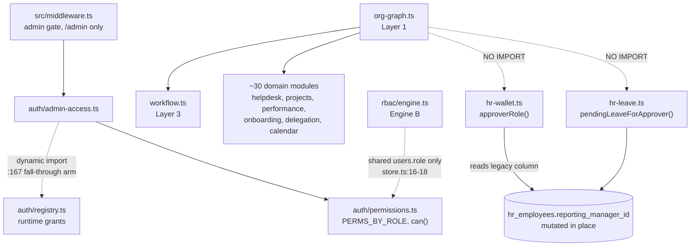
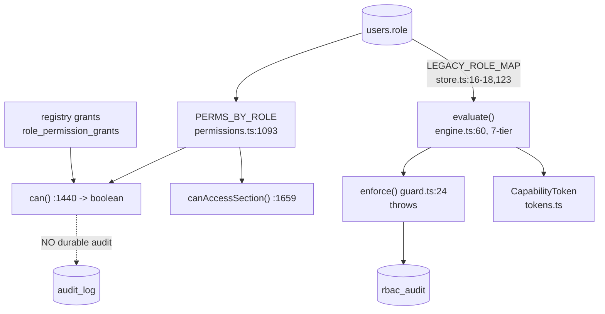
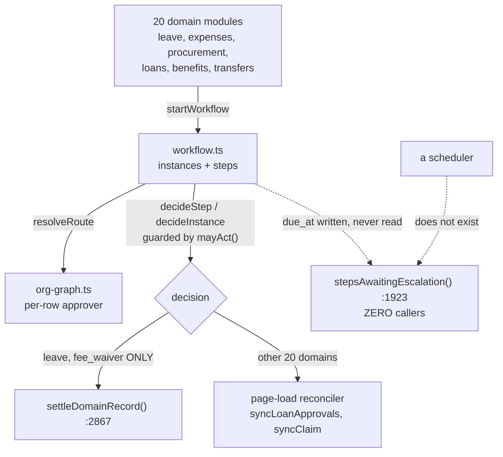

# HumanOS Phase 2 — Architecture Discovery Report

**Date:** 2026-08-16
**Repository:** `c:/Users/user/Projects/edurankai` (Astro 5 + Drizzle over postgres-js + Postgres/Supabase)
**Commissioned:** before the 72-section "HumanOS Phase 2" master prompt is turned into a build plan.

## Method

Source-only. No database connection was opened, no file matching `.env*` was read, and no project code was executed. Schema facts come from `db/*.sql`, `src/lib/db/schema.ts`, the self-bootstrapping `ensure*()` DDL inside `src/lib/*-schema.ts`, and the admin pages that write each column. Every claim carries a `path:line` or an explicit status marker. Where the twelve domain maps and three cross-cutting analyses that fed this report disagreed with what I read in the source myself, **my reading wins and I say so** — sections 2 and 6 both contain corrections to the supplied material.

### Legend

| Status | Meaning |
|---|---|
| **VERIFIED** | I opened the code and it does this. |
| **PARTIAL** | It half-does this, or does it on one path only. |
| **UNVERIFIED** | Plausible, not confirmed. I did not open the file, or it needs a live system. |
| **CONTRADICTED** | Documentation, naming, or the master prompt claims X; the code does not-X. |
| **MISSING** | Does not exist in this tree. |

### Maturity ladder (used in section 3)

| Level | Meaning |
|---|---|
| L0 | Does not exist. |
| L1 | Exists as data or a library, with no reliable trigger or reader. |
| L2 | Works correctly, but only when a human clicks something. |
| L3 | Runs unattended on a schedule or an event, policy-driven. |
| L4 | Infers — a model or learned component decides. |
| L5 | Self-improving. |

**Nothing in this tree reaches L4.** The single L3 automation cluster is the mail platform, which has zero HR producers. That is the one-sentence summary of the maturity baseline.

---

## 1. Executive summary

This is a large, genuinely-built HRMS whose libraries are unusually careful and whose *triggers* are almost entirely missing — the consistent pattern across all twelve domains is that the mechanism ships and the thing that would run it does not. The single structural truth a Phase 2 builder must internalise is this: **there is no event fabric and no scheduler for the HR domain at all** — the file that calls itself the platform event bus has never emitted anything in production (`src/lib/events.ts:86`), the HR event table is write-only with two emitters and zero readers (`src/lib/hr-events.ts:110-124`), the durable job queue is drained by nothing and has no handler registered for the jobs already being enqueued into it (`src/lib/job-handlers.ts:20`), and not one of the sixteen configured crons is an HR job (`vercel.json`, verified this pass). Every Phase 2 capability phrased as "when X happens, do Y" currently has nowhere to attach.

Three findings should change the plan outright. **(1)** Three of the master prompt's asserted Phase 1 foundations — Cerbos, a branded authorization token, and a bitemporal append-only model — do not exist, and the third was *deliberately declined in writing* with its cause recorded (`src/lib/org-graph-schema.ts:41-47`), so any section depending on them is planning against fiction. **(2)** There are two complete, unreconciled authorization engines in one tree coupled only through a shared `users.role` column (`src/lib/rbac/store.ts:16-18`), plus two further vocabularies, and adding an agent runtime or a context engine would make that fifth vocabulary permanently unfixable. **(3)** The prompt's own charge that HR logic lives in page handlers is *understated* — there is no `src/pages/api/admin/hr` directory at all (verified by `ls`), against 232 page-embedded mutation branches.

Against that, the parts that work are worth protecting: the approval engine is correct and one cron away from being the "universal workflow engine" the prompt asks for; `completeHire()` is a reference-quality idempotent audited handoff; and the wellness privacy boundary is real, fail-closed and k-anonymised — though it has one live leak, on the team calendar, that Phase 2 would otherwise build on top of.

---

## 2. Does the "Phase 1 foundation" exist?

This section settles what Phase 2 is allowed to assume. **Three of nine elements do not exist**, and one is contradicted by a recorded decision rather than merely absent.

| Asserted element | Status | Evidence | What Phase 2 may assume |
|---|---|---|---|
| **Authorization spine** | **PARTIAL** | Two complete engines: `src/lib/auth/permissions.ts:1093` (compiled role-to-capability matrix, `can()` at `:1440`) and `src/lib/rbac/engine.ts:60` (ABAC, 7-tier ladder, deny-overrides, object ACLs, capability tokens). Separate role tables, separate grant tables, separate audit tables, three incompatible calling conventions. Coupled only by `src/lib/rbac/store.ts:16-18` `LEGACY_ROLE_MAP` reading the same `users.role`. Two further vocabularies: `src/lib/aquin/gate.ts` (deliberately refuses an EduRankAI session) and `src/lib/mailgov/*`. | A spine exists, but not *one* spine. Reconciling these is the largest single Phase 2 authorization decision. Neither can be deleted: Engine A owns the deny-by-default admin door; Engine B owns explicit deny, ABAC, delegation tokens and object ACLs. |
| **Per-row authorization** | **PARTIAL** | Real in three unreconciled forms: WHERE-clause scope fragments (`src/lib/auth/workspace-access.ts:600,611`), a legacy single-column manager check (`src/lib/hr-wallet.ts:630`), and a proper effective-dated org graph (`src/lib/org-graph.ts`) consumed by 30+ modules. **The money and leave approval paths do not consult the graph** — `hr-wallet.ts` and `hr-leave.ts` import `org-graph` nowhere. | Per-row authority exists but is hand-written per query, and is absent from precisely the two paths where "who was entitled to approve this last March" matters most. |
| **Cerbos policy decision point** | **MISSING** | `grep -rli cerbos src/ db/ docs/ package.json` returns exactly one file: `docs/HANDOFF_HRMS_REVIEW.md` (verified this pass). It argues **against** adoption at `:39-41` on two grounds — a gRPC sidecar is not a Vercel primitive, and running it beside the existing registry would mean two authorization systems, which the three-layer rule forbids. No `@cerbos/*` dependency, no policy directory, no PDP client. | **Nothing.** Any section assuming a PDP must first build one, and must reconcile that with the recorded rejection. |
| **Fail-closed behaviour** | **VERIFIED** | `src/lib/auth/permissions.ts:1664-1666,1675` (no user, then false; applicant, then false; `catch { return false }`); `src/lib/wellness.ts:337-341` (DENY on every error path); `src/lib/auth/cron-auth.ts` (refuses when the secret is absent); `src/lib/auth/workspace-access.ts:288-300` (refuses rather than guessing between two matching employee rows). Three deliberate, documented fail-OPEN exceptions exist and are defensible — see section 6. | This is real and should be preserved, not rebuilt. Note the one structural exception in 6-D1. |
| **Branded authorization token** | **MISSING** | `grep -rn '__brand|Branded<|unique symbol' src/lib/auth/ src/lib/rbac/` returns **zero hits** (verified this pass). `can()` returns a bare boolean; `canAccessSection` returns `Promise<boolean>`; `AdminAccess`, `Decision` and `WorkspaceGate` are plain structural interfaces any object literal satisfies. The only branded types in the tree are content facets at `src/lib/learning-object.ts:104-163`. | **Nothing.** The "only this field may decide" rule is enforced by comment, not by the compiler. The primitive is proven in-tree and cheap to apply — but it must be built. The nearest existing thing is `src/lib/rbac/tokens.ts` `CapabilityToken`, a *runtime* revocable credential, not a TypeScript brand. |
| **Audit axis** | **PARTIAL** | At least eight or nine independent axes with no shared writer and no cross-axis correlation id: `audit_log`, `rbac_audit`, `chat_audit_log`, `legal_access_log`, `hr_events`, `mailapi_audit_events`, `aq_audit`, `edu_sync_audit`, `mp_audit_logs`. `logAudit` is opt-in per module (101 files reference it) and seven mutating HR modules call it zero times. Only `hr_events` (`src/lib/hr-events.ts:289-310`) and `mailapi_audit_events` (`src/lib/mailgov/schema.ts:101-124`) are append-only by DB trigger. | An axis exists but is fragmented, opt-in, and unscoped by tenant despite the recent multi-tenant commit. Phase 2 must pick **one** and migrate. **See 2-A — the supplied digest's central claim about this is stale.** |
| **Bitemporal append-only model** | **CONTRADICTED** | `src/lib/org-graph-schema.ts:41-47`, read verbatim this pass: *"WHAT WAS DELIBERATELY NOT ADOPTED: full bitemporality... this project bootstraps its own DDL over a Supabase TRANSACTION POOLER connection, which cannot create extensions or roles and does not guarantee a session for `SET LOCAL`... That is a weaker guarantee, honestly stated, not a silent one."* Mirrored in `db/org-graph-schema.sql:58` and `docs/org-graph.md:67-78`. `hr_employees` has no temporal column and is UPDATEd in place from ~18 files. | **Nothing** — and this is not an oversight to fix, it is a decision to reverse, which touches the database connection story and therefore needs the user's approval. See conflict **C7**. |
| **Identity / session controls** | **PARTIAL** | `SESSION_DURATION_MS` = 30 days with sliding renewal at 15 days (`src/lib/auth/session.ts:8-9,52-56`), so an active session is effectively immortal. No rotation on privilege change, no device binding, no idle timeout, no step-up re-auth. The middleware second-factor gate is an **enrolment** gate, not a presentation gate — it checks that a face row exists, and `src/lib/auth/two-factor.ts:370` states outright that middleware does not read the per-surface 2FA cookie. | A claim of "MFA enforced on every request" would be false. Enrolment is enforced; presentation is not. Consistent with the product's any-one-of-N sign-in model, but the naming overstates it. |
| **Mutation gates (structural)** | **PARTIAL** | The deny-by-default admin gate is real: `src/middleware.ts:25-28` `isAdminPath` normalises repeated slashes before matching, `:468` gates every `/admin` path before frontmatter for all HTTP methods, `:469` `canOpenAdmin`. **But `isAdminPath` matches only `/admin` and `/admin/...`** — so the 393 files under `src/pages/api/**` are gated by nothing structural and each is its own and only gate. Only ~44 call a shared guard (`denyAdminApi` 37; `requireCapability`/`authorizeRequest` 7). | The "a new page cannot forget" property **does not hold on the surface that writes**. Any Phase 2 API extraction must move the gate, not just the SQL. |

### 2-A. Correction to the supplied digest: `logAudit` is no longer a silent swallow

Three of the fifteen cross-cutting findings I was given rank as *critical* or *high* on the claim that `src/lib/audit.ts:64-66` reads `catch (err) { console.error('Audit log failed:', err); }`, swallowing every audit failure and logging the raw error rather than `e.cause`, in violation of `CLAUDE.md:53`.

**That is stale.** I read the file. The current implementation at `src/lib/audit.ts:87-118`:

- extracts `const reason = err?.cause?.message || err?.message || String(err)` — the house rule is now followed;
- calls `trackError('audit.write_failed', ...)` so the failure lands in `edu_error_log` and appears on `/admin/ops`;
- deliberately does **not** forward `args.diff`, because diffs carry salary, PAN and health-adjacent values and the error log has wider read access and different retention;
- returns `{ ok: false, error: reason }` rather than `void`.

The comment block at `:88-103` records both prior defects by name and why each was fixed. The correct, narrower findings are:

| Real finding | Status | Evidence |
|---|---|---|
| A fail-closed audit writer exists and **has zero callers**. | **VERIFIED** | `logAuditOrThrow` is exported at `src/lib/audit.ts:132`; `grep -rn 'logAuditOrThrow' src/` outside `audit.ts` returns nothing. Its own docstring says to use it where "the audit row IS the control — a permission grant, a legal-hold access, a payroll approval, a health-data disclosure". Not one of those four paths uses it. |
| `hrAudit` — the only audit wrapper on money decisions — **ignores the result**. | **VERIFIED** | `src/lib/hr-wallet.ts:815-820`: `catch (_) { /* auditing must never block the decision it records */ }`, and it never inspects `logAudit`'s returned `{ok:false}`. Materially less severe than the digest states, because the failure now reaches `edu_error_log` via `trackError` inside `logAudit` — what is lost is the *caller's* knowledge, not the trace. |
| Audit **coverage** is a much larger hole than audit **reliability**. | **VERIFIED** | See 6-B. |

**Implication for Phase 2:** the expensive-sounding "make audit reliable" work is largely done. The remaining work is (a) adopt `logAuditOrThrow` on the four control paths its own docstring names, and (b) close the coverage gap. Budget accordingly.

---

## 3. Current architecture map

| # | Domain | Maturity | What exists | Key files |
|---|---|---|---|---|
| 1 | Authorization, identity, session | **L2** | Deny-by-default `/admin` gate (L3 in isolation), two complete policy engines, real fail-closed behaviour, 30-day sliding sessions | `src/middleware.ts`, `src/lib/auth/permissions.ts`, `src/lib/auth/admin-access.ts`, `src/lib/rbac/engine.ts`, `src/lib/rbac/tokens.ts` |
| 2 | Organization graph (Layer 1) | **L2** | Effective-dated edge store, cycle-safe recursive chain walks, ~30 consumers, honest empty state | `src/lib/org-graph.ts`, `src/lib/org-graph-schema.ts`, `src/lib/org-assignment.ts`, `db/org-graph-validate.sql` |
| 3 | Workflow / approvals (Layer 3) | **L2** | 22-domain approval engine, 6-state machine, parallel steps, delegated approval, halted state, strong idempotency | `src/lib/workflow.ts` (2,927 lines), `src/lib/workflow-schema.ts`, `db/workflow-schema.sql` |
| 4 | Event fabric | **L1** HR / **L3** mail | Six non-interoperating mechanisms plus ~20 module-local `*_events` tables; the declared bus is dead; only mail has working consumers | `src/lib/events.ts`, `src/lib/hr-events.ts`, `src/lib/job-queue.ts`, `src/lib/mailint/router.ts`, `src/lib/mailplatform/router.ts` |
| 5 | Core HR employee master | **L2** | One wide `hr_employees` table, reference-quality `completeHire()`, free-text lifecycle status with no vocabulary constant | `db/hr-schema.sql`, `src/lib/hire-completion.ts`, `src/lib/hr-lifecycle.ts`, `src/pages/admin/hr/employees/[id].astro` |
| 6 | Requisition to offer to BGV to onboarding | **L2** | Real chain with two hard breaks and two browser-only enforcement points; BGV is an unlinked orphan register | `src/lib/hr-requisition.ts`, `src/lib/hr-bgv.ts`, `src/lib/onboarding-journey.ts`, `src/pages/portal/offer/[token].astro` |
| 7 | Leave, attendance, time, scheduling | **L2** | Real state machines; approval writes attendance rows; no accrual, no cron, orphaned lapse module | `src/lib/hr-leave.ts`, `src/lib/attendance.ts`, `src/lib/attendance-schema.ts`, `src/lib/attendance-lapse.ts` |
| 8 | Payroll, payslips, wallet, finance | **L2** | Strict one-way run state machine, real idempotency, deliberate refusal to write a zero payslip; no statutory filing, no proration, no HTTP surface | `src/lib/payroll.ts`, `src/lib/hr-wallet.ts`, `src/lib/loans.ts`, `src/lib/payroll-reports.ts` |
| 9 | Wellness, consent, privacy | **L2** gate / **L0** consent | Fail-closed women-only gate, `MIN_GROUP = 5` with residual suppression, aggregate-only oversight; zero audit, zero consent record, plaintext health columns | `src/lib/wellness.ts` (2,263 lines), `src/lib/assistant/scope.ts`, `src/lib/ai-boundary.ts` |
| 10 | Safety, field work, location, emergency | **L1** | One thin SOS vertical; the proximity beacon is answered 410 at the edge; no geofence enforcement, no lone-worker, no incident entity | `src/lib/safety.ts`, `public/sos.js`, `src/pages/admin/sos.astro`, `src/lib/applicant-location.ts` |
| 11 | Audit, legal hold, observability, reconciliation | **L1** | 8-9 audit axes, correct legal-hold ordering, ten real reconciliation joins nothing schedules, dead cron instrumentation | `src/lib/audit.ts`, `src/lib/legal-hold.ts`, `src/lib/observability-health.ts`, `src/lib/hire-reconcile.ts` |
| 12 | API surface, notifications, cron, PWA, offline | **L1** | 393 API files with no HR directory; three notification systems; 16 crons, none HR; offline queue with a data-loss path | `src/pages/api/**`, `src/lib/notify.ts`, `src/lib/push.ts`, `vercel.json`, `public/offline-sync.js` |

### The one pattern that explains almost everything

This tree consistently ships the **mechanism** and omits the **trigger**. The following are all correct, careful, often-commented code with **zero callers**, verified by grepping the exported symbol names — not just module paths, because dynamic `await import()` is used heavily here and a path-only grep produces false orphans.

| Orphan | Location | What it would do |
|---|---|---|
| `stepsAwaitingEscalation()` | `src/lib/workflow.ts:1923` | List exactly the approvals that are overdue |
| `recordCronRun()` | `src/lib/observability-health.ts:303` | Make 14 of 16 crons observable |
| `enqueueNotify` / `enqueueGuardianAlert` | `src/lib/job-handlers.ts:10,16` | The documented "reliable send path" |
| `mayActFor()` | `src/lib/delegation.ts:408` | Enforce domain-scoped delegation, incl. never-delegable limits |
| `logAuditOrThrow()` | `src/lib/audit.ts:132` | Fail-closed audit on control paths |
| `reconcile()` | `src/lib/org-graph-backfill.ts:1420` | Graph-vs-column drift detection |
| `purgeLocationsFor()` | `src/lib/applicant-location.ts:440` | Location retention and erasure |
| `saveEmployeeOverride()` | `src/lib/payroll.ts:713` | Per-employee payroll component overrides |
| `deleteAllMyWellnessData()` plus 4 siblings | `src/lib/wellness.ts:1300-1470` | The right to erasure |
| `postgresSink()` | `src/lib/mailplatform/events.ts:409` | Apply the partitioned event-stream DDL |
| Whole module: `attendance-lapse.ts` | `src/lib/attendance-lapse.ts` (532 lines plus a test) | Nine-day lapse, profile pause, appeal |
| Whole module: `org-backfill.ts` | `src/lib/org-backfill.ts` (~1,000 lines) | A *second*, richer backfill and validation engine |

**Phase 2 estimating consequence:** for these items the gap is "written and never wired", not "nobody wrote it". That is a materially cheaper class of fix and should move those estimates down. The genuinely missing things are narrower than they first appear: a scheduler, an edge-writing admin surface, and a handful of handler registrations.

---

## 4. The connective tissue

This is the heart of the report. Everything above describes components; this section describes whether they are connected, and the answer is usually "less than the naming implies".

### 4.1 Module dependency graph

The org graph is the one genuinely load-bearing shared dependency — and the two paths that move money bypass it.

| Edge | Mechanism | Status |
|---|---|---|
| `middleware` to `auth/admin-access` + `auth/permissions` + `auth/session` | direct import | **VERIFIED** |
| `auth/admin-access` to `auth/registry` | **dynamic** import at `admin-access.ts:167`, deliberately lazy so the middleware bundle does not pull the registry | **VERIFIED** (the digest called this a direct import at `:143` — that line is a function signature) |
| `org-graph` to `workflow.ts` | direct import; workflow never queries `org_relationships` itself | **VERIFIED** |
| `org-graph` to 30+ domain modules | direct import | **VERIFIED** |
| `org-graph` to leave/money approval | **none** | **MISSING** — `hr-wallet.ts` and `hr-leave.ts` import `org-graph` nowhere |
| Engine B to Engine A | shared `users.role` via `LEGACY_ROLE_MAP` | **PARTIAL** — not "none". Changing a person's `users.role` silently re-authorizes them in *both* engines, and `super_admin` maps onto `superadmin`, which carries unconditional `administer` in Engine B with no `rbac_user_roles` row required. |
| `src/lib/org-backfill.ts` to anything | **none** | **MISSING** — 49 KB, ~1,000 lines, zero importers |

### 4.2 Data ownership graph

Nothing declarative exists. What exists instead is a documented pattern of *contested* ownership.

| Table / column set | Writer A (audited) | Writer B (unaudited) | Status |
|---|---|---|---|
| `hr_employees` bank / PAN / UAN / PF / ESIC / **gender** | `src/lib/profile.ts:538,584,622,658` with `logAudit` at `:551,592,632,667` | `src/pages/admin/profile.astro:45-70` — raw inline UPDATE, **0 `logAudit`** (verified by grep), does not import `profile.ts` | **CONTRADICTED** — two writers for one column set |
| `hr_employees.base_salary` | `src/pages/admin/hr/payroll/index.astro:513` (inside the structure CTE) | `src/pages/admin/hr/employees/[id].astro:394` | **PARTIAL** — can diverge from the salary structure `computePay` actually reads |
| Offboarding state | `src/lib/hr-separation.ts:45-78` — structured, audited, closes org edges, verifies by read-back at `:947-966` | `src/pages/admin/hr/employees/[id].astro:482-499` — `offboarding_state` JSONB blob, unaudited, closes nothing | **CONTRADICTED** — two models can disagree about whether somebody has left |
| Org backfill | `src/lib/org-graph-backfill.ts` (wired to `/admin/org/graph`) | `src/lib/org-backfill.ts` (dead, richer) | **CONTRADICTED** |
| `hr_employees.reporting_manager_id` | `src/lib/org-assignment.ts:447-452` (dual-write with the graph, `RETURNING`-guarded) | — | **VERIFIED** — but comments at `workspace-access.ts:249` and `permissions.ts:976` still assert this column is "written by zero lines of application code", which is **STALE** and will mis-scope Phase 2 planning |

**Tables absent from `src/lib/db/schema.ts` entirely** (they exist only as raw DDL inside application code, so anything using Drizzle typing or `drizzle-kit` introspection is blind to them): `hr_employees`, `org_relationships`, `org_teams`, `org_positions`, `org_employee_assignments`, `hr_events`.

**Tables with no declaration anywhere** (used by live code, owned by no schema file): `content_flags`, `content_blocked_domains`.

### 4.3 Authorization graph

| Fact | Status | Evidence |
|---|---|---|
| Engine B decisions are audited; Engine A refusals are not | **VERIFIED** | `src/lib/rbac/guard.ts:24` writes exactly one row per decision. Engine A refusals go to `logEvent()` at `src/middleware.ts:469` and `api-guard.ts:65` — structured stdout, no table, no consumer. "Show me every denied access attempt" is answerable for the 106 pages using Engine B and unanswerable for the rest. |
| `canOpenAdmin` has **five** arms, not four | **VERIFIED** | `src/lib/auth/admin-access.ts:164-175`: a role outside `ADMIN_CAPABLE_ROLES` falls through to a **database** grant path (`hasPermission(user.id, PERM_ADMIN_ACCESS)`). The effective allow-set is *matrix union registry grants*, and the registry half is mutable at runtime by anyone who can edit custom roles. Still fail-closed on error. |
| Engine B's Tier-0 session check is **unreachable dead code** | **VERIFIED** | `src/lib/rbac/engine.ts:65` denies on `!p.sessionValid`, but `src/lib/rbac/store.ts:114,183` — the *only* Principal factory — hardcodes `sessionValid: true` on both exits and never calls `validateSessionToken`. `src/lib/security/authz.ts:1-3` advertises "re-verifies identity and capability on every call"; it re-verifies capability only. **This is the single most load-bearing thing to know before building anything on Engine B.** |
| The middleware section gate is **VIEW-only** and applies that answer to POST | **VERIFIED** | `getViewableSectionKeys` at `permissions.ts:1623`; `src/middleware.ts:492` applies the same set to all methods. A custom role granted view-but-not-edit can POST to that section's page unless the page independently checks `edit`. Only a minority do. |
| ~30 admin pages have POST handlers with **no page-level gate at all** | **PARTIAL** | api-keys, mail/*, moderation, partnerships, certificates, submissions, notifications, fee-waivers, credential-transfer, sections, profile and others. They depend entirely on middleware, which for POST applies only `canOpenAdmin` plus a VIEW-level section check. |

### 4.4 Workflow graph

The engine is correct. It has no tick.

| Fact | Status | Evidence |
|---|---|---|
| `due_at` is written on every step and read to act by nothing | **VERIFIED** | Written at `workflow.ts:2296,2702`; the only reader is `stepsAwaitingEscalation()` at `:1923`, which has zero callers. No workflow entry in `vercel.json` (16 crons, verified). |
| An **escalated** step can never itself escalate | **VERIFIED** | `workflow.ts:2815-2823` inserts the escalated step with `due_at` literal NULL; `:1937-1939` requires `due_at IS NOT NULL`. Even if a cron were added tomorrow, the escalation path silently drops the SLA axis. |
| `notified_at` is declared in two schema files and **never written** | **VERIFIED** | Declared `workflow-schema.ts:241,257` and `db/workflow-schema.sql:166,182`. No write anywhere. A column that looks like delivery evidence and is always NULL. |
| Delegation scope is stored and never enforced | **VERIFIED** | `src/lib/delegation.ts:238-254` writes the granted domains into an edge `note`; `org-graph.ts:1008-1030` `getDelegates` and `workflow.ts:1670` `mayAct` never read it. **Any delegation is an approvals delegation for every domain.** The enforcement code exists at `delegation.ts:408` `mayActFor` with never-delegable hard limits — zero callers. |
| Five of ten relationship kinds have **no writer anywhere** | **VERIFIED** | `team_lead`, `functional_manager`, `reviewer`, `executive_sponsor`, `approval_owner`. Complete enumeration of `openRelationship()` call sites yields only `temporary_delegate`, `project_manager`, `reporting_manager` plus the three `supersede*` helpers. **Consequence is broader than approvals:** `src/lib/helpdesk.ts:458,516` routes a desk from an `approval_owner` edge, and `src/lib/onboarding-journey.ts:73,1067` does the same for onboarding — ticket routing and onboarding-owner routing are disabled by the same missing writer. Executive-sponsor rungs above 100k/200k/500k are non-optional and halt permanently. |
| `escalateStep` / `resumeWorkflow` carry **no entitlement check** | **VERIFIED** | Their own docblocks say so (`workflow.ts:2652-2659, 2745-2754`). `src/pages/portal/employee/credits/approvals.astro:55,75` gates only on `requireEmployee()` and passes a form-supplied `step_id` straight in. Any active employee can escalate somebody else's approval to that person's manager. Bounded — escalation cannot decide anything and refuses to fire twice — but it is a per-row gap on a write path. |
| The decision door itself **is** guarded | **VERIFIED** | `decideStep` at `:2409-2413` and `decideInstance` at `:2478-2483` both call `mayAct()` before any write. Worth stating positively; the picture is otherwise unbalanced. |
| The engine has **no API surface** | **VERIFIED** | `grep "from '@/lib/workflow'"` under `src/pages/api` returns nothing. Reachable only through `.astro` frontmatter POSTs. |

### 4.5 Event graph — real consumers versus write-only rows

The commissioning prompt specifically asked for explicitness here. **Six independent mechanisms plus ~20 module-local `*_events` tables. Exactly one non-mail domain in the entire repository publishes an event any consumer receives.**

| Mechanism | Producers | Consumers | Verdict |
|---|---|---|---|
| `src/lib/events.ts` — *"the platform event bus"* | **ZERO** production callers of `emit()` (only `events.test.ts`) | `attachActivityFeed()` at `activity-feed.ts:192` is **never called** | **DEAD.** The vocabulary (11 names), the ROUTING table and the failure ledger all read as production infrastructure and none of it executes. |
| `hr_events` — the intended HR spine | 2 of 12 types: `learning-progress.ts:565` (CourseCompleted), `skills.ts:485` (SkillVerified) | **ZERO.** `timelineFor()`, `listHrEvents()`, `eventCounts()` have no caller outside the module | **WRITE-ONLY.** Well built — real append-only trigger at `:289-310`, `correlation_id` at `:268`, protected-attribute refusal at `:503`. No traffic, no reader, absent from `db/*.sql`. |
| `activity_log` (`activity-feed.ts`) | 3 direct `record()` sites plus the `sendPushToAdmins` mirror at `push.ts:196` | `/admin/activity`, `/api/cron/activity-digest` | **WORKING**, narrowly. `sendPushToUser` at `push.ts:290` is **not** instrumented, so per-user notifications never enter the feed. |
| `mailint` bus | 1 non-mail producer: `application-stages.ts:221` (`application.stage.changed`). **26 of 27 catalogue types have no in-tree producer.** | Real: routes to email/campaign/workflow/analytics, plus queued webhook fan-out and delayed steps | **WORKING** — for callers who are not in this codebase. |
| `mailplatform` bus (`mail_automation_events`) | **ZERO in-tree producers.** Only the daily tick cron's own `schedule.date`/`schedule.time` | `router.ts:81` ingest to automation runs | **WORKING**, self-fed only. |
| `mp_events` (`adapters/event-bus-postgres.ts`) | **16 automatic in-tree publishers** — the most-produced stream in the repository | Analytics rollups at `:174-179`; `contact.created` re-ingested as an automation trigger | **WORKING.** Its `message.*` / `campaign.*` / `contact.*` names **collide** with the mailint catalogue across two unconnected tables with no bridge. This collision is why some event names look produced when they are not. |
| `edu_jobs` (durable queue) | `mp.*` kinds enqueued from 7 sites in the mail platform | **Nothing drains it on a schedule**, AND `src/lib/job-handlers.ts:20` registers only `notify`, `notify-guardians`, `push` — no `mp.*` handler exists (verified this pass) | **BROKEN TWICE OVER.** `job-queue.ts:84` *fails* a job whose kind is unregistered. Adding the missing cron alone would produce a wave of `no handler for mp.campaign_batch` failures, not working delivery. The tree's own docs recommend exactly that one-line fix (`docs/ops/MONITORING.md:275-277`). |

**Envelope gaps across all five envelope shapes:** `causationId` exists **nowhere**; `correlationId` exists as a column on two tables and is set by exactly one call site (`skills.ts:494`) with a value that correlates nothing across modules; a stored schema `version` exists on **no** row in any table (`EVENT_ENVELOPE_VERSION` is stamped on outbound webhook bodies only); a sensitivity dimension exists only in mailint; retention exists only inside an undeployed ClickHouse DDL string.

### 4.6 Notification graph

Three parallel systems over three runtime-bootstrapped tables that appear nowhere in `src/lib/db/schema.ts`.

| Fact | Status | Evidence |
|---|---|---|
| Priority and category are classified but **half-persisted** | **VERIFIED** | `src/lib/notification-catalog.ts:9-19,122` classifies 44+ types into 8 categories and 4 priorities. `src/lib/push.ts:145-154` persists both. `src/lib/notify.ts:51` writes **neither**. |
| No acknowledgement, no escalation, no per-recipient delivery status, no retry | **MISSING** | `src/lib/notifications-schema.ts:16-31` columns are `is_read, read_at, seen_at, clicked_at, is_archived`. Grep for `acknowledge|escalat|delivery_status|delivered_at|retry` across the five notification modules returns one hit, a comment about dedup. |
| Audience routing **fails open** | **VERIFIED** | `src/lib/notify-audience.ts:66` — `return null; // fail-open: unmapped types go to everyone` — and `:74` `if (audience === null) return role !== 'applicant'`. HR notification titles carry names. A new Phase 2 HR type broadcasts to marketing, editor, teacher, technical_moderator and partner accounts until someone adds a map entry. |
| The `notify` helper object is **dead code** | **VERIFIED** | `src/lib/notify.ts:96-145` exports `newApplication, statusChange, hired, leaveRequest, offerSigned`. Grep returns **zero** callers. All five `{ notify }` destructured imports in the tree come from `@/lib/edu-notify`, a different module. The two real call sites of `notifyAllAdmins` in HR (`hr-leave.ts:1304`, `hire-completion.ts:519`) fire only on **failure** paths — a successfully-routed leave request notifies nobody. |
| The only reliability mechanism is a 2-minute dedup predicate | **VERIFIED** | `notify.ts:56-63`, `push.ts:157-165`. |

### 4.7 Integration graph (external and scheduled)

| Integration | Status | Evidence |
|---|---|---|
| 16 cron entries, **none HR** | **VERIFIED** | `vercel.json` — 16 paths verified by count this pass. Mail (6), payments/reconcile, aquintutor (2), hiring/draft-reminders, hei-refresh, activity-digest, face-retention, lms-reminders, mailint-dispatch, mail/snooze. No leave accrual, no probation expiry, no attendance lapse, no payroll, no reconciliation, no workflow escalation. |
| Two built, secret-gated job endpoints scheduled **nowhere** | **VERIFIED** | `src/pages/api/cron/security-scan.ts` and `src/pages/api/jobs/run.ts` exist on disk and are absent from `vercel.json`. **Presence of a file in `src/pages/api/cron/` is not evidence of scheduling anywhere in this tree.** |
| One cron uses a non-daily schedule on a daily-only tier | **PARTIAL** | `/api/aquintutor/league-settle` at `0 1 * * 1`, while `src/pages/api/cron/face-retention.ts:7-8` and `hei-refresh.ts:3-5` both record that sub-daily schedules silently fail every deploy on this tier. |
| Five behaviourally **divergent** cron-auth implementations | **VERIFIED** | The shared helper is `src/lib/auth/cron-auth.ts` (uses `timingSafeEqual`, trims whitespace). Local copies at `mail/imap-poll.ts:37`, `aquintutor/streak-nudge.ts:17`, `aquintutor/league-settle.ts:22`, `hiring/draft-reminders.ts:16`, and `v1/email/dispatch.ts:31-44` all use plain `===`, do not trim, and accept a narrower header set. All fail closed. |
| External money rail | **VERIFIED** | RazorpayX payouts, `src/lib/hr-wallet.ts:874-880`. Reached only from the withdrawal path; a network error deliberately leaves the row at `paying` with no automatic retry (`:892-900`) and a human resolves it (`:737-812`). |
| Third-party reverse geocoding of precise coordinates | **VERIFIED** | `public/analytics.js:108` and `src/pages/admin/analytics.astro:509` send coordinates to an external geocoding host. Unreviewed data egress that Phase 2 would inherit. |

### 4.8 UI navigation graph

| Fact | Status | Evidence |
|---|---|---|
| Three live admin surfaces are absent from `admin-nav.ts` but **are** reachable | **VERIFIED** | `/admin/offline-work` from `admin/profile.astro:346`; `/admin/hr/reconciliation` from `admin/hr/index.astro:718` and two others; `/admin/wellness/consultants` from `admin/wellness.astro:146`. A nav miss is not proof of unreachability — reported so Phase 2 does not "reconnect" connected pages. |
| Four service workers, two registering at the same `/` scope | **VERIFIED** | `public/sw.js` (registered from `BaseLayout.astro:234`) and `public/era-sw.js` (registered via `/era-pwa.js` from `BaseLayout.astro:131`). `era-sw.js:20-26` deletes every cache key that is not its own, which includes `sw.js`'s entire precache — the two thrash on every public page load. `era-sw.js:52` excludes only `/api/`, with **no `/admin` exclusion**, while `sw.js:61` excludes both. |
| The SOS panic button is scoped to `/portal` only | **VERIFIED** | `public/sos.js:4`: `if (!window.location.pathname.startsWith('/portal')) return;`. The script is loaded site-wide by two layouts, so every `/aquintutor/*` page ships it and renders no button. |

---

## 5. Security and privacy boundaries

### 5.1 The wellness / women's-health rule (`CLAUDE.md:30-34`) — compliance check

The rule, verbatim: *"The wellness system (`src/lib/wellness.ts`) is women-only and gated server-side. No admin, and not the founder, may see one person's cycle, symptoms or consult messages. Oversight screens are aggregate only and suppress any group below `MIN_GROUP`. If you find yourself writing a query that returns a row per user on an admin surface, that is the screen that must not exist."*

**What complies (verified this pass by reading the source):**

| Control | Status | Evidence |
|---|---|---|
| Server-side women-only gate, fail-closed | **VERIFIED** | `src/lib/wellness.ts:302` reads `hr_employees.gender` server-side — never a header, cookie or query string — and `:337-341` returns DENY on every error path. |
| `MIN_GROUP = 5`, enforced per oversight function | **VERIFIED** | `src/lib/wellness.ts:60` (read directly). Floors re-applied at `:2095, 2160, 2207, 2218`, with residual-category suppression at `:2096-2098,2113` so a remainder cannot be subtracted back out. |
| Oversight pages open no database connection at all | **VERIFIED** | `/admin/wellness` and `/founder/admin/wellness` import neither `db` nor `sql`; both call only `programmeHealth()`. |
| AI, assistant, analytics, person-360 and digital-twin all refuse wellness sources | **VERIFIED** | `src/lib/assistant/scope.ts:197-204` — `FORBIDDEN_SOURCE_PREFIXES = ['wellness_']` plus a per-table reason map, enforced through an `assertRetrievableSource` choke point. Mirrored refusals at `analytics-domains.ts:50`, `person-360.ts:161`, `digital-twin.ts:292`. `src/lib/ai-boundary.ts:160-171` `PROTECTED_ATTRIBUTE_SEGMENTS` covers health, medical, diagnosis, symptom, cycle, wellness, pregnancy, maternity, gender, and `hr-events.ts:503-511` refuses matching payload keys on the emit path. |
| No `wellness_*` table is read outside the module | **VERIFIED** | Every non-`wellness.ts` hit across `src/` is a prose comment or a test asserting refusal. |

**What does not comply — three findings, all VERIFIED:**

> **W1 (critical). The team calendar renders a named person's leave TYPE to their manager, with no floor and no suppression.**
> `src/lib/calendar-hub.ts:387` builds `title: (withNames && name ? name + ' - ' : '') + leaveWord(type)`, with `type` read from `hr_leave_request.leave_type` at `:377`, over a `teamScope` resolved from the viewer's direct reports. `src/lib/hr-leave.ts:146,150,155` include `sick`, `maternity` and `bereavement`. A manager therefore sees *"&lt;name&gt; - Sick leave"* and *"&lt;name&gt; - Maternity leave"* today. This directly contradicts `src/lib/hr-events.ts:73`, which refuses to carry leave type for precisely this reason. **Phase 2 wants to build on the calendar; this must be fixed first.** *Fix:* show "Away" on named team views; keep the type on the person's own view.

> **W2 (critical). A second health subsystem exists with none of these protections.**
> `counselling_requests` (mental-health topic from a fixed list, plus 2,000 characters of free-text notes and a contact string, plaintext) is written by two **unauthenticated** POST routes — `src/pages/api/aquintutor/wellness/counselling.ts:35` and `sleep-signup.ts:24`, rate-limited on client address only. `src/pages/aquintutor/admin/index.astro:169` then runs `SELECT id, status, created_at FROM counselling_requests ... LIMIT 15` and `:109` a per-row status UPDATE, gated only by `user.role === 'admin'`. **Precisely:** the list selects no topic, notes or contact, so disclosure *text* is not rendered — the violation is of the stated no-per-row-view rule and the absent `MIN_GROUP` floor. The endpoint's own header at `counselling.ts:16-17` says *"NO PER-PERSON ADMIN VIEW MAY BE BUILT ON THIS TABLE."* One has been.

> **W3 (critical). `hr_employees.gender` — the sole wellness gate — is self-editable, unaudited, and read on every admin page load.**
> `src/pages/admin/profile.astro:50` writes `gender` from a form field in a raw inline UPDATE with **0 `logAudit` calls** (verified by grep), targeting a row id taken from the form body, scoped by a three-email OR with no unique constraint behind it, and printing "Your details were saved." unconditionally with no `RETURNING`. Separately, `src/layouts/AdminLayout.astro:41-45` reads `gender` inside a bare empty catch on **every** admin request, purely to choose an accent colour, using the same ambiguous three-email OR with `LIMIT 1`. That file is under `src/layouts/`, which `CLAUDE.md:60` forbids editing without approval — **reported for the user, not changed.**

**Also VERIFIED and material.** `src/lib/wellness.ts` contains **zero** `logAudit`/`logAccess` calls (grep count: 0). Nothing is recorded when a consultant opens a health disclosure, when an administrator is appointed to the pool, or when a request is taken from the queue. And an `audit.view` holder can self-appoint into `wellness_consultants` — `src/pages/admin/wellness/consultants.astro:78-88` performs **no comparison** of the resolved account id against the current user's — then read full consult message bodies via `listAssignedConsults` (`wellness.ts:1820-1830`, which selects `q.message`). The exposure requires `super_admin` (`audit.view` is granted only in that block, `permissions.ts:1109`) and the pool roster is visible to the requester, so it is a founder-trust question rather than broad access — but there is no trace at any step.

**Right to erasure is code-complete and unreachable:** `deleteAllMyWellnessData` (`wellness.ts:1430`), `deleteCycle` (`:1321`), `deleteSymptom` (`:1418`), `updateCycle` (`:1300`), `saveSettings` (`:1470`) all have zero callers and no UI. A woman who wants her cycle history deleted must ask a human — i.e. disclose the request.

**Encryption:** every health column is plaintext `TEXT` (`wellness.ts:163-228`), while `src/lib/crypto/envelope.ts` implements AES-256-GCM envelope encryption with key rotation whose **only** production consumer is DKIM private-key storage (`mailplatform/domains/store.ts:724`).

### 5.2 The legal-hold ordering rule (`CLAUDE.md:35-36`) — compliance check

The rule: *"Legal-hold records (`src/lib/legal-hold.ts`) require an open numbered matter and a written reason, and `logAccess()` must succeed **before** anything renders."*

| Surface | Ordering | Matter and reason | Verdict |
|---|---|---|---|
| `/founder/admin/held-records` | **CORRECT** — `logAccess()` at `:70-78`, `if (!res.ok)` at `:80-82` sets the error, records assigned only in the else branch at `:83-88` | **CORRECT** — open numbered matter checked at `legal-hold.ts:220-222`, 20-char reason at `:142-163` | **VERIFIED compliant** |
| `/admin/audit/chat` | **CORRECT in shape** — inserts `chat_audit_log` at `:46` before the `chatMessages` SELECT at `:57`, fail-closed catch at `:62-69` | **NON-COMPLIANT** — enforces only a **6-character** reason (`:29`) and **no numbered matter**; never imports or calls `logAccess()`; renders plaintext channel message bodies at `:124` | **CONTRADICTED** — the ordering rule is honoured against a *different table*, with a different writer, no matter binding, and none of `legal-hold.ts`'s guarantees |

**Two further legal-hold findings, both VERIFIED:**

- The `logAudit` call in `held-records.astro:88-91` is **malformed and cannot ever insert**: it passes `detail:` and **omits** `entity:`, which is `varchar(100).notNull()` with no default (`src/lib/db/schema.ts:310`, verified this pass). The `as any` is what let it compile; the trailing `.catch(() => {})` discards the constraint violation. The primary `legal_access_log` row still lands and is fail-closed, so this is the loss of the *secondary* cross-cutting trail — but a unified reader over `audit_log` would show zero legal-hold reads and be believed.
- `accessHistoryFor()` at `legal-hold.ts:355-375` — documented as *"Deliberately available to the SUBJECT, not only to the founder... the disclosure notice promises this"* — **is** wired, at `src/pages/portal/my-record-access.astro:12,19`. (The supplied digest called this an orphan; that is stale. Do not redo this work.)

### 5.3 Other privacy and security boundaries

| Boundary | Status | Evidence |
|---|---|---|
| **Cached portal HTML survives sign-out** | **VERIFIED** | `public/sw.js:61` caches every `/portal` page — including `/portal/employee/payslips`, `/contract`, `/documents` and `/portal/wellness/*` — into a device-local page cache. `src/pages/portal/logout.ts` deletes the session row and cookie correctly but never purges `caches` or IndexedDB. Safe for concurrent users; unsafe for **sequential** users on one device, which is the shared or borrowed phone case that file says the product cares about. `era-sw.js` makes it worse by also caching `/admin`. |
| **Two unauthenticated proctoring/health write endpoints** | **VERIFIED** | `src/pages/api/aquintutor/interview/log-event.ts:34` takes no `locals` and no guard — possession of a `sessionId` string is the only requirement to write proctoring events, drive `risk_score`/`strikes_count` and trip auto-termination in another person's name. `src/pages/api/activity/log.ts:14` stamps `userId: user?.id || e.userId || null` — an unauthenticated caller can attribute encrypted proctoring entries to any user id. Both files **document the defect and decline to fix it**. `CLAUDE.md:44` requires proctoring to be advisory with a human deciding; an unauthenticated writer puts forged strikes in front of that human. |
| **Two admin surfaces gated only by `role === 'applicant'`** | **VERIFIED** | `/admin/api-keys.astro:6-7` mints and revokes platform API credentials; `/admin/offline-work.astro:6-7` renders every employee's offline payloads joined to name and email. `src/lib/auth/permissions.ts:1648-1651` names this exact test as forbidden: *"every internal role passes it, including the `editor` that offer letters auto-assign to candidates who have not yet accepted."* `src/lib/auth/api-guard.ts` records that this anti-pattern was remediated across `/api/admin/**`; these page surfaces were left behind. |
| **A login-path audit write is swallowed** | **VERIFIED** | `src/pages/admin/login.astro:149-152` inserts the biometric second-factor attempt — including the server-measured face-match distance and verdict — into `identity_verifications`, ending in `.catch(() => {})`. The *outer* catch at `:167-169` logs correctly with `e?.cause?.message`, so sign-in availability is **not** at risk; what is lost is the forensic record. The two neighbouring swallows on the same path (`last_used_at`, `lastLoginAt`) are genuine telemetry and should be left alone. |
| **PII in the error log** | **PARTIAL** | `src/lib/logger.ts:10-18` `redactMeta` redacts secret-shaped values and keys matching `/pass\|secret\|token\|key/i` but **not** email, name, phone or salary. `src/lib/fee-waiver.ts:239` persists a real email address into `edu_error_log.context`. `audit_log.diff` is rendered as a raw 100-char JSON preview on `/admin/audit`. |
| **No tenant column on the employee master or the audit log** | **VERIFIED** | `grep 'org_id\|organization_id\|tenant' db/hr-schema.sql` returns nothing; `audit_log` has no org scoping. The most recent commit is "Multi-tenant SaaS layer: orgs, roles, plans, entitlements, metering, billing". There is no RLS (`grep 'ROW LEVEL SECURITY\|CREATE POLICY'` returns zero). Any Phase 2 claim of per-row authorization over the employee master must answer this. |

---

## 6. What is broken or dangerous now

Severity-ranked. Every row cited. Statuses reflect **my** verification, which corrects the supplied material in two places.

### A. Data loss and irreversibility

| # | Finding | Severity | Evidence |
|---|---|---|---|
| A1 | **Offline sync deletes records it failed to persist.** The server wraps each per-record INSERT in `catch (_) {}` and returns `{ ok: true, synced: n }` regardless; the client tests only `if (d.ok)` and then deletes **every** record in the batch from the IndexedDB queue, ignoring `d.synced`. One bad record — oversized JSONB, constraint violation, mid-batch connection loss — is removed from the retry queue and flagged `synced: true` on the device. `/admin/offline-work` describes these payloads as including worklog entries, i.e. pay records. | **critical** | `src/pages/api/offline/sync.ts:37-44` and `public/offline-sync.js:57-63`, both read verbatim this pass. *Fix: return acknowledged clientIds; delete only those.* |
| A2 | **Payroll has no reversal.** No delete, no void, no credit note, no correction run anywhere in `src/`. A month that has a run cannot be run again. | **critical** | `src/lib/payroll.ts:1707` (*"there is no delete and no void anywhere in this file"*); `src/pages/admin/hr/payroll/index.astro` — the only four POST actions are create, approve, mark-paid, update-salary. **This is the reason no executing agent may touch payroll.** |
| A3 | **Idempotency uniqueness is conditional.** `hr_payroll_runs_period_uniq`, `hr_payslips_run_emp_uniq` and `hr_wallet_txn_ref_uniq` are created with `CREATE UNIQUE INDEX IF NOT EXISTS` inside try/catch that logs and continues. On a database already holding a duplicate the index never builds and the guard silently does not exist — the file's own comment names the consequence: every loan instalment recovered twice, every one-off bonus paid twice. Nothing in the product reports which indexes are actually present. | **high** | `src/lib/payroll.ts:324-338`, `src/lib/hr-wallet.ts:130-133`. Same shape on the org-graph overlap invariants at `src/lib/org-graph-schema.ts:218-254,350-360`. |
| A4 | **`closeRelationship()` reports success when it changed nothing.** No `RETURNING`, no rowcount check — a wrong id, an already-closed edge, or `effective_from >= at` all return `{ ok: true }`. Callers that do not verify will report a leaver's reporting line as closed when it is still open, i.e. a departed employee's approval authority silently persists. | **high** | `src/lib/org-graph.ts:1508-1515`. `src/lib/hr-separation.ts:947` already compensates ("VERIFY, DO NOT TRUST THE COUNT"); the correct pattern exists at `org-assignment.ts:459-465`. |

### B. Audit coverage (larger than audit reliability — see the 2-A correction)

| # | Finding | Severity | Evidence |
|---|---|---|---|
| B1 | **Six modules that mutate state contain zero `logAudit` calls**: `attendance.ts` (17 mutating statements), `attendance-schema.ts`, `hr-bgv.ts`, `hr-flags.ts`, `hr-requisition.ts`, `wellness.ts`. | **high** | Grep over each returns zero. "Who ran this background check, marked this person absent, raised this disciplinary flag" is unanswerable. |
| B2 | **Four hand-written `.astro` POST handlers that rewrite the employee master are unaudited**, while library paths writing the same columns are audited. | **high** | `admin/hr/employees/[id].astro` — 1,682 lines, 19 action branches, 12 raw INSERT/UPDATE over salary, bank, PAN, Aadhaar, employment status, exit checklist; **`logAudit` count: 0** (verified). Same for `admin/hr/employees/index.astro`, `admin/profile.astro` (**0**, verified), `admin/hr/classification/index.astro`. Contrast `src/lib/profile.ts` (9 `logAudit`), `hr-lifecycle.ts` (9), `hr-separation.ts` (5). **The defect is duplication, not absence** — an audited writer and an unaudited duplicate of it both exist. Resolve by deletion, not by adding calls. |
| B3 | **The fail-closed audit writer has zero adopters.** `logAuditOrThrow` exists for exactly the four cases its docstring names — permission grant, legal-hold access, payroll approval, health-data disclosure — and none of them uses it. | **high** | `src/lib/audit.ts:132`; grep for callers returns nothing. *(This replaces the stale "logAudit swallows everything" finding — see 2-A.)* |
| B4 | **No mechanism forces an audit row on a mutation.** No middleware, no Drizzle hook, no database trigger. Coverage cannot be inferred from the existence of `audit.ts`. | **high** | Established by B1-B3 together. |
| B5 | **No core audit table is append-only in schema.** `audit_log`, `rbac_audit`, `legal_access_log` and `org_relationships` have no trigger, no RLS, no revoked grants. | **medium** | The mechanism **is** available on this pooler and already in production use: `src/lib/hr-events.ts:289-310` and `src/lib/mailgov/schema.ts:101-124` both install `BEFORE UPDATE OR DELETE` triggers. This is a one-file pattern copy, **not** an environmental limit. |

### C. Silent failures and misleading states

| # | Finding | Severity | Evidence |
|---|---|---|---|
| C1 | **An unconditional, unaudited, organisation-wide UPDATE of `hr_attendance` runs on every GET of the admin attendance console, with its failure discarded.** It rewrites `clock_out` and recomputes `work_hours` for every matching row in the table — not scoped to the viewed date, employee or department. `work_hours` feeds attendance reporting and the loss-of-pay arithmetic. | **high** | `src/pages/admin/hr/attendance/index.astro:218-226`. The comment's reasoning ("nothing on the page depends on it having run") is true of the page and false of the data. |
| C2 | **`ensureOnce` swallows DDL failures, so a resolved bootstrap proves the promise settled, not that any table exists.** `hr-bgv.ts:137` and `hr-requisition.ts:101` both `await ensure...()` then proceed straight to a SELECT/INSERT with no verification. | **high** | `src/lib/ensure-once.ts:30-32` — the file records a prior incident where a bootstrap reported `ok:true, ran:8, failed:0` while ten tables were missing. The correct pattern exists at `src/lib/onboarding-journey.ts:392-431` (queries `information_schema` by column name, caches only a positive answer). **Declared DDL is not deployed schema — the honest recon verdict for a self-bootstrapped table is "declared in source", never "present".** |
| C3 | **`hr_bgv_records.application_id` / `.offer_id` can never be populated** — the only writer never passes them, so no BGV record can be joined to an application, offer or employee. Nothing anywhere gates joining on BGV clearance. | **high** | Declared `src/lib/hr-bgv.ts:53-54`; the sole call site `src/pages/admin/hr/bgv/index.astro:40-46` passes only name, email, consent, ip, vendor. **BGV is not an edge in this pipeline in either direction.** |
| C4 | **BGV consent is enforced in HTML only, and never read.** `required` on the checkbox is a browser attribute; the server records whatever boolean arrives with no refusal; `updateBgvCheck()` never reads `consent_given`, so all eight checks can be run and marked `clear` on a record with no consent. `consent_ip` stores the HR user's address. There is no candidate-facing consent surface. | **high** | `src/pages/admin/hr/bgv/index.astro:100,43,44`; `src/lib/hr-bgv.ts:136-145,150-203`. |
| C5 | **Offer expiry is enforced in HTML only** — the identical anti-pattern, on a binding-contract path. The signing POST branch never reads `expiryDate`; expiry is computed at render, *after* the handler, and the sign form is merely hidden. A lapsed offer keeps status `sent` until a human presses a manual repair button, so the signature succeeds and the full hire handoff runs. | **high** | `src/pages/portal/offer/[token].astro:322-345` versus `:591-598,1103-1121`; `src/lib/hire-completion.ts:747-762`. Worse: `src/lib/offer-clock.ts` is a **tested** pure module whose header says it exists so two screens cannot disagree — and the candidate signing page re-implements the arithmetic inline instead of importing it. The untested duplicate is the one on the legally binding path. |
| C6 | **A failed read is reported as a missing relationship.** `subjectDepartmentId()` catches and returns null, so a database error produces the halt sentence *"no department head is recorded for X's department"* — a data-entry instruction for what is actually an outage. | **medium** | `src/lib/workflow.ts:1287-1298,1352`. |
| C7 | **Own reads round a database failure down to an empty history.** `listCycles`, `listSymptoms`, `getSettings` return `[]` on failure. A woman whose read fails sees a page saying she has logged nothing and may re-log a period, corrupting her own averages. | **medium** | `src/lib/wellness.ts:1352-1355,1412-1415,1462-1465`. The module **fixed** exactly this for the consultant queue with an explicit `WellnessRead<T>` at `:1711` and never applied it to the owner's own reads. |
| C8 | **`safeRows()` renders every queue on the AquinTutor admin console as "Empty" on a query failure**, including the pending-counselling queue. | **medium** | `src/pages/aquintutor/admin/index.astro:12`. This is precisely the failure `wellness.ts:1706-1709` calls *"the single most dangerous empty state in this system"* — fixed there, left standing here. Same page: a role **promotion** (`UPDATE users SET role = 'partner'`) at `:100-102` ends in `.catch(() => {})`, so the admin sees success while the account stays `applicant`. |

### D. Fail-open gates

| # | Finding | Severity | Evidence |
|---|---|---|---|
| D1 | **The middleware section gate fails OPEN for any role with no `ROLE_SECTIONS` entry.** `null` means "no filtering", and middleware tests `if (allowed && !allowed.has(sectionKey))`. The function's own docstring warns that `null` conflates "super_admin, unrestricted on purpose" with "unknown role, unrestricted by omission". Three roles were added as empty arrays specifically because their absence was this bug latent. | **medium** | `src/lib/auth/permissions.ts:1608-1611`, `src/middleware.ts:492`. The **write**-level gate (`canAccessSection`) is correctly fail-closed on the same input (`:1666-1667,1675`) — an undocumented asymmetry Phase 2's consolidation should resolve. |
| D2 | Notification audience routing fails open (see 4.6). | **medium** | `src/lib/notify-audience.ts:66,74`. |
| D3 | Feature flags fail open — an unreadable `edu_feature_flags` returns every kill switch to ON. Bounded: it gates only `ai_tutor` and `community`, so it carries no authorization weight. | **low** | `src/lib/observability.ts:63,71`. |
| — | **Three deliberate fail-open exceptions that should be PRESERVED, not "fixed"** | — | `src/lib/auth/intern-guard.ts:133` (a guard that removes mistakenly-granted access must not become a new lockout — safe only because `canOpenAdmin` independently fails closed on the same signal, an **invisible cross-file dependency** a Phase 2 refactor of the admin door could silently break); `src/lib/auth/two-factor.ts:171-180` (a rate-limit counter, not the lock); D3 above. |

### E. Structural debt

| # | Finding | Severity | Evidence |
|---|---|---|---|
| E1 | **`employment_status` is free text with no vocabulary constant and no transition guard.** Four literals written from six sites; every POST handler writes its target state unconditionally; the only gating is computed for **rendering** and never re-checked server-side. `cancel_exit` sets `employment_status='active'` **without** setting `is_active=true`. Readers already disagree with writers. | **high** | `db/hr-schema.sql:58`; grep for `EMPLOYMENT_STATUS`/`EmploymentStatus` across `src/**/*.ts` returns **zero**; `src/pages/admin/hr/employees/[id].astro:470-480,513-520,545-552,824-825`. |
| E2 | **Two indistinguishable backfill engines**, one dead and richer than the live one — including the only in-app graph shape-fault and orphan-edge validation in the tree. | **high** | `src/lib/org-backfill.ts` (zero importers) versus `src/lib/org-graph-backfill.ts` (imported once, and only for two of its three advertised functions — `reconcile()` at `:1420` has no caller). "In-product graph validation" reads as BUILT and is unreachable. |
| E3 | **CI gates nothing.** `npm test` runs with `continue-on-error: true` and deploys are independent of GitHub Actions. | **high** | `.github/workflows/ci.yml:118-123,7-18`. No audit or security assertion currently blocks anything. |
| E4 | **Zero tests on the load-bearing modules.** No `workflow.test.ts`, no `org-graph.test.ts`, no `org-graph-backfill.test.ts`, no `wellness.test.ts`; none for `hire-completion.ts`, `hire-reconcile.ts`, `hr-bgv.ts`, `hr-requisition.ts`, `offer-templates.ts`. `org-graph-backfill.ts:107-110` cites a test file that does not exist. | **high** | `src/lib` has ~85 `*.test.ts` files; the only one touching the org graph is `org-assignment.test.ts` (pure refusal strings). Every invariant in the approval engine is asserted by comment and enforced only at runtime. |
| E5 | **Interview tables have no DDL in this repository** — created by a hand-run, gitignored migration this repo does not carry. Their shape cannot be verified from source and a fresh database will not have them. | **medium** | `src/lib/interview-feedback.ts:1-18` states this and deliberately refuses to re-declare them. |
| E6 | **Stale comments that will mis-scope planning.** `workspace-access.ts:249` and `permissions.ts:976` assert `reporting_manager_id` is "written by zero lines of application code" — `org-assignment.ts:449` writes it. `org-graph.ts`'s header claims "NOTHING CALLS THIS YET... shipped INACTIVE" — 30+ modules import it. `permissions.ts:975-982` justifies keeping `department.lead` on the ground that the organisational data does not exist — the graph, its writers, its resolvers and an entry screen all now exist. `capacity.ts:283` describes a `/api/jobs/run` cron that is not in `vercel.json`. | **medium** | All four verified against current source. |

---

## 7. Manual processes and missing automation

This is where Phase 2 earns its keep. Quantified where the source supports it.

### 7.1 Retyping data the system already holds

| What a human retypes | Where it already exists | Evidence |
|---|---|---|
| The whole commercial content of an offer — role title, department, employment type, work mode, duration, hours, compensation, reporting-to, dates, signatory | The approved requisition, and the interview scorecards | Only `level` is carried automatically (`src/pages/admin/applications/[id]/offer-letter.astro:256`); everything else is a free-text form field at `:209-244` |
| An approved requisition, retyped into `/admin/roles` to open the position | `hiring_requisitions` — role_title, department, level, engagement_type, country, work_mode, skills, budget band | `opened_role_id` is declared at `hr-requisition.ts:56` and **written nowhere**; `roles` has no requisition column. The page copy claims *"Only approved requisitions become open roles"* (`requisitions/index.astro:106`) |
| The engagement classification of every new joiner, before onboarding can start | The requisition already captured `engagement_type` **from the identical vocabulary** | `onboarding-journey.ts:1258-1276` refuses when `classification_reviewed_at` is null; `admin/hr/classification/index.astro:80-83` is the only writer. **This is the hard stop in the automated hire chain.** |
| The base salary, typed onto the employee record | The signed offer letter's compensation field | `hire-completion.ts:36-42` explicitly refuses to parse it; `payroll.ts:1807-1835` then skips the person by name from every run |
| Eight salary fields, two pre-filled with hardcoded literals | — | `admin/hr/payroll/index.astro:1178-1198,1185-1186` |
| The candidate's temporary password, copied from a flash message and relayed by hand | The account that was just provisioned | `offer-letter.astro:353-357` — this page sends no email; the only automatic delivery is a web push that may not be subscribed |
| The BGV subject's name and email, retyped, producing a record linked to nothing | The application and the offer | `admin/hr/bgv/index.astro:40-46` — see C3 |
| Every department head, one at a time | — | No data column to seed from; `db/org-graph-backfill-department-heads.sql` is a separate opt-in migration |
| Every team, position and posting | — | `src/lib/org-structure.ts:3-10` — `org_teams` was unwritable by any screen until that page existed |

### 7.2 Work that only happens when a human opens the right page

| Process | Trigger today | The automation that already exists |
|---|---|---|
| Escalating an overdue approval | A human opens one of three pages and presses Escalate **per step** | `stepsAwaitingEscalation()` at `workflow.ts:1923` would list exactly what is due — zero callers |
| Applying approved attendance corrections and overtime credits | A human opens `/portal/employee/attendance/corrections` or `/overtime` | `applyApprovedCorrections` (`attendance.ts:1844`), `applyApprovedOvertimeClaims` (`:2406`) — both return `0` on failure, which renders identically to "nothing needed applying" |
| Propagating an approval to the domain record for **20 of 22** workflow domains | A human opens the relevant page so its reconciler runs | `settleDomainRecord` handles only `leave` and `fee_waiver` (`workflow.ts:2867,2905`) |
| Finding people lost between tables | A human with `employee.manage` opens `/admin/hr/reconciliation` | Ten real cross-table joins with paired repairs, `hire-reconcile.ts:664-712` — computed at page render and **discarded**. No exception table, no notification, no cron |
| Applying an approved transfer or promotion | A human opens `/admin/hr/transfers` or `/promotions` | `syncMoves()` (`hr-lifecycle.ts:1237`); callers are admin page frontmatter only |
| Detecting a nine-day attendance lapse | Nothing | The entire policy module, tested, **zero callers** (`attendance-lapse.ts`) |
| Expiring comp-off credits | Nothing | `creditCompOff` takes an `expiresOn` and `consumeCompOff` spends FIFO by expiry — nothing scheduled ever expires a credit |
| Noticing that a cron stopped | An operator knowing from elsewhere | `recordCronRun()` (`observability-health.ts:303`) — zero adopters, so 14 of 16 crons permanently report "not instrumented", and `/admin/ops:82` escalates only `overdue`, never `never` |
| Marking an offer expired | A human presses a button | Otherwise never persisted — a lapsed offer counts as "awaiting signature" forever and stays signable |
| Retrying a leave approval whose attendance write came up short | A human reads a flash message and fixes it manually | `hr-leave.ts:1655-1659` states outright there is no sweep that re-runs |
| Draining the background job queue | An administrator opens `/admin/jobs` and presses a button | `/api/jobs/run` exists and is in no cron — and see 4.5, the handlers are missing too |
| Reclaiming rows stranded in `processing` by a dead worker | An operator picks a threshold on `/admin/mail/performance` | `reclaimStalled()` (`queue-observability.ts:400`) — manual button only |

### 7.3 Correctness work that only a human can currently do

- **Running `db/org-graph-validate.sql` by hand.** Every fault class the partial unique indexes cannot catch — retroactive overlaps, orphan edges, cycles, vocabulary drift — is detected only by a person running eight sections of SQL in `psql` (`org-graph-schema.ts:203-212`).
- **Merging duplicate `(employee_id, date)` attendance rows by hand.** If the UNIQUE index cannot build because duplicates exist, **every attendance upsert fails** until a person merges them (`attendance-schema.ts:293-301`).
- **Deciding whether two employee rows sharing one email are the same person.** `workspace-access.ts:288-300` refuses to guess and returns `ambiguous`; a manual HR correction is the only resolution. That is the *correct* behaviour — but three other call sites take `LIMIT 1` instead.
- **Recording the org edge that unblocks a halt.** The halt sentence names the missing edge; nothing in the product can create it (see 4.4).

---

## 8. Rule conflicts between the Phase 2 prompt and this repo's standing rules

I did not have the text of the 72-section master prompt. Every prompt-side claim below is therefore **UNVERIFIED on the prompt side** and taken from the commissioning brief's characterisation; the repo side of every conflict is verified against source. If a section's wording differs, the repo rule still stands and the resolution still applies.

### C1 — Emoji in privacy UI

| | |
|---|---|
| **Prompt demand** | Lock and pin emoji in privacy UI copy (section 30). |
| **Repo rule** | `CLAUDE.md:40` — *"No emojis anywhere — inline monochrome SVG only."* Currently observed without exception: a pictograph scan across `src/` returns **zero** files (run this pass). |
| **Resolution** | **Refuse the emoji; keep the semantics.** Inline monochrome SVG glyphs (lucide-style padlock and pin), sized in `em`, `currentColor`-filled so they inherit theme, with an `aria-label` carrying the meaning. Costs nothing. Do not treat this as a style preference to negotiate — if the Phase 2 spec ships with emoji in its copy examples, every downstream implementer copies them, and section 30 would be the first violation in the tree. |

### C2 — Health-pattern detection with staged escalation to a manager

| | |
|---|---|
| **Prompt demand** | Health-pattern detection with staged escalation that can notify an operational manager (sections 26, 29). |
| **Repo rule** | `CLAUDE.md:30-34` — no admin and not the founder may see one person's cycle, symptoms or consult messages; oversight is aggregate only below `MIN_GROUP`; a query returning a row per user on an admin surface is *"the screen that must not exist."* |
| **Resolution — four conditions, all required** | **(1)** No per-person health signal, derived or raw, may leave the wellness boundary. A pattern detected over one person's data **is** that person's health data; inference does not launder it. **(2)** Escalation from a health signal may reach exactly two destinations: the person themselves, and a wellness consultant whose name is on the roster the person can see. Never a manager, never HR, never the founder. **(3)** A manager may receive only an aggregate over at least `MIN_GROUP` = 5 distinct people with residual suppression, **or** a non-health operational fact the person filed themselves (an approved absence exists; capacity is reduced) carrying no cause. **(4)** The detection code must be **structurally unable** to reach a manager, not merely configured not to — extend `FORBIDDEN_SOURCE_PREFIXES` and route through the existing `assertRetrievableSource` choke point (`src/lib/assistant/scope.ts:197-204`) rather than relying on a policy document. |
| **Blocking prerequisite** | **Fix W1 and decide W2 first** (see 5.1). The team calendar already leaks named sick and maternity leave to managers today. Building staged escalation on top of a boundary that already leaks would make the leak load-bearing. |

### C3 — Recon of migrations, triggers and environment variables

| | |
|---|---|
| **Prompt demand** | Recon of migrations, triggers and environment variables (section 6). |
| **Repo rule** | `CLAUDE.md:5-7` forbids connecting to any database or reading any `.env*` file. `CLAUDE.md:9-17` records that this exact instruction was violated on 2026-08-02 by a subagent doing exactly this kind of survey, which read staff gender data out of `hr_employees`. |
| **Resolution — a source-only substitute that answers the question in full** | **(a) Migrations:** there is no migration runner in this project. The authorities are `db/*.sql` plus the self-bootstrapping `ensure*()` DDL in `src/lib/*-schema.ts` and the `ensureOnce` guards. Read both. **(b) Triggers:** `grep -rn 'CREATE TRIGGER' src/ db/` — the tree has exactly two, and both modules read `pg_trigger` back and report whether the guarantee is real (`hr-events.ts:313-350`), which is the pattern to copy. **(c) Env vars:** grep for `import.meta.env` and `process.env` to obtain variable **names**; never open the file. For presence of a specific secret in the deployed environment, load the in-product diagnostic page. **(d)** For anything genuinely requiring the live database, **stop and hand the user the exact command**, per `CLAUDE.md:24-26`. |
| **Critical caveat** | **Declared DDL is not deployed schema.** `ensureOnce` swallows failures (`src/lib/ensure-once.ts:30-32`), so a resolved bootstrap proves the promise settled, not that any table exists. The honest recon verdict for a self-bootstrapped table is *"declared in source"*, never *"present"*. **State this substitution explicitly in the Phase 2 plan** so no downstream agent reads section 6 as authorisation to connect — that is precisely how the 2026-08-02 incident happened. |

### C4 — Agents that execute, versus advisory-only

| | |
|---|---|
| **Prompt demand** | Agents that execute, with autonomy levels A0-A5 (section 18). |
| **Repo rule** | `CLAUDE.md:44` — *"Automated proctoring and detection are advisory only — a human decides."* |
| **Does the principle generalise to all HR agents here?** | **Yes**, on three grounds, and the third is decisive. **(1) The asymmetry is identical and worse.** The rule exists because a false positive costs a person something they cannot easily recover. In HR the same false positive costs pay, status or a record — and unlike proctoring, this system has almost no reversal: payroll has no void (A2), offline sync can delete a worklog entry it failed to persist (A1), and `closeRelationship` reports success when it changed nothing (A4). An executing agent needs an undo, and the tree does not have one. **(2) The codebase already generalised it itself, unprompted.** Attendance deliberately has no `within_geofence` or `rejected_reason` column and says *the omission is the design* (`attendance-schema.ts:44-49`); the proximity arithmetic exists and returns an English sentence rather than a boolean (`attendance.ts:1174-1183`); the onboarding pack refuses to default an unrecorded classification rather than guess; `hr_events` refuses protected attributes rather than filtering them; `lookupWorkspace` refuses rather than picking. That is the same principle applied five times across five domains by five authors. **It is already the house rule; section 18 is the exception.** **(3) The one safe shape already exists** — `completeHire()` (`hire-completion.ts:221-548`): idempotent, per-step durable outcome ledger, never throws, notifies on incompleteness, audits with its gaps enumerated. |
| **Resolution** | **A0-A2** (observe, propose, prepare a draft a human commits) are permitted anywhere. **A3+** only where the action is idempotent, reversible, audited on a fail-closed writer, and touches **none** of pay, employment status, discipline, health, or access rights. **Never A3+** on payroll, separation, disciplinary flags, classification, wellness or authorization. Bind autonomy to the **action class in code**, checked at the agent runtime's single write seam — not to a per-agent configuration knob, which will drift where the affected person cannot see it. |
| **Concrete test case** | `attendance-lapse.pauseProfile()` would automatically pause a person's profile after nine days. It is currently orphaned. If Phase 2 schedules it, that is an executing agent with an employment consequence: **the assessment may run automatically; the pause may not.** |

### C5 — Health tracking and a flourishing index

| | |
|---|---|
| **Prompt demand** | Health tracking and a flourishing index (sections 25, 40). |
| **Repo rule** | `CLAUDE.md:30-34`. A flourishing index is by construction a per-person score derived from health-adjacent signals — the exact artifact forbidden on any admin surface — and its natural consumers (performance, promotion, PIP, capacity planning, payroll) are exactly where health must never be an input. |
| **Resolution — four conditions, all required** | **(1)** The index may exist **only** as an aggregate over at least `MIN_GROUP` = 5 distinct people with residual-category suppression. The wellness oversight functions already implement precisely this (`wellness.ts:2011,2096-2098,2113`) and should be **reused**, not reimplemented. **(2)** No per-person score may be computed, stored or rendered anywhere — including for the person themselves — unless computed inside the wellness boundary and readable only by them. **(3)** The index must never be joinable to an employment-decision surface. **Enforce this by adding its source tables to `FORBIDDEN_SOURCES` with a stated reason**, the way `hr_payslips` and `wellness_*` already are, so a future query fails loudly at the first request rather than quietly succeeding. **(4)** The input vocabulary must be screened against `PROTECTED_ATTRIBUTE_SEGMENTS` on the emit path, as `hr_events.ts:503-511` already does. |
| **If any of the four cannot be met** | The honest answer is that the flourishing index does not get built, **and that refusal is the deliverable.** This is the conflict most likely to be resolved by accident in the wrong direction, because the index sounds benevolent and its per-person form is the useful one. Write the four conditions into the spec as **acceptance criteria**, not guidance. |
| **Precedent to follow** | `src/lib/analytics-workforce.ts:37,68` — queries no `wellness_*` table and imports `MIN_GROUP` from `wellness.ts` so one floor governs both. |

### C6 — A consent center (found by this recon, not in the supplied list)

| | |
|---|---|
| **Prompt demand** | A consent center. |
| **Repo reality** | Wellness eligibility **is not a consent record at all** — it is derived from `hr_employees.gender`, a value an HR admin typed (`wellness.ts:302,311-328`; there is no consent column, table or write anywhere in `ensureWellnessSchema` at `:160-243`). Any consent center that shows an administrator who is in scope for the wellness programme is therefore a **row-per-person gender-and-health-eligibility roster**, which `CLAUDE.md:33-34` names as the screen that must not exist. |
| **Resolution** | **(1)** Self-service only — the subject's own view of their own consent facts, keyed to the session, **never a list**. **(2)** Any aggregate consent reporting obeys `MIN_GROUP`. **(3)** The first increment reflects existing consent records only and collects nothing new. **(4)** Wellness participation should acquire a **real** consent record (the woman opting in) rather than being inferred from gender — this is the correct fix and it also removes the dependency on an unaudited, self-editable column (W3). |
| **Three foundations to copy, not design** | `src/lib/mailgov/consent.ts:125,163` (per-category ledger with source, purpose, IP, evidence, and a withdrawal path); `src/lib/auth/face-erasure.ts:156,200,260-262` (withdrawal plus verified erasure plus retention window plus dry-run runner); `src/lib/hr-bgv.ts:55-57` (person-keyed consent with IP). **None has an `expires_at` or `legal_basis` column** — that gap is uniform. |

### C7 — The time machine over bitemporal history (found by this recon)

| | |
|---|---|
| **Prompt demand** | A time machine over the asserted bitemporal append-only model. |
| **Repo reality** | Neither exists, and the absence is a decision recorded in three places with its cause: the Supabase transaction pooler this project bootstraps its own DDL over cannot create extensions (`btree_gist`), roles, or guarantee a session for `SET LOCAL`, so `EXCLUDE` constraints over `tstzrange` and `SECURITY DEFINER` are unavailable (`org-graph-schema.ts:41-47`, `db/org-graph-schema.sql:58`, `docs/org-graph.md:67-78`). |
| **Resolution** | **(1)** Do **not** present bitemporality as a build item. It is a decision to be taken **by the user**, with the pooler constraint stated, because it changes how this project connects to its database — a policy-level change no agent should make silently (`CLAUDE.md:60`). **(2)** The honest increment that needs **no** approval is a transaction-time column plus the append-only trigger that already runs successfully on this exact connection in two modules, applied to `org_relationships`, `audit_log` and `rbac_audit`. **(3)** Reframe the gap correctly: not *"unenforceable on Supabase"* but *"the org graph and both audit axes were never given the trigger that `hr_events` and `mailapi_audit_events` already have"* — a one-file pattern copy. |
| **Consequence if ignored** | Any Phase 2 section assuming bitemporality exists will produce plans that cannot be built. **The plan must open by correcting the premise, or every dependent estimate is wrong.** |

### C8 — An agent runtime and a context engine would add a fifth authorization vocabulary (found by this recon)

| | |
|---|---|
| **Prompt demand** | An AI agent runtime, and a context engine that decides what a principal may see. |
| **Repo rule** | `docs/HANDOFF_HRMS_REVIEW.md:39-41` rejects Cerbos partly on the ground that running it beside the existing registry *"would mean two authorization systems, which the three-layer rule forbids."* There are already **four** vocabularies: `src/lib/auth/*`, `src/lib/rbac/*`, `src/lib/aquin/gate.ts` (a deliberately separate principal that does not accept an EduRankAI session), and mailgov's key/scope model. An agent runtime and a context engine are two more policy decision points. |
| **Resolution** | **(1)** Both must reuse Engine B's `evaluate()` and its capability tokens, since that is the only engine with explicit deny, ABAC conditions, object ACLs and narrowing-only delegation. **(2)** An agent's credential must be a revocable capability token scoped **narrower** than the human who authorised it — `src/lib/rbac/tokens.ts:62,68` (`opsSubset`, `resourceNarrowerOrEqual`) already enforces exactly this. **(3) CRITICAL PREREQUISITE:** Engine B's Tier-0 session check is **unreachable dead code** (see 4.3) — the only Principal factory hardcodes `sessionValid: true` and never validates the session. An agent runtime built on Engine B today would inherit **no independent identity verification at all.** Fix that first. |
| **Sequencing** | The Phase 2 authorization decision must be taken **before** the agent runtime is designed, not alongside it. Deciding it late means the agent ships with the fifth vocabulary and the consolidation becomes permanently impossible. |

---

## 9. Recommended build order

Vertical slices, ranked by leverage over effort. Sizes assume one engineer.

### Slice 0 — Correct the premise (half a day; it is a writing task)

**Delivers:** a Phase 2 plan that is buildable. Rewrite the sections that depend on Cerbos, a branded authorization token, and a bitemporal model, per section 2 and conflicts C7 and C8. State the C3 recon substitution explicitly.
**Depends on:** nothing. **Check:** the plan document itself.
**Do this first or every downstream estimate is wrong.**

### Slice 1 — Stop the bleeding (1-2 days, very high leverage)

**Delivers:** four one-line-to-one-file fixes that stop active data and privacy loss.

| Fix | Location |
|---|---|
| Offline sync returns acknowledged clientIds; client deletes only those | `src/pages/api/offline/sync.ts:37-44`, `public/offline-sync.js:57-63` |
| Team calendar shows "Away" instead of the leave type on named views (**W1**) | `src/lib/calendar-hub.ts:387` |
| `held-records` `logAudit` gains its `entity:` field and drops the `as any` | `src/pages/founder/admin/held-records.astro:88-91` |
| `/admin/api-keys` and `/admin/offline-work` gated by `canAccessSection`, not `role !== 'applicant'` | both files, lines 6-7 |

**Depends on:** nothing. **Check:** `/portal/worklog` then go offline, submit, reconnect — the row appears in `/admin/offline-work`; `/portal/employee/calendar` team view as a manager shows "Away"; `/admin/audit` filtered on `legal_hold.read` shows a row after a `/founder/admin/held-records` visit; `/admin/api-keys` redirects for an `editor` account. **Size: small.**

### Slice 2 — Make the system observable (2-3 days; the highest leverage-over-effort item in the plan)

**Delivers:** the ability to prove anything else in Phase 2 is actually running — which `CLAUDE.md:64-67` requires and which nothing currently satisfies for scheduled work.

- One `await recordCronRun(path, 'ok', detail)` line in each of the 14 uninstrumented cron routes.
- `/admin/ops` banner escalates `never`, not only `overdue` (`ops/index.astro:82`).
- Add `/api/cron/security-scan` to `vercel.json`.
- Remove `continue-on-error` from `.github/workflows/ci.yml:122-123`, then add one test that flags any exported symbol in `src/lib` with zero importers outside its own file and test — seeded with the section 3 orphan list as an allowlist that may only shrink.

**Depends on:** nothing. **Check:** `/admin/ops` shows a real last-run time for every cron; a deliberately-broken test fails CI. **Size: small.** *This slice is what would have caught almost every "built and never wired" finding in this recon automatically, and it makes the rest of Phase 2 self-policing — which is why it belongs before the big builds, not after.*

### Slice 3 — Give the approval engine a tick (3-5 days)

**Delivers:** SLA and escalation that actually fire — the first genuinely automated HR behaviour in the product.

- One daily cron calling the existing `stepsAwaitingEscalation()` (`workflow.ts:1923`).
- Fix the NULL `due_at` on escalated steps (`workflow.ts:2815-2823`), or escalated steps can never escalate.
- Add the entitlement check to `escalateStep` and `resumeWorkflow` (their own docblocks demand it).
- Wire the already-written `mayActFor()` (`delegation.ts:408`) so delegation scope is enforced.
- Write `notified_at` where the notification is actually sent.

**Depends on:** slice 2 (so you can see it running). **Check:** `/portal/approvals`, and `/admin/hr/leave/workflow` showing an auto-escalated step with no human press. **Size: medium.** **Do not build a second workflow engine** — this one already has 20 producers.

### Slice 4 — Reconciliation that tells somebody (3-5 days)

**Delivers:** lost hires, orphan edges and graph-vs-column drift surfaced without anyone opening a page.

- Persist `reconciliationReport()` findings to one exceptions table with a stable key.
- One daily cron; reuse the existing `notifyAllAdmins` for urgent findings.
- Wire `reconcile()` (`org-graph-backfill.ts:1420`) into the same run, and **delete `src/lib/org-backfill.ts`** as the first proof of the data-ownership rule.

**Depends on:** slice 2. **Check:** `/admin/hr/reconciliation`; a notification arriving with no page load. **Size: medium.** The detection logic is already written and already fast — this is likely to surface real, currently-invisible data damage on day one.

### Slice 5 — One event spine with traffic (1-2 weeks)

**Delivers:** the seam every later Phase 2 capability needs.

- Pick `hr_events` as the HR spine (it already has the append-only trigger, the correlation column, the protected-attribute refusal, and a written vocabulary). Do **not** add a seventh mechanism.
- Emit the four lifecycle events from the paths that **already** exist and already write an audit row at the same moment: `hr-lifecycle.ts:1421,1469` (transfer, promotion), `hr-separation.ts:991` (exit), `hire-completion.ts` (join).
- Build **one** reader: render `timelineFor()` on the employee record. That is the digital twin's first honest version, and it inherits the protected-attribute refusal for free.
- Register the missing `mp.*` job handlers **before** scheduling `/api/jobs/run` — scheduling first produces failures, not delivery.

**Depends on:** slices 2 and 4. **Check:** `/admin/hr/employees/<id>` showing a real timeline. **Size: large.**

### Slice 6 — API extraction, one capability at a time (ongoing)

**Delivers:** the "API-first for every domain capability" ambition, without a big-bang.

Extract exactly one capability first — the **leave decision** — into a route that calls the existing `decideLeave`, gate it with `denyAdminApi`, and change the page to post to it. Then repeat per capability. **Depends on:** the section 2 authorization decision, because middleware gives API routes nothing and each route is its own and only gate. **Check:** `/admin/hr/leave` still works, driven by the new route. **Size: large and continuous.**

### Explicitly multi-quarter — do NOT attempt in one pass

| Ambition | Why |
|---|---|
| **Authorization engine consolidation** | Two complete engines, four vocabularies, 106 pages on Engine B and the rest on Engine A, and Engine B's session check is dead code. A design decision plus a migration, not a build. **But the decision must be taken early** (C8), because the agent runtime depends on it. |
| **Bitemporal model and time machine** | Reverses a recorded architectural decision and touches the database connection story. Requires the user's approval (C7). The trigger-plus-transaction-time increment is *not* this and can ship in a week. |
| **AI agent runtime with A0-A5** | Least foundation beneath it, most policy above it (C4). Build A0-A2 only: an agent that observes and proposes, writing a proposal row a human commits, reusing the `completeHire` outcome-ledger shape and an rbac capability token as its credential. |
| **Consent center** | Blocked on giving wellness participation a real opt-in record first (C6), or the center itself becomes the forbidden screen. |
| **Flourishing index** | Blocked on the four acceptance criteria in C5, and possibly on a refusal. |
| **Statutory payroll compliance** | The product cannot produce a single statutory filing or bank payment file today, and `payroll.ts:29-31` explicitly disclaims compliance. A domain project, not a slice. |

---

## 10. What remains UNVERIFIED

This section is a feature. None of the following was converted into confidence.

| Unverified | Why | What it would take |
|---|---|---|
| **Whether any self-bootstrapped table physically exists in production** — `hr_events`, `org_relationships`, `org_teams`, `org_positions`, `org_employee_assignments`, `hr_profile_pauses`, `mp_event_stream`, `content_flags`, `content_blocked_domains`, `chat_audit_log` | `ensureOnce` swallows DDL failures (`ensure-once.ts:30-32`), so declared DDL is not deployed schema. `content_flags` and `content_blocked_domains` have **no declaration anywhere** yet are written by live code. `chat_audit_log` exists only as a Drizzle declaration with no bootstrap, and this repo has no migration runner — if it was never created, the INSERT at `chat.astro:46` throws and the page fail-closes permanently. | A `SELECT to_regclass(...)` the **user** runs. Per `CLAUDE.md:24-26` this is handed over, not executed here. |
| **Whether the three org-graph overlap indexes and the two append-only triggers actually exist** | Each is created inside its own catch that logs and continues. If one failed on a database with pre-existing violating rows, the invariant silently does not hold and `ensureOrgGraphSchema()` still resolves. | A `pg_indexes` / `pg_trigger` query the user runs. `org-graph-backfill.ts:723` `checkSchema()` already does this, but only when that page loads. |
| **The exact count of page-embedded HR mutation branches** | I verified the shape (`ls` confirms no `src/pages/api/admin/hr`; 35 files under `src/pages/admin/hr/` carry POST handlers; `employees/[id].astro` is 1,682 lines with 0 `logAudit`). The figures 138 / 94 / 232 come from the supplied digest and I did not re-derive them branch by branch. | A scripted AST count. The directionally-verified conclusion is unaffected. |
| **The full 1,682-line template of `src/pages/admin/hr/employees/[id].astro`** | I read its POST-handler region and grepped it. I did not read the render half, so "the operator is not told the ALTER failed" is inferred from an unread template. | Read the file end to end. |
| **`src/lib/rbac/objectAcl.ts` and `src/lib/rbac/policy.ts`** | Exported and referenced by Engine B's Tier-0 kernel-lock check; I did not open them and did not confirm any surface populates object ACLs. | **Treat per-object ACL as unproven.** |
| **`src/lib/invoices.ts` (~1,250 lines)** | A full AR/AP module with its own series, tax components and state machine — company money in and out. Cross-referenced by `expenses.ts:947-949`. It appeared in no domain map and I did not survey it. | A thirteenth domain pass. |
| **`src/lib/offer-verification.ts` and `/admin/offer-verifications`** | A third-party employment-verification subsystem adjacent to the hiring pipeline, in no capability row. | A targeted read. |
| **The 72-section master prompt's actual wording** | I was given a characterisation of sections 6, 18, 25, 26, 29, 30, 40. Every prompt-side claim in section 8 is UNVERIFIED on the prompt side. | The prompt text. The repo side of every conflict is verified and the resolutions hold regardless. |
| **Whether any external monitor polls `/api/health` or `/api/health/deep`** | Nothing in this repo polls them: no cron entry, no workflow, no in-app scheduler. The only in-tree consumers are `curl` commands inside prose runbooks. | Knowledge of out-of-tree infrastructure. If none exists, the health endpoints are L2 (a machine-readable surface awaiting a monitor), not L3. |
| **Whether `identity_verifications`, `interview_rounds` and `interview_scorecards` exist** | All three are written or read by live code with **no DDL in this repository** — `interview-feedback.ts:1-18` states its two were created by a hand-run, gitignored migration this repo does not carry. | The user's database, or the missing migration file. |
| **Runtime behaviour of the two competing service workers** | `sw.js` and `era-sw.js` both claim scope `/` and each deletes the other's caches on activate. Which controls a given client is registration-order dependent and I could not determine it from source. | Loading the site and inspecting `navigator.serviceWorker.controller`. |
