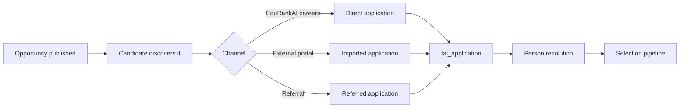
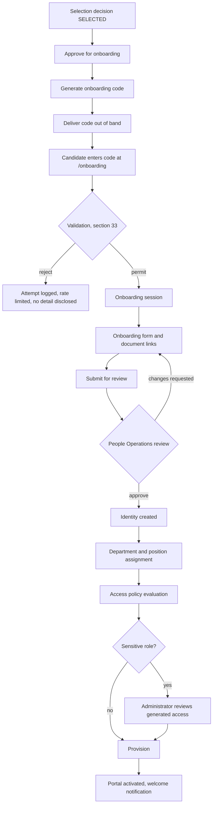
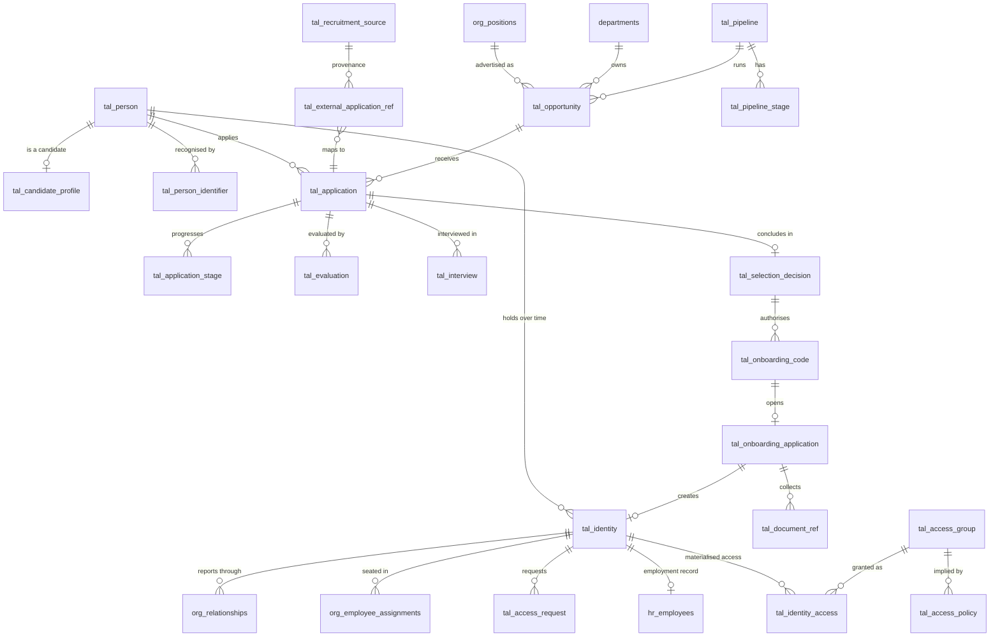

# Talent-to-Organization Master Specification

**EduRankAI Recruitment, Selection, Onboarding, Organizational Identity and Departmental Access**

| Field | Value |
|---|---|
| Document | `docs/talent-to-org/TALENT_TO_ORG_MASTER_SPEC.md` |
| Version | 1.0.0 |
| Date | 2026-08-18 |
| Status | Specification. No code in this document has been executed. Nothing here has been deployed. |
| Scope | `/careers/*`, `/apply/*`, `/onboarding/*` (new), `/portal/*`, `/admin/*` recruitment, HR and access surfaces |
| Companion to | `docs/workforce-os/WORKFORCE_OS_MASTER_SPEC.md` (what a signed-in person sees), `docs/workforce-os/AUTHORIZATION_FIRST.md` (the binding authorization boundary), `docs/org-graph.md` (Layer 1) |
| Method | Source-only. No database connection was opened, no `.env*` file read, no script that opens a connection run. Every schema claim below cites the file it was read from. |

---

## 0. Preface — what already exists, and what this document actually changes

This is not a greenfield build. EduRankAI already runs a public careers portal, a six-step
application funnel, an offer-letter flow with signature capture, an HR employee register, a
Drive-link document desk, an inert organization graph and a capability system. The specification
below is written **against those files**, and its largest single contribution is telling the
implementation team which of the modules in the brief are *renames of things that exist* and which
are genuinely new.

### 0.1 The existing system, by file

| Concern | Where it lives today | Verdict |
|---|---|---|
| Departments master data | `src/lib/db/schema.ts:80` `departments` | Reuse. |
| Job ad / opportunity | `src/lib/db/schema.ts:92` `roles` | **Split.** See finding F1. |
| Application record | `src/lib/db/schema.ts:125` `applications` | Reuse, add `person_id`. See F2. |
| Funnel stages | `src/lib/application-stages.ts` `STAGES`, `application_stage_events` | **Generalize.** See F4. |
| "How did you hear about us" | `src/lib/application-sources.ts` `application_sources` | Keep. **Not** the source registry. See F5. |
| Offer and acceptance | `src/lib/db/schema.ts:368` `offer_letters`, `/portal/offer/[token]` | Reuse as the selection artefact. See F3. |
| Employee register | `db/hr-schema.sql:43` `hr_employees` (`employee_code`) | Reuse, bridged to the identity registry. See F6. |
| Onboarding documents | `src/lib/hr-onboarding.ts`, `hr_onboarding_documents` | Reuse. Drive links only. See F7. |
| Per-engagement onboarding requirements | `src/lib/onboarding-packs.ts` `ENGAGEMENT_PACKS` | Reuse as-is. This is brief section 28, already built. |
| Onboarding checklist | `src/lib/onboarding-journey.ts` | Reuse as-is. |
| Positions (seats) | `src/lib/org-graph-schema.ts:289` `org_positions` | Reuse. Do not create a second positions table. |
| Seat assignment | `org_employee_assignments` | Reuse. |
| Reporting lines, department heads | `src/lib/org-graph.ts` (Layer 1, **shipped inactive — nothing imports it**) | Activate. |
| Capabilities | `src/lib/auth/permissions.ts`, `src/lib/auth/capability.ts` | Reuse. Extend additively. |
| Workspace gates | `src/lib/auth/workspace-access.ts` | Reuse. |
| Audit | `src/lib/audit.ts` `logAudit` / `logAuditOrThrow`, `audit_log` | Reuse. `logAuditOrThrow` for every access grant. |
| Async work | `src/lib/job-queue.ts` (`edu_jobs`), `src/lib/events.ts` | Reuse. See F9. |
| Notification | `src/lib/notify.ts`, `src/lib/edu-notify.ts`, `src/lib/email.ts` | Reuse. |

**Genuinely new in this specification:** Person identity resolution, the Recruitment Source Registry,
Opportunity (as distinct from Position), configurable Selection Pipelines, the Selection Decision
record, the **Onboarding Code**, the Onboarding Application, the unified Identity Registry across
employee / intern / fellow / member, Access Groups, the Access Provisioning engine, and the Access
Request workflow. Everything else is wiring.

### 0.2 Table ownership convention

New tables in this system carry the `tal_` prefix, following the `mp_` / `org_` / `hr_` convention
already in the tree. A module owns its prefix. Nothing in this specification alters a column owned
by another module; where it needs a column on someone else's table it adds one additively and says
so.

### 0.3 Findings that change the brief

These are stated up front because several of them alter what should be built. Work proceeds on the
resolutions given here unless a decision-maker rules otherwise.

**F1 — `roles` conflates Opportunity with Position.** `roles` (`schema.ts:92`) is simultaneously the
published job advertisement (`isOpen`, `isFeatured`, `applicationDeadline`, `viewCount`, `salary`
copy) and the nearest thing the product has to a job definition. The brief requires these apart:
section 22 Opportunity is a *hiring event* that opens, closes and archives; section 27 Position is
*organizational master data* that outlives every advertisement against it. Resolution: `org_positions`
is the Position (it exists and is unused); a new `tal_opportunity` is the hiring event; `roles` is
retained as the **public advertisement projection** and gains `position_id` and `opportunity_id`. No
existing `roles` row is deleted or repointed by this work.

**F2 — there is no Person.** `applications` copies `first_name`, `last_name`, `email`, `phone`,
`city` and `dob` onto every row, and the only linkage between two applications by the same human is a
matching email string. The brief forbids this explicitly (section 43). Resolution: `tal_person` plus
`tal_person_identifier`, with `applications.person_id` added additively. **Backfill is not
automatic**: matching on email alone will merge two people who shared a college address and will
split one person who changed jobs. The backfill produces *candidate merges for human confirmation* in
an admin queue; it never merges unattended. `/admin/applications/dedup.astro` already exists and is
the surface this extends.

**F3 — the offer letter is already the selection artefact, and its token is the prior art for the
onboarding code.** `offer_letters` carries a unique 64-character `token` used as the URL path at
`/portal/offer/[token]`, with signature, IP and user-agent capture. The comment at
`src/pages/portal/offer/[token].astro:49` records a past incident in which any signed-in account
could open any candidate's offer, salary included, from the token alone. **The Onboarding Code must
not repeat that shape.** See section 16.

**F4 — the six-step funnel is a published promise, not just a constant.** `STAGES` in
`src/lib/application-stages.ts` is fixed at six steps and `/policy/recruitment` publishes it as
"Six steps. No surprises." Per-opportunity pipelines (brief section 6) are therefore not a purely
internal change: an opportunity that runs a different pipeline must **publish that pipeline on its own
opportunity page**, and the six-step template remains the seeded default for everything that does not
override it. Terminal stages (`decision_no`, `withdrawn`) and their candidate-facing copy carry across
to every custom pipeline; a pipeline without a defined ending is rejected at save time.

**F5 — `application_sources` is attribution, not provenance.** It answers "how did you hear about
us", is candidate-declared and is deliberately unverified. The Recruitment Source Registry the brief
asks for (sections 3 and 24) is a different thing: the system of record a candidate arrived *through*,
carrying an external application identifier that must survive forever. Both exist; they are never
merged, and a report that confuses them will double-count. Note also that source **labels are
admin-managed data** (`application_sources` seeds them as rows). No third-party platform name is ever
hard-coded into page copy, and the public careers portal renders none.

**F6 — identity is employee-shaped.** `hr_employees.employee_code` is the only organizational
identifier in the product, and `hr_employees` is where interns already live too. The brief wants four
identity series (EMP / INT / FEL / MEM) over one registry. Resolution: `tal_identity` is the registry
and the issuer of codes; `hr_employees` remains the employment record for the categories that have one
and is linked by `tal_identity.hr_employee_id`. `employee_code` is not renamed and not reformatted —
existing codes are imported into the registry as they stand, with their original series recorded.

**F7 — document storage conflicts with the brief, and the project rule wins.** Brief section 36 asks
for upload, secure storage and non-public access. The established rule in this codebase, implemented
in `src/lib/hr-onboarding.ts`, is that documents of any kind are **Google Drive links shared as
"Anyone with the link — Viewer"**, never uploaded, with the sole exception of a small profile
photograph. This specification designs the link-based system. It states plainly what that costs:
*the document itself is not access-controlled at rest.* Anyone holding the URL can open it, including
after the candidate is rejected and after an employee exits. What this system controls is the
**reference** — who may see the link, who verified it, when it was revoked from our side. Where
genuinely private identity documents are involved (section 35) the honest options are (a) do not
collect them until the statutory moment requires it, and (b) the S3 presigned-upload path that already
exists in the tree for media. Both are specified in section 33; (a) is the default.

**F8 — `department_id` has two incompatible types.** `departments.id` is `varchar(50)`
(`schema.ts:80`), `hr_employees.department_id` is declared `UUID REFERENCES departments(id)`
(`db/hr-schema.sql:53`), and `org-graph-schema.ts` carries an explicit "ID-SPACE TRAP" note telling
callers to treat it as TEXT and never cast. **Every new table in this spec declares `department_id
TEXT` and never `::uuid`.** A cast here is a guaranteed production 500.

**F9 — the job queue has a known crashed-worker gap.** `claimBatch()` moves a job to `processing`; a
worker that dies leaves it there with nothing to reclaim it. Access provisioning runs on this queue.
Every provisioning job in section 23 is therefore specified idempotent and keyed, and section 41
requires the reclaim before provisioning goes live for anything above the intern tier.

**F10 — identifier collision in the brief.** `ERAI-INT-2026-00873` is given as an internship
*opportunity* and `ERAI-INT-003291` as an intern *identity*. Same segment, two namespaces, and the two
will be pasted into the same search box. Resolution: opportunities take `ERAI-OPP-*`; the identity
series keep EMP / INT / FEL / MEM. See section 26A.

**F11 — the onboarding code in the brief is both a name and a secret.** `ERAI-ONB-26-POM-7X4K9`
identifies a record *and* authorizes an action, and it encodes the position (`POM`) in plaintext. An
identifier gets logged, pasted into tickets and quoted in emails; a secret must not be. They are split
in section 16: the record has an ID, the secret is generated separately, stored only as a hash, and
displayed exactly once.

**F12 — automated evaluation never selects.** Assessment scores, proctoring flags and any model
output are advisory. `tal_selection_decision.decided_by_user_id` is `NOT NULL`; there is no code path
that writes a SELECTED decision without a human actor. This is the standing rule for automated
detection on this platform and it applies here without exception.

---

# PART I — PRODUCT

## 1. Product vision

One controlled lifecycle from the first time EduRankAI hears of a person to the day their access is
revoked, with every transition attributable to a named human and a written reason.

Today that lifecycle is four disconnected systems: a careers site, an application funnel, an HR
register and a permissions matrix. A person crosses each boundary by being re-typed into the next one.
The cost is visible in the tree — an offer that could be opened by the wrong account, a manager column
that overwrites its own history, an employee register that cannot say which application produced a
hire.

The product this specification describes is the connective tissue: **Person → Candidate → Applicant →
Evaluated → Selected → Onboarding → Organizational Identity → Departmental Member → Active**, where
each arrow is a record, not a re-typing.

## 2. System objectives

| # | Objective | How it is measured |
|---|---|---|
| O1 | A person applying three times is one person | Zero duplicate `tal_person` rows for a confirmed identity; merges are human-confirmed |
| O2 | Every candidate's provenance survives forever | 100% of applications carry a `tal_recruitment_source` and, where applicable, an external reference |
| O3 | Selection is configurable per opportunity | An opportunity can run a pipeline the product has never run before, without a deploy |
| O4 | Selection is authorized, not inferred | Every SELECTED status traces to a `tal_selection_decision` with a human actor and a reason |
| O5 | Onboarding is entered only by authorization | No onboarding session exists without a valid, unexpired, unused, bound onboarding code |
| O6 | Identity is stable, email is not | Every downstream reference uses `tal_identity.identity_code`; nothing keys on an address |
| O7 | Access is derived, not typed | Access groups are computed from identity, position, department and status; manual grants are exceptions and are logged as such |
| O8 | Status change moves access the same day | Suspension, leave and exit each drive a provisioning recomputation within one queue cycle |
| O9 | Nothing privileged loads above the authorization boundary | Per `AUTHORIZATION_FIRST.md`; enforced by test, not by review |
| O10 | Every critical event is on the record | The events in section 25 write `audit_log` before the response returns |

## 3. User personas

| Persona | Signed in? | Primary surface | What they must never see |
|---|---|---|---|
| **External candidate** | No | `/careers`, `/apply` | Any other candidate; any internal note; any evaluation score |
| **Applicant with an account** | Yes, `applicant` | `/portal/applications` | Their own scores, reviewer notes, panel comments |
| **Selected candidate** | Code-authorized, then account | `/onboarding` | Anything outside their own onboarding record |
| **New joiner** | Yes | `/portal` | Modules their identity type does not carry |
| **Employee / Intern / Fellow / Member** | Yes | `/portal` composed by type | Other people's documents, salary, health-adjacent fields |
| **Reporting manager** | Yes | `/portal` plus team views | Team members' identity documents, payroll detail, unrelated departments |
| **Department head** | Yes | `/admin`, department-scoped | Departments they do not head |
| **Hiring manager** | Yes | `/admin/recruitment`, scoped to assigned opportunities | Payroll, identity documents, unrelated pipelines |
| **Evaluator / interviewer** | Yes | Assigned evaluations only | Other evaluators' scores before submitting their own; candidate contact details |
| **People Operations** | Yes | `/admin/hr`, onboarding approval | Security administration, infrastructure |
| **Access administrator** | Yes | `/admin/access` | Candidate records, payroll |
| **Auditor** | Yes | Read-only `/admin/audit` | Nothing is hidden; nothing is writable |
| **Super admin** | Yes | Everything | — (holds the wildcard; the count of holders is a monitored metric) |

## 4. User journeys

**J1 — External candidate, hired.** Sees the opportunity on an external portal, opens
`/careers/[slug]`, applies at `/apply`, receives an application number, tracks six steps at
`/portal/applications`, completes an assignment, interviews, receives a decision with a written
reason, signs the offer at `/portal/offer/[token]`, **receives an onboarding code through a separate
channel**, enters it at `/onboarding`, completes the form and document links, People Operations
approves, identity is issued, the portal activates with the access their position implies.

**J2 — External candidate, not selected.** Identical to the point of decision, then: a written
reason, an appeal route (`/portal/appeals` exists) and an offer to keep the profile in the talent pool
(`/admin/recruitment/talent-pool` exists). The person record survives; the candidacy closes.

**J3 — Internal applicant.** An active identity applies for an internal opportunity. The system
recognizes the identity, pre-fills organization-controlled fields as read-only, does **not** create a
second person, routes the application away from their own reporting chain, and on selection issues a
**transfer**, not a new identity. See section 14.

**J4 — Imported candidate.** A partner portal submits, or a CSV is uploaded. The system creates or
matches a person, records the source and the external application ID, and the candidate joins the
pipeline at whatever stage the import declares — never past `SELECTED`, which requires an internal
decision record.

**J5 — Access request.** An active identity requests access they were not provisioned. The manager
approves, the department approves, security approves where the resource is classified. The grant is
time-bounded and appears as a manual grant in the provisioning diff forever.

**J6 — Exit.** Status moves to exit. Access recomputes to nothing on the last working day. The
identity is archived, not deleted, and its code is never reissued.

## 5. Recruitment lifecycle



Recruitment ends where evaluation begins. It owns publication, discovery, intake, provenance,
deduplication and eligibility. It owns no judgement about the candidate.

### 5A. Opportunity management module

**Purpose.** An opportunity is a hiring event against a position: it opens, it runs a pipeline, it
closes, it archives. The position outlives it (F1).

**Users.** Talent Admin, Hiring Manager (own opportunities), Department Head (own department).

**Inputs.** Position, department, employment type, level, headcount, eligibility rules, deadline,
pipeline, assignment and assessment configuration, interview process, hiring manager, evaluators,
onboarding requirements, the onboarding package a selected candidate receives.

**Outputs.** An opportunity record, a public advertisement projection into `roles`, a JobPosting
structured-data feed, and the pipeline published on the detail page.

**States.** `draft` → `published` → `closed` → `archived`. Plus `unpublished` (was public, now not —
the public URL returns 410) and `duplicated` as an action, not a state.

**Permissions.** `opportunity.view`, `opportunity.edit`, `opportunity.publish`. Publish is separate
from edit on purpose: editing a draft is routine, making it world-readable is not.

**Business rules.**
1. Publishing requires: an active position, a department, a pipeline with a defined ending, a hiring
   manager, and compensation copy that is honest for the engagement type (unpaid internships say so).
2. An opportunity cannot be deleted once an application exists. Close and archive.
3. Editing the pipeline of a **published** opportunity with live applications is refused. Close it and
   publish a successor, or move the affected applications explicitly with a recorded reason. Silently
   changing the process people are already in is precisely what `/policy/recruitment` promises not to
   do.
4. Closing an opportunity does not close its applications. Open applications continue to a decision.
5. Duplication copies configuration and no candidates.
6. Every opportunity has an immutable `ERAI-OPP-*` identifier (F10, section 26A).

**Validation rules.** Deadline must be future at publish. Headcount, where set, must be a positive
integer. Eligible identity types must be a non-empty subset of the configured types.

**APIs.** `POST /api/admin/talent/opportunities`, `PATCH .../:id`, `POST .../:id/publish`,
`POST .../:id/close`, `POST .../:id/duplicate`.

**Database entities.** `tal_opportunity`, `org_positions`, `departments`, `tal_pipeline`, `roles`.

**Failure states.** A publish that fails validation lists **every** failing precondition at once, not
the first one. Iterative single-error publishing is how a deadline gets missed.

**Audit.** `opportunity.created`, `.updated`, `.published`, `.unpublished`, `.closed`, `.archived`,
`.evaluator_assigned`.

## 6. Selection lifecycle

Selection is a pipeline of stages, each an instance row, each with an owner, an outcome and a
timestamp. It ends in exactly one `tal_selection_decision`. See section 7 for the state machine and
section 24 for the candidate-visible status model.

Selection owns screening, assessment, assignment, interview, evaluation, panel review and the
decision. It does not own the offer letter (already built) and it does not own onboarding.

### 6A. Selection pipeline engine

**Purpose.** Let each opportunity run its own sequence of stages without a deploy (brief section 6),
while keeping the published six-step commitment intact for everything that does not override it (F4).

**Model.** `tal_pipeline` is a named, versioned template. `tal_pipeline_stage` is an ordered stage with
a type, an owner role, an SLA and candidate-facing copy. `tal_application_stage` is the instance: one
row per application per stage, carrying entry time, owner, outcome and note.

**Stage types.** `screening`, `review`, `assessment`, `assignment`, `functional_evaluation`,
`interview`, `panel`, `final_review`, `decision`. Each type declares which evaluation records it
expects, so "assessment" without an assessment result is an incomplete stage rather than a silent pass.

**Seeded templates.**

| Template | Stages |
|---|---|
| Standard six-step (**default**) | Submitted → Review → Assessment → Interview → Decision → Onboarded |
| Software engineering intern | Application → Screening → Technical assessment → Interview → Final decision |
| People operations manager | Application → Screening → Assignment → Functional assessment → Interview → Leadership review → Final decision |
| Fellowship | Application → Portfolio review → Assignment → Panel review → Interview → Final decision |

**Business rules.**
1. Every pipeline must terminate in a `decision` stage and must inherit the two closed states
   (`decision_no`, `withdrawn`) with their existing candidate copy.
2. Stages advance forward by default; a backwards move requires a reason and is visible to the
   candidate.
3. A stage with an SLA that elapses raises an operational alert; it never auto-advances and never
   auto-rejects.
4. Versioning: editing a pipeline creates a new version. Applications stay on the version they entered
   on, which is the only way "which process did this person actually go through" stays answerable.
5. The pipeline a candidate is in is published on the opportunity page.

**Failure states.** A pipeline referencing a stage type the code does not implement fails validation at
save, not at the first candidate who reaches it.

**Audit.** `pipeline.created`, `.version_published`, `stage.entered`, `stage.completed`,
`stage.reverted`.

### 6B. Selected Candidates console

**Purpose.** The single operational queue between "we said yes" and "they are in the system". This is
the console the brief's section 23 describes and it has no equivalent today.

**Per candidate it shows.** Candidate ID, name, opportunity, selection ID, selection date, decision,
department, position, employment type, reporting manager, joining date, onboarding status, onboarding
code status, document status, identity creation status, access provisioning status.

**Actions.** Approve for onboarding · Generate onboarding code · Send onboarding instructions · Revoke
code · Extend validity · Regenerate code · Review onboarding · Approve onboarding · Create identity ·
Provision access · Suspend onboarding.

**Business rules.**
1. "Approve for onboarding" and "Generate code" are **two separate acts** with two separate
   permissions. The first is a People Operations judgement; the second is an issuance.
2. Actions are disabled *and* refused server-side when their preconditions are unmet.
3. Every destructive action (revoke, suspend) requires a reason and notifies the candidate in
   human language, without disclosing internal detail.
4. The row is never deleted. A withdrawn selection is a state.

**Failure states.** Where an action's precondition is unmet the console says which one, naming it —
never a greyed button with no explanation.


## 7. Onboarding lifecycle



The code authorizes **entry to the workflow and nothing else**. Identity creation is a separate,
human-approved act. Access provisioning is a third act, derived from the identity, never from the
code.

## 8. Information architecture

```
Public
  /careers                       opportunity index (search, filter by department, type, location)
  /careers/[slug]                opportunity detail including the pipeline this opportunity runs
  /careers/departments           department index
  /policy/recruitment            the published selection commitment
  /policy/hiring                 hiring policy
  /policy/candidate-transparency what candidates are told, and when
  /apply/*                       the application funnel (exists: step-1 to step-6)

Code-authorized (no account required to begin)
  /onboarding                    code entry
  /onboarding/session            the form, one section at a time
  /onboarding/status             read-only progress after submission

Signed in, candidate
  /portal/applications           status across all applications
  /portal/applications/[id]      one application, six-step tracker, messages
  /portal/offer/[token]          offer letter and signature (exists)
  /portal/appeals                decision appeals (exists)

Signed in, identity holder
  /portal                        composed by identity type (Workforce OS)
  /portal/profile                own record; organization-controlled fields read-only
  /portal/organization           team, manager, department
  /portal/access                 what I hold, and how to request more
  /portal/documents              my document references and their verification state

Admin
  /admin/recruitment             dashboard
  /admin/recruitment/sources     the Recruitment Source Registry
  /admin/opportunities           opportunity CRUD, pipeline configuration, evaluator assignment
  /admin/candidates              person and candidacy records
  /admin/applications            application detail (exists)
  /admin/selection               stage boards, evaluations, panel review
  /admin/selection/selected      the Selected Candidates console
  /admin/onboarding/codes        code issue, revoke, extend, regenerate
  /admin/onboarding              onboarding review and approval
  /admin/identity                the Identity Registry
  /admin/hr/*                    employment records (exists)
  /admin/org                     departments, positions, teams, relationships
  /admin/access                  access groups, policies, provisioning, requests
  /admin/audit                   audit log (exists)
```
---

# PART II — SURFACES

Every module below carries the same thirteen-field block: purpose, users, inputs, outputs, states,
permissions, business rules, validation rules, APIs, database entities, security, failure states,
audit.

## 9. Candidate portal

**Purpose.** Show a candidate everything EduRankAI is willing to tell them about their own
candidacies, and nothing about anyone else's.

**Users.** Applicants with an account. Selected candidates before their identity exists.

**Inputs.** Session. Nothing else — the portal never takes an application ID from the URL without
re-checking ownership server-side.

**Outputs.** Application list, per-application six-step tracker (`ApplicationStageTracker.astro`
exists), stage blurbs, messages thread, offer link where one exists, appeal link where a decision is
closed.

**States.** No applications; open applications; closed applications; selected and awaiting an
onboarding code; onboarding in progress.

**Permissions.** Ownership only. `application.applicant_user_id = session.user.id` **or**
`application.person_id ∈ persons linked to session.user.id`. Role is not consulted; an admin does not
see a candidate's portal view, they use the admin console.

**Business rules.**
1. A candidate sees their **stage**, never their **score**, never reviewer notes, never panel
   comments. Score exposure is a one-line change away in `applications` and must be guarded by a test.
2. A closed application renders a terminal stage with terminal copy. It must never render an open
   step's present-tense blurb — the failure `CLOSED_STAGES` was added to prevent.
3. The written decision reason is always shown for a closed application. "No reason recorded" is a
   defect, not a state.
4. A selected candidate is told a code is coming and through which channel. The code itself is never
   rendered in the portal — see section 16.

**Validation rules.** Application ID must parse as UUID; a non-parsing ID and an unowned ID return
the identical 404 body.

**APIs.** `GET /api/portal/applications`, `GET /api/portal/applications/:id`,
`POST /api/portal/applications/:id/withdraw`, `POST /api/portal/applications/:id/message`.

**Database entities.** `applications`, `application_stage_events`, `application_messages`,
`offer_letters`, `tal_person`, `tal_application`.

**Security.** Ownership check before the first data-bearing query, per `AUTHORIZATION_FIRST.md`.
Withdrawal is idempotent and cannot be reversed by the candidate.

**Failure states.** Database unavailable → the tracker renders "we cannot reach your record right
now" and never a zero-state that reads as "you have no applications". That distinction has already
cost this project once and is a hard requirement.

**Audit.** `application.withdrawn`, `application.message_sent`. Views are not audited at this tier.

## 10. Careers portal

**Purpose.** Public discovery of opportunities. The only recruitment surface that is world-readable.

**Users.** Anonymous. Signed-in internal identities see the same page plus an "internal opportunity"
badge where eligible.

**Inputs.** Query parameters `q`, `dept`, `level`, `type`, `location`, `product`. All optional.

**Outputs.** Opportunity cards; department index; opportunity detail with responsibilities,
qualifications, expected standards, the **selection procedure this opportunity runs**, assignment
summary, deadline, work structure, location, compensation where applicable, and links to
`/policy/recruitment` and `/policy/candidate-transparency`.

**States.** Published; closing soon (deadline within 7 days); closed; archived (410, not 404 — the
URL was public and is now gone, and saying so is more useful than pretending it never existed).

**Permissions.** None. Public.

**Business rules.**
1. **No confidential candidate data on any public route.** Application counts, applicant names and
   pipeline volumes are admin-only.
2. **No third-party platform or company name in public copy.** Source names live in admin data.
3. **Compensation copy is honest.** Internships display a stipend only where a stipend is explicitly
   recorded; otherwise they say unpaid. No range is invented and no "competitive" placeholder is
   printed.
4. **Positioning.** EduRankAI is the technology platform. No public copy claims to be a university,
   to award degrees, or to confer credentials — accredited partners do that.
5. The published pipeline on the detail page must equal the pipeline the opportunity actually runs.
   A pipeline edit on a published opportunity republishes the page or is refused.

**Validation rules.** Search terms are length-capped and used as `ILIKE` parameters only. Filters are
matched against known enum values; an unknown filter value yields the unfiltered list, never an
error page.

**APIs.** Server-rendered. `GET /api/careers/opportunities` exists for the JSON feed and the
JobPosting structured data.

**Database entities.** `roles` (advertisement projection), `tal_opportunity`, `departments`,
`org_positions`, `tal_pipeline`.

**Security.** Anonymous responses are edge-cacheable and must contain nothing session-dependent. The
JSON feed exposes exactly the fields the HTML page does.

**Failure states.** A search that matches nothing renders "no opportunities match" with the filters
echoed and a one-click reset. A search that errors falls back to a narrower predicate rather than
returning an empty list — the pattern already implemented in `careers.astro`.

**Audit.** View counts are aggregate only (`roles.view_count`), never per-visitor.

## 11. Onboarding portal

**Purpose.** The authorized entry point for a selected candidate. The only surface in the product
where a person acts before they have an account.

**Users.** Selected candidates holding a valid onboarding code.

**Inputs.** The code secret. Then the bound email address for the confirmation step. Then form data.

**Outputs.** An onboarding session, a saved draft after each section, a submitted onboarding
application, a read-only status page.

**States.** `code_entry` → `identity_confirmation` → `in_progress` → `submitted` → `changes_requested`
→ `approved` | `rejected` | `expired` | `suspended`.

**Permissions.** Held by the code, scoped to one onboarding application. The session grants nothing
outside `/onboarding/*`.

**Business rules.**
1. Entering a code creates the onboarding session and marks the code **consumed** for single-use
   codes. Refreshing the page does not consume a second use.
2. The session is short-lived (see section 16) and is re-established by re-entering the code, which
   is explicitly permitted for a consumed code **by the same bound subject** — otherwise a browser
   crash would destroy a person's onboarding.
3. Organization-controlled fields (position, department, employment type, reporting manager, level,
   joining date) render read-only, sourced from the selection record. A change request goes to People
   Operations as a message; the candidate never edits them.
4. Document requirements are resolved from `ENGAGEMENT_PACKS` for the engagement on the selection
   record. A pack that asks for a document type outside `DOC_TYPES` fails at configuration time, not
   at the candidate.
5. The candidate may save and return. Draft data is retained for the code's validity window plus 30
   days, then purged.
6. On submission the candidate is told exactly what happens next and who to contact.

**Validation rules.** Every field validated server-side. Drive links validated with `isDriveLink()`
and rejected with the specific human reason from `linkProblem()` — never a bare "invalid". Date of
birth is collected only where the engagement pack requires it. Photograph is a resized JPEG, camera
capture or upload, no other file accepted.

**APIs.** `POST /api/onboarding/code/redeem`, `POST /api/onboarding/session/section`,
`POST /api/onboarding/session/document`, `POST /api/onboarding/session/submit`,
`GET /api/onboarding/session/status`.

**Database entities.** `tal_onboarding_code`, `tal_onboarding_code_attempt`,
`tal_onboarding_application`, `tal_document_ref`, `tal_selection_decision`.

**Security.** Section 16 in full. Summary: hashed secret, bound subject, rate limited, CAPTCHA after
threshold, uniform rejection response, no enumeration, no privilege granted.

**Failure states.**

| Failure | Behaviour |
|---|---|
| Wrong code | Uniform message: "That code is not valid for onboarding." Attempt logged. |
| Expired code | Same uniform message. Admin sees the true reason; the candidate is given a contact route. |
| Revoked code | Same uniform message. |
| Consumed code, same subject | Session re-established. |
| Consumed code, different subject | Uniform message, attempt logged as **suspicious**, People Operations notified. |
| Selection record withdrawn mid-onboarding | Session suspends with an honest message and a named contact. |
| Storage failure on submit | The submission is not silently lost: the candidate is told, the draft is retained, and the error is tracked. |

**Audit.** `onboarding.code.viewed`, `onboarding.code.used`, `onboarding.started`,
`onboarding.section_saved`, `onboarding.submitted`, plus every failed attempt.

## 12. Employee portal

**Purpose.** The signed-in home for an active organizational identity.

This module is **already specified** in `docs/workforce-os/WORKFORCE_OS_MASTER_SPEC.md` and this
document does not restate it. Three obligations are added here:

1. **Composition keys off identity type, not role string.** `tal_identity.identity_type` is the
   input to the workspace composer; `users.role` is not. The credit-hours widget renders for the
   intern workspace and nowhere else, which is the defect the Workforce OS spec exists to fix.
2. **The onboarding checklist is a portal module** for anyone whose onboarding is approved but whose
   checklist (`onboarding-journey.ts`) is incomplete, and disappears when it completes.
3. **`/portal/access`** is new: what I hold, why I hold it (derived versus granted), when a
   time-bounded grant expires, and how to request more.

**Failure states.** A widget with no data source is not rendered — no placeholder, no zero, no
"coming soon". That rule is inherited verbatim.

## 13. Member, fellow and intern portals

There is one portal. Identity type composes it. Building four portals guarantees four divergent
implementations of the same profile page.

| Module | Employee | Intern | Fellow | Member |
|---|---|---|---|---|
| Dashboard | yes | yes | yes | yes |
| My profile | yes | yes | yes | yes |
| Organization and team | yes | yes | yes | limited |
| Projects and tasks | yes | yes | yes | by assignment |
| Attendance and work records | yes | yes | no | no |
| Credit hours | no | **yes** | no | no |
| Leave and availability | yes | yes | availability only | no |
| Compensation | yes | stipend if recorded | grant if recorded | no |
| Documents | yes | yes | yes | yes |
| Policies | yes | yes | yes | yes |
| Learning | yes | yes | yes | yes |
| Internal opportunities | yes | yes | yes | yes |
| Performance and evaluations | yes | completion assessment | fellowship review | no |
| Access requests | yes | yes | yes | limited |
| Onboarding checklist | until complete | until complete | until complete | until complete |

A module absent from a column is **not rendered and its loader is not invoked**. Hiding a rendered
module client-side is the fetch-then-filter failure the authorization boundary forbids.

## 14. Admin console

**Purpose.** The operational surface for everyone who runs recruitment, selection, onboarding,
identity and access. Data-dense, permission-controlled, and never showing an administrator a record
their scope does not cover.

**Users.** Nine administrative roles, section 35.

**Sections.** Dashboard, Recruitment, Opportunities, Candidates, Selection, Selected Candidates,
Onboarding Codes, Onboarding, Identity Registry, Employees, Interns, Fellows, Members, Departments,
Positions, Roles, Access Management, Assessments, Assignments, Interviews, Evaluations, Documents,
Reports, Audit Logs, Settings.

The last four already exist in some form; `admin-nav.ts` and `admin-sections.ts` own navigation and
`userCanAccess(userId, pageKey, action)` in `permissions.ts` already gates page keys. New sections
register there rather than inventing a second navigation mechanism.

**Inputs.** Filters, bulk selections, and the written reasons that several actions require.

**Outputs.** Lists, detail views, boards, exports, and the state transitions in section 45.

**Permissions.** Every section declares a page key and a required capability. A section the
administrator cannot access is **absent from navigation and returns 404 on direct URL entry** — not
403, which confirms the section exists.

**Business rules.**
1. **Scope is applied in the query, not in the render.** A hiring manager's candidate list is
   filtered by their assigned opportunities in SQL. `departmentFilter()` and `employeeFilter()` in
   `workspace-access.ts` already exist for exactly this and are the required mechanism.
2. **No loader above the authorization boundary.** Inherited verbatim from
   `AUTHORIZATION_FIRST.md`.
3. **Reason-required actions** cannot be submitted with an empty or whitespace reason: selection
   decisions, code revocation, code extension, manual access grants, identity suspension, legal-hold
   style record access.
4. **Bulk actions are capped** at 200 rows per submission and produce a per-row result report. A bulk
   action that partially fails reports which rows failed and why; it never reports success for the
   batch.
5. **Exports are audited** with the row count and the filter used.

**Validation rules.** Every state transition validated server-side against the state machines in
sections 24, 26 and 16.3. The UI disabling a button is not a control.

**APIs.** `/api/admin/talent/*`, all POST, all CSRF-protected, all re-checking capability
server-side. `/api/*` is **not** covered by the `/admin` middleware gate in this codebase — every
endpoint carries its own guard. This has been a real vulnerability here before.

**Database entities.** All of them.

**Security.** MFA required for Super Admin, Access Administrator and People Operations Admin. Session
fixation protection on privilege change. Rate limiting on search endpoints that accept free text.

**Failure states.** A failed write shows the real reason from `e.cause?.message`, never the failed
SQL, and never a green toast over a red result. "Reported success and observable result are not the
same thing" is the standing rule on this project and it applies to every action here.

**Audit.** Every write. Reads are audited for candidate records, identity documents and anything
carrying a sensitive flag.

## 14A. Admin dashboard

Required tiles, each stating its source:

| Tile | Source | Notes |
|---|---|---|
| Active opportunities | `tal_opportunity` where status published | |
| Applications, last 30 days | `tal_application` | Sparkline by day |
| Candidates by recruitment source | `tal_external_application_ref` joined to source | Provenance, not attribution |
| Candidates per selection stage | `tal_application_stage` | Board-style, per opportunity |
| Assessments pending | `tal_evaluation` where status pending and type assessment | |
| Interviews pending | `tal_interview` where scheduled and outcome null | |
| Selected candidates | `tal_selection_decision` where decision selected | |
| Pending onboarding | selected with no approved onboarding application | The queue that matters most |
| Onboarding completion rate | approved / codes issued, 90-day window | |
| Active employees / interns / fellows / members | `tal_identity` grouped by type and status | |
| Department distribution | `tal_identity` by department | |
| Pending access provisioning | `tal_provisioning_run` where status awaiting review | |
| **Failed onboarding attempts** | `tal_onboarding_code_attempt`, last 24h | Red when a single code exceeds 3 |
| **Expiring onboarding codes** | active codes with `valid_until` within 72h | Actionable: extend or revoke inline |

Two rules: a tile with no data source is not built, and a tile whose source can legitimately be empty
says "none yet" rather than rendering a zero that reads as a fault.

## 15. Recruitment source architecture

**Purpose.** Preserve, forever, the relationship between an external application and EduRankAI's
internal record.

**Two distinct concepts, never merged (F5):**

| | Attribution | Provenance |
|---|---|---|
| Question | "How did you hear about us?" | "Which system did this application arrive through?" |
| Declared by | The candidate | The integration or the importing administrator |
| Verified | No | Yes, by the ingestion path |
| Table | `application_sources` (exists) | `tal_recruitment_source` + `tal_external_application_ref` |
| Used for | Marketing attribution | Reconciliation, deduplication, partner reporting, compliance |

**Ingestion modes.**

| Mode | Trust | Person resolution | Stage entry |
|---|---|---|---|
| API (partner pushes) | Authenticated source key | Automatic match, human confirm on ambiguity | As declared, capped at pre-decision |
| Webhook | Signed payload, replay-protected | Same | Same |
| CSV import | Administrator asserts | **Preview and confirm before commit** | Same |
| Manual entry | Administrator asserts | Administrator selects the person | Same |

**Business rules.**
1. `(source_id, external_application_id)` is **unique**. A re-delivered webhook updates; it never
   creates a second candidate.
2. A source is never hard-deleted while a reference points at it — deactivate only. This mirrors the
   rule already implemented for `application_sources`.
3. An import may never create a `tal_selection_decision`. Selection is internal by definition.
4. Every imported row carries `ingested_by`, `ingested_at`, `raw_payload`. The raw payload is
   retained for reconciliation and is admin-only.
5. A source key is scoped to one source, is hashed at rest, and is revocable without a deploy. The
   `mailapi` key model in this tree is the reference implementation.
6. **No source name appears in candidate-facing copy.** Internal reporting only.

**Validation rules.** External IDs are opaque strings, length-capped, never parsed for meaning.
Emails are normalized (lower-cased, trimmed) for matching but stored as delivered.

**APIs.** `POST /api/v1/talent/candidates` (partner ingest), `POST /api/v1/talent/webhooks/:source`,
`POST /api/admin/talent/import` (CSV, two-phase), `GET /api/admin/talent/sources`.

**Failure states.** A partner sends a malformed payload → 422 with a field-level reason, the raw
payload is stored in a quarantine table, and an administrator can replay it after correction. Nothing
is dropped silently.

**Audit.** `source.created`, `source.deactivated`, `source.key_rotated`, `application.imported`,
`import.quarantined`, `import.replayed`.

## 16. Onboarding Code architecture

This is the load-bearing module of the brief and the one with no prior implementation.

**Purpose.** A time-bounded, subject-bound authorization, issued by EduRankAI after selection, that
permits exactly one thing: entry to the onboarding workflow for one selection record.

### 16.1 The identifier / secret split (F11)

| | Identifier | Secret |
|---|---|---|
| Example | `ERAI-ONBCODE-2026-000921` | `ERAI-ONB-7X4K9-2QP8M-4RTVD` |
| Purpose | Naming the record in tickets, logs, admin screens | Authorizing entry |
| Stored | Plaintext | **Argon2id or bcrypt hash only** |
| Displayed | Freely | **Exactly once**, at generation, to the issuing administrator |
| Logged | Yes | **Never**, in whole or in part beyond the 6-character display prefix |
| In a URL | Yes | **Never** — the code is entered into a form field, never carried as a path or query parameter |

The last row is the direct lesson of F3. `offer_letters.token` sits in the URL path, which means it
reaches server logs, browser history, referrer headers and any proxy in between. The onboarding code
does not.

**The secret encodes nothing.** No position abbreviation, no year, no department. It is 15 random
characters from an unambiguous alphabet (`23456789ABCDEFGHJKLMNPQRSTUVWXYZ`, no `0/O`, no `1/I/L`)
in three groups of five, giving roughly 75 bits of entropy — enough that guessing is not a threat
model even before rate limiting.

### 16.2 Binding

A code carries bindings evaluated at every redemption:

| Binding | Required | Meaning |
|---|---|---|
| `selection_id` | Always | The approved decision this code descends from |
| `person_id` | Always | The human it was issued to |
| `bound_email` | Always | Normalized; the candidate confirms it after entering the code |
| `opportunity_id` | Always | Snapshot of what they were selected for |
| `position_id`, `department_id`, `employment_type` | Always | Snapshot; the onboarding form's read-only fields come from here, not from live lookups |
| `max_uses` | Always, default 1 | Multi-use requires an explicit reason recorded at issue |
| `valid_from`, `valid_until` | Always | Default: issue date to +14 days |
| `requires_identity_confirmation` | Default true | The bound-email confirmation step |

For sensitive roles (any position flagged `is_sensitive`, plus every role carrying a
`SENSITIVE` capability), the issue form **cannot** be submitted with `max_uses > 1` or a validity
window over 7 days.

### 16.3 States

```
DRAFT -> ACTIVE -> CONSUMED -> CLOSED
           |  \-> EXPIRED
           \---> REVOKED
```

`CONSUMED` still permits session re-establishment by the same bound subject until `valid_until`;
`CLOSED` (set when the onboarding application is approved or rejected) permits nothing.

### 16.4 Redemption, in order

Section 33 gives the normative logic. The ordering matters as much as the checks: **rate limiting is
evaluated first**, and every rejection returns the same response body and the same latency envelope,
so the endpoint cannot be used to discover which codes exist.

### 16.5 Abuse controls

| Control | Value |
|---|---|
| Per-IP attempts | 5 per 10 minutes, then 429 with `Retry-After` |
| Per-code attempts | 10 lifetime failures, then the code auto-revokes and People Operations is notified |
| CAPTCHA | After 3 failures from an IP within 10 minutes |
| Response uniformity | One message, one status, for wrong / expired / revoked / exhausted / unknown |
| Timing | Hash comparison always runs, including for a code that does not exist |
| Notification | Every failure against a **valid** code notifies the issuing administrator |

### 16.6 Delivery

The code is delivered through the official channel recorded on the selection record — the
transactional mail path in this tree, or a channel the administrator records manually. It is
**never**: rendered in the candidate portal, included in a link, sent in the same message as the
offer letter, or read out to anyone who calls in. The email states the code, the validity window, the
onboarding URL, and that EduRankAI will never ask for the code by phone or on any other site.

### 16.7 What the code must never do

Restating the brief because it is the single most likely implementation error: **the code does not
grant departmental permissions.** It does not create an account. It does not create an identity. It
does not touch `users.role`. Its entire authority is `INSERT INTO tal_onboarding_application`.

**Users.** Talent Admin and People Operations Admin issue; Super Admin may revoke; the candidate
redeems.

**Inputs.** At issue: selection ID, validity window, max uses, delivery channel, reason if
non-default. At redemption: the secret, then the bound email.

**Outputs.** At issue: the identifier, the secret shown once, a delivery record. At redemption: an
onboarding session or a uniform rejection.

**Permissions.** `onboarding.code.issue`, `onboarding.code.revoke`, `onboarding.code.extend`,
`onboarding.code.regenerate`, `onboarding.code.view` (metadata only — no capability reveals a secret,
because none is stored).

**Business rules.**
1. A code is issued only from a selection decision whose `decision = 'selected'` and whose
   `approved_for_onboarding_at` is set. Two acts, not one.
2. Regeneration **revokes** the previous code and issues a new record. It never mutates a secret in
   place, so the audit trail shows exactly which secret was live when.
3. Extension moves `valid_until` forward only, with a reason, and never past 60 days from issue.
4. One `ACTIVE` code per selection record at a time.
5. A revoked code is never reactivated.

**Validation rules.** Alphabet-checked before hashing; whitespace and hyphens stripped; case
normalized to upper.

**Failure states.** Notification delivery failure at issue is surfaced to the administrator as an
explicit "the code was created but not delivered" state with a resend action. A created-but-undelivered
code is a supported state and is visible on the console; it is not silently assumed sent.

**Audit.** `onboarding.code.generated`, `.delivered`, `.delivery_failed`, `.viewed`, `.used`,
`.failed_attempt`, `.revoked`, `.extended`, `.regenerated`, `.auto_revoked`. Every one carries actor,
IP, and the code identifier — never the secret.
---

# PART III — IDENTITY AND ACCESS

## 17. Identity architecture

**Purpose.** One registry of every human EduRankAI recognizes organizationally, keyed by something
that never changes.

### 17.1 The three-record model

```
tal_person                 the human. Exists from first contact. Never deleted.
   |
   +-- tal_candidate_profile     what they are as a candidate (skills, education, portfolio)
   |        +-- tal_application (many)
   |
   +-- tal_identity              what they are organizationally. Zero, one, or several over time.
            +-- hr_employees     the employment record, where the type has one
            +-- users            the login account
```

Three separate things: the human, their candidacy, their organizational standing. A person with three
applications and two successive internships is **one** `tal_person`, one `tal_candidate_profile`,
three `tal_application`, and two `tal_identity` rows the second of which links back to the first.

### 17.2 Identity is not an account, and not an email

| Concept | Table | Changes over time? |
|---|---|---|
| The human | `tal_person.id` | Never |
| Organizational standing | `tal_identity.identity_code` | Never once issued |
| Login account | `users.id` | May be recreated |
| Work address | `tal_identity.work_email` | Yes, freely |
| Employment record | `hr_employees.id` | Yes |

**Every downstream foreign key points at `tal_identity.id`, and every human-quoted reference is
`identity_code`.** Nothing in this system keys on an email address. The brief is explicit and this
codebase has already been bitten by role-and-address coupling.

### 17.3 Identity record

Person ID, organizational ID, identity type, official username (`users.internal_handle` exists),
official email where assigned, status, department, position, role, reporting manager (resolved from
the org graph, **not** stored as a column — see 18.3), start date, end date, access groups
(materialized, section 23), permissions (derived), projects, organizational relationships.

Two of those are deliberately **not columns**: reporting manager and access groups. The first is a
relationship and lives in `org_relationships` with a lifetime; storing it as a column is the exact
defect `docs/org-graph.md` documents. The second is derived, and section 23 explains why the
materialized copy is a cache with a recompute path and never the source of truth.

### 17.4 Issue rules

1. An identity is created **only** by onboarding approval, or by an explicit administrative
   "create identity without onboarding" action that requires a written reason and Super Admin or
   People Operations Admin. Founding staff and pre-existing employees arrive by the second path.
2. `identity_code` is allocated from a per-series counter inside the same transaction as the identity
   insert, with a unique constraint as the real guarantee. Counter-then-insert without the constraint
   produces duplicates under concurrency.
3. Codes are **immutable and never reused**, including after exit and after a data-entry mistake. A
   mistaken identity is voided, not renumbered.
4. Existing `hr_employees.employee_code` values are imported as-is, with `code_is_legacy = true`, so
   the registry never rewrites a code someone already has on a letter.

### 17.5 Lifecycle

Section 25 gives the state machine. The identity outlives every one of them: exit archives, it does
not delete.

### 17.6 Internal identities and internal opportunities

**Purpose.** Let existing people apply without duplicating them, and without inheriting authority
from an email address.

1. **Eligibility is computed, never assumed from the email domain.** The gate is
   `identity_exists AND identity_status = 'active' AND identity_type ∈ opportunity.eligible_types AND
   NOT conflicted`. An `@edurankai.in` address on a terminated identity grants nothing. An exited
   person applying again is an **external** candidate whose person record already exists.
2. **No duplicate person.** The application attaches to the existing `tal_person`.
3. **Conflict routing.** An applicant is removed from the evaluator set of their own application
   automatically, and their reporting chain (`getReportingChain()` in `org-graph.ts`) is excluded from
   panel assignment unless an administrator overrides with a written reason.
4. **Confidentiality.** An internal application is not visible to the applicant's current manager by
   default. Manager visibility is a per-opportunity setting, defaults to off, and is disclosed to the
   applicant before they apply.
5. **Selection produces a transfer, not a new identity.** New position, new department, new access,
   **same `identity_code`**. Promotion is the same act. The employment change flows through the
   existing `/admin/hr/transfers` and `/admin/hr/promotions` surfaces.
6. **Cross-type moves** (intern to employee, member to fellow) issue a new code in the new series and
   mark the previous identity `converted`, linked forward. Both codes stay resolvable forever.

**Permissions.** `identity.view`, `identity.create`, `identity.edit`, `identity.suspend`,
`identity.terminate`, `identity.merge`.

**Failure states.** Code allocation collision → transaction retries once, then fails loudly with the
series name; it never silently allocates a duplicate. An internal applicant suspended mid-pipeline
pauses the application and tells the hiring manager the pipeline is paused, without the reason.

**Audit.** `identity.created`, `.updated`, `.suspended`, `.reactivated`, `.terminated`, `.archived`,
`.transferred`, `.converted`, `.merged`, `.code_allocated`.

## 18. Department architecture

**Purpose.** Configurable organizational units. Not a hard-coded list.

**Source of truth.** `departments` (`schema.ts:80`), already admin-managed, already carries
visibility and ordering. It is reused unchanged except for the additive columns in section 26.

**Business rules.**
1. **`department_id` is TEXT everywhere** (F8). No cast, ever.
2. A department is deactivated, never deleted, while any identity, position, opportunity or historical
   application references it.
3. A department head is a **relationship**, not a column: `org_relationships` with
   `relationship_type = 'department_head'` and a lifetime. `getDepartmentHead()` and
   `isDepartmentHead()` already exist and are the only permitted way to ask.
4. Departments may nest. `parent_department_id` is additive and optional; access policies evaluate the
   ancestor chain with a depth cap (`MAX_CHAIN_DEPTH = 12` is the existing convention).
5. A department carries a default access-group set (section 23) which every position in it inherits
   and may extend, never reduce below the organizational floor.

**Failure states.** A department with no head: approvals that require a head route to the parent
department, then to People Operations. Silent routing to nobody is the failure this rule prevents.

**Audit.** `department.created`, `.updated`, `.deactivated`, `.head_assigned`, `.head_revoked`.

## 19. Position architecture

**Purpose.** The seat, distinct from the person in it and from the advertisement for it.

**Source of truth.** `org_positions` (`src/lib/org-graph-schema.ts:289`): title, code, department,
team, grade, active flag. It exists and is unused. This specification activates it and adds the
attributes the access engine needs.

A position is associated with: department, level, reporting structure, employment type, access
groups, required competencies, selection workflow, onboarding workflow.

**Business rules.**
1. **`title` is descriptive text and is never compared to a role name or a capability.** The existing
   comment on the table says exactly this and it is binding.
2. A position's default access groups are policy. Changing them is a **policy change** requiring
   approval; assigning a person to a position is a **mechanism change** and does not.
3. `is_sensitive` on a position tightens onboarding-code rules (16.2) and forces access review before
   provisioning (section 23).
4. Headcount is optional. Where set, opening an opportunity beyond approved headcount requires an
   override with a reason.
5. Deactivating a position with a current occupant is refused with the occupant listed.

**Failure states.** An opportunity pointing at a deactivated position cannot be published; the error
names the position.

**Audit.** `position.created`, `.updated`, `.deactivated`, `.access_policy_changed` (always
`logAuditOrThrow`, because this row *is* the control).

## 20. RBAC model

**Purpose.** Standing authority attached to what someone is.

**Existing mechanism, reused.** `src/lib/auth/permissions.ts` holds a `Permission` union in dotted
notation (`applications.view`, `employee.manage`, `department.lead`, `payments.refund`),
`PERMS_BY_ROLE` maps role to permissions, `can()` is the pure test, `capability.ts` is the single
entry point, and `registry.ts` adds custom roles and the Super Admin wildcard.

**This specification adds keys; it does not add a second engine.** Two engines deciding access is the
defect the three-layer architecture exists to prevent.

### 20.1 Role vocabulary

The brief's list maps onto this codebase as follows. Roles marked *new* are added to
`userRoleEnum` **and** to `PERMS_BY_ROLE` in the same change — a role in one and not the other is how
a console became unreachable here before.

| Brief role | Here | Notes |
|---|---|---|
| SUPER_ADMIN | `super_admin` | Exists. Wildcard. |
| ADMINISTRATOR | `super_admin` scoped, or a custom role | Not a separate enum value |
| PEOPLE_OPERATIONS | `hr` | Exists |
| HIRING_MANAGER | `recruiter` | Exists, opportunity-scoped |
| EVALUATOR | `reviewer` | Exists, assignment-scoped |
| INTERVIEWER | *new*, or `reviewer` + attribute | Prefer the attribute; see 21 |
| DEPARTMENT_HEAD | `department_head` | Exists, department-scoped |
| EMPLOYEE / INTERN / FELLOW / MEMBER | **not roles** | These are `identity_type`. See 20.2 |
| MANAGER | **not a role** | A relationship. `getManager()` |
| FINANCE / ENGINEER / PRODUCT_MANAGER | **not roles** | Department plus position attributes |
| AUDITOR | *new* `auditor` | Read-only, including audit log |
| ACCESS_ADMINISTRATOR | *new* `access_admin` | Provisioning only |
| TALENT_ADMIN | *new* `talent_admin` | Recruitment and onboarding |

### 20.2 The rule that keeps the model small

**If it is a relationship, it is not a role. If it is a department or a job function, it is not a
role. If it is what someone *is*, it is an identity type, not a role.**

Modelling "Manager" as a role produces the question "manager of whom?" with no answer, and that is
precisely why `org_relationships` exists. Modelling "Engineer" as a role produces an authority that
follows a person into a department where it means nothing.

### 20.3 Composition

Roles compose additively: effective standing authority is the union of the base role's permissions
and every custom role grant, with the Super Admin wildcard on top. **There is no deny rule at this
layer** — denial belongs to attributes (section 21), where it can be scoped. A union-only model is
auditable; a mixed allow/deny model is not.

## 21. ABAC model

**Purpose.** Scope. RBAC says *what kind of thing* you may do; attributes say *to which rows*.

### 21.1 Attributes

| Attribute | Source | Example use |
|---|---|---|
| Department | `tal_identity.department_id` | A department head sees their department |
| Position | `tal_identity.position_id` | Position-specific tooling |
| Seniority / grade | `org_positions.grade` | Approval thresholds |
| Employment type | `tal_identity.employment_type` | Contractors excluded from internal-only resources |
| Project | `org_employee_assignments`, project relationships | Project managers see their project |
| Reporting hierarchy | `org_relationships` via `isResponsibleFor()` | A manager sees their reports' leave |
| Employment status | `tal_identity.status` | Suspended sees nothing |
| Location / country of work | `hr_employees.country_of_work` | Statutory data segregation |
| Security classification | `tal_access_group.classification` | Classified resources require explicit approval |
| Assignment | `tal_evaluation.evaluator_identity_id` | An evaluator sees only their own assignments |
| Organizational category | `tal_identity.identity_type` | Portal composition |

### 21.2 The effective-access formula

```
effective_access =
      capabilities(role)                       -- Layer 2, permissions.ts
  ∩   scope(department, position, project, hierarchy, assignment)
  ∩   gate(identity_status)
  ∪   explicit_grants(access requests, time-bounded)
  −   suspensions
```

`gate(identity_status)` is evaluated **first in practice**: a non-active identity resolves to the
empty set before any other term is computed. A suspended department head is not a department head.

### 21.3 Implementation obligation

Attributes are applied **in the query**. `departmentFilter()` and `employeeFilter()` in
`workspace-access.ts` already exist and produce SQL fragments for exactly this. A list that loads
every row and filters during render has already read data the principal was not entitled to, and no
amount of correct rendering undoes that.

## 22. Permission model

**Naming.** Dotted, lower-case, singular noun then verb: `candidate.view`, `onboarding.code.issue`,
`identity.terminate`. One convention. Two conventions for one concept is how a check ends up asking
for a permission nobody granted — the existing file says so in a comment and it is right.

**New permission keys** (added to the `Permission` union, granted in `PERMS_BY_ROLE`, and marked
SENSITIVE in `registry.ts` where noted):

```
candidate.view            candidate.edit            candidate.merge          (SENSITIVE)
opportunity.view          opportunity.edit          opportunity.publish
pipeline.view             pipeline.edit
evaluation.view           evaluation.submit         evaluation.view_others
interview.schedule        interview.record
selection.recommend       selection.decide          (SENSITIVE)
selection.approve_onboarding                        (SENSITIVE)
onboarding.code.issue     onboarding.code.revoke    onboarding.code.extend
onboarding.code.regenerate                          onboarding.code.view
onboarding.review         onboarding.approve        (SENSITIVE)
identity.view             identity.create           identity.edit
identity.suspend          identity.terminate        (SENSITIVE)
identity.merge                                      (SENSITIVE)
access.view               access.grant              (SENSITIVE)
access.revoke             access.policy.edit        (SENSITIVE)
access.request.approve
document.view             document.verify           document.view_sensitive  (SENSITIVE)
source.manage             source.key_rotate         (SENSITIVE)
audit.view
```

**Rules.**
1. A permission key that does not exist in the union **fails to compile**. That is the point of the
   union and it must not be widened to `string`.
2. `evaluation.view_others` is separate from `evaluation.view` so an evaluator cannot see a
   colleague's score before submitting their own.
3. `document.view_sensitive` gates identity documents specifically. `document.view` covers the rest.
4. Every SENSITIVE key granted to a custom role requires a recorded justification through the
   registry's strict sink.
5. **No permission is granted by email domain, by joining date, or by anything other than an explicit
   grant.**

## 23. Access provisioning

**Purpose.** Turn an identity into a concrete set of access groups, deterministically, repeatably, and
with the reason for every element visible.

### 23.1 The pipeline

```
Onboarding approved
  -> Identity created
  -> Department determined      (from the selection record)
  -> Position determined        (from the selection record)
  -> Role determined            (from the position's default role mapping)
  -> Access policy evaluated    (pure function; no writes)
  -> Access groups generated    (a proposed set with a reason per element)
  -> Sensitive? -> administrator reviews the proposal
  -> Applications provisioned   (one idempotent job per target system)
  -> Portal activated
  -> Welcome notification
```

### 23.2 Derivation, not assignment

```
proposed_groups(identity) =
      department_default_groups(department_id)
    ∪ position_groups(position_id)
    ∪ type_groups(identity_type)
    ∪ manual_grants(identity_id, unexpired)
```

`evaluateAccess(identity)` is a **pure function** — same inputs, same output, no writes, unit-testable
without a database. The materialized result lives in `tal_identity_access` with `source` on every row
(`department` | `position` | `type` | `manual` | `request`) so any screen can answer "why does this
person have this?" without re-deriving.

Recomputation is triggered by: identity created, department changed, position changed, type changed,
status changed, policy edited, manual grant expired, nightly reconciliation.

**The materialized table is a cache.** Nightly reconciliation re-derives, diffs, and reports
divergence as an incident. Drift that nobody notices is how an exited employee keeps access.

### 23.3 Idempotency (F9)

Every provisioning job carries `dedup_key = 'provision:' + identity_id + ':' + target_system + ':' +
policy_version`. `enqueue()` in `job-queue.ts` already accepts a `dedupKey`. A job that runs twice
must produce the same end state. Until the crashed-worker reclaim is in place, provisioning for
sensitive positions requires the administrator review step (23.1) — a stuck job is then visible as an
unfinished review rather than as silent nothing.

### 23.4 Deprovisioning

Status change to `suspended`, `exited` or `terminated` enqueues revocation **with higher priority than
any grant**. Revocation is never batched behind grants, and a revocation failure is an incident, not a
retry-and-forget.

**Users.** Access Administrator, People Operations Admin, Super Admin.

**Inputs.** Identity, its attributes, the policy set, manual grants.

**Outputs.** `tal_identity_access` rows, provisioning jobs, a diff report per run.

**States (per run).** `proposed` → `awaiting_review` → `approved` → `provisioning` → `provisioned` |
`partially_failed` | `failed`.

**Permissions.** `access.view`, `access.grant`, `access.revoke`, `access.policy.edit`.

**Business rules.** Manual grants are always time-bounded (default 90 days, hard cap 365) and always
carry a reason. A manual grant surviving a recompute is reported monthly to its approver.

**Validation rules.** A policy that would grant a SENSITIVE capability through a department default is
refused at save time. Sensitive access is granted per-identity, never by bulk default.

**Failure states.** Partial provisioning is a visible state with a per-system breakdown and a retry
per system. It is never reported as complete.

**Audit.** `access.provisioning.proposed`, `.reviewed`, `.provisioned`, `.failed`,
`permission.granted`, `permission.revoked` — the last two through `logAuditOrThrow`, because the audit
row is the control.

## 24. Candidate status model

```
APPLICATION_RECEIVED -> UNDER_REVIEW -> SHORTLISTED
   -> ASSESSMENT_PENDING -> ASSESSMENT_COMPLETED
   -> INTERVIEW_PENDING  -> INTERVIEW_COMPLETED
   -> FINAL_REVIEW
   -> SELECTED | WAITLISTED | REJECTED
SELECTED -> ONBOARDING_INVITED -> ONBOARDING_STARTED -> ONBOARDING_PENDING
         -> ONBOARDING_APPROVED -> ACTIVE
Any state -> WITHDRAWN (candidate-initiated)
Any state -> REJECTED  (organization-initiated, reason required)
```

**Rules.**
1. **The candidate can never set their own status**, with exactly one exception: `WITHDRAWN`.
2. Status is **derived from stage instances and the decision record**, not typed independently. A
   status column that can disagree with the stage history is two sources of truth.
3. `SELECTED` requires a `tal_selection_decision` row with a human `decided_by_user_id` (F12).
4. `ONBOARDING_INVITED` requires an active onboarding code.
5. `ACTIVE` requires an identity.
6. Every transition writes `application_stage_events` (exists) with actor, timestamp and note.
7. Backwards transitions are permitted with a reason and are visible to the candidate as a corrected
   status, not silently.
8. **Mapping to the existing six-step tracker** is a pure function so `/portal/applications` keeps
   working unchanged: `received/under_review → 01-02`, `assessment* → 03`, `interview* → 04`,
   `final_review/selected/rejected → 05`, `onboarding*/active → 06`.

## 25. Organizational status model

```
INVITED_FOR_ONBOARDING -> ONBOARDING_STARTED -> ONBOARDING_PENDING -> VERIFICATION
   -> ACTIVE
ACTIVE <-> ON_LEAVE
ACTIVE <-> SUSPENDED
ACTIVE  -> NOTICE -> EXITED -> ARCHIVED
Any     -> TERMINATED -> ARCHIVED
```

| Status | Portal | Access | Notes |
|---|---|---|---|
| INVITED_FOR_ONBOARDING | No | None | Code issued, not yet redeemed |
| ONBOARDING_STARTED / PENDING | Onboarding only | None | No identity yet |
| VERIFICATION | Onboarding status page | None | Documents under review |
| ACTIVE | Full, composed by type | Full derived set | |
| ON_LEAVE | Read-mostly | Retained; approval authority **suspended** | Delegation required, section 38 |
| SUSPENDED | Sign-in blocked | **Empty set** | Reason recorded, not shown to peers |
| NOTICE | Full | Full until last working day, then empty | Scheduled, not manual |
| EXITED | No | Empty | Identity retained |
| TERMINATED | No | Empty, immediate | Revocation is same-cycle, highest priority |
| ARCHIVED | No | Empty | Historical reference only; code never reused |

**Rules.**
1. **Status change drives access automatically.** A manual access change that contradicts status is
   refused, not merged.
2. `ON_LEAVE` suspends approval authority. An approval queue routing to someone on leave routes to
   their delegate, and if no delegate exists it routes up the chain and says so. Approvals silently
   waiting on an absent person is a real operational failure this rule prevents.
3. Exit is **scheduled**: last working day drives revocation, so nobody has to remember.
4. Nothing is deleted. Personal data retention and deletion is section 32.
---

# PART IV — DATA, API, EVENTS

## 26. Database schema

Conventions, all inherited from this codebase and all load-bearing:

* `CREATE TABLE IF NOT EXISTS` plus `ALTER TABLE ... ADD COLUMN IF NOT EXISTS`, so a fresh environment
  completes and production is a no-op. The DDL runs through `ensureOnce()`, never at module scope.
* **`department_id` is `TEXT`** everywhere (F8). Never `::uuid`.
* Reads normalize: `const r = Array.isArray(res) ? res : (res?.rows || [])`. Never `res.rows[0]`.
* Errors log `e?.cause?.message || e?.message`.
* Bootstrap failure clears its own memo and rethrows — a cached-resolved promise over failed DDL took
  a write path down here before.

### 26.1 Person and candidacy

```sql
CREATE TABLE IF NOT EXISTS tal_person (
  id                 UUID PRIMARY KEY DEFAULT gen_random_uuid(),
  person_code        TEXT NOT NULL UNIQUE,          -- ERAI-PER-2026-000001
  display_name       TEXT NOT NULL,
  preferred_name     TEXT,
  primary_email      TEXT,                          -- convenience only; never an identity key
  primary_phone      TEXT,
  country            TEXT,
  merged_into_id     UUID,                          -- set when this row loses a merge; never deleted
  created_at         TIMESTAMPTZ NOT NULL DEFAULT NOW(),
  updated_at         TIMESTAMPTZ NOT NULL DEFAULT NOW()
);
CREATE INDEX IF NOT EXISTS tal_person_email_idx ON tal_person (lower(primary_email));
CREATE INDEX IF NOT EXISTS tal_person_merged_idx ON tal_person (merged_into_id) WHERE merged_into_id IS NOT NULL;

-- Every way we know how to recognise this human. Matching happens here, not on tal_person.
CREATE TABLE IF NOT EXISTS tal_person_identifier (
  id            UUID PRIMARY KEY DEFAULT gen_random_uuid(),
  person_id     UUID NOT NULL,
  kind          TEXT NOT NULL,                      -- email | phone | external | user_account | identity
  value_norm    TEXT NOT NULL,                      -- normalised (lower/trim/E.164)
  source_id     UUID,                               -- which recruitment source asserted it
  is_verified   BOOLEAN NOT NULL DEFAULT FALSE,
  created_at    TIMESTAMPTZ NOT NULL DEFAULT NOW()
);
CREATE UNIQUE INDEX IF NOT EXISTS tal_person_ident_uq ON tal_person_identifier (kind, value_norm, person_id);
CREATE INDEX IF NOT EXISTS tal_person_ident_lookup ON tal_person_identifier (kind, value_norm);

-- Proposed merges. NEVER applied unattended (F2).
CREATE TABLE IF NOT EXISTS tal_person_merge (
  id             UUID PRIMARY KEY DEFAULT gen_random_uuid(),
  keep_person_id UUID NOT NULL,
  merge_person_id UUID NOT NULL,
  confidence     NUMERIC(4,3),
  evidence       JSONB NOT NULL DEFAULT '{}'::jsonb,
  status         TEXT NOT NULL DEFAULT 'proposed',  -- proposed | confirmed | rejected
  decided_by     UUID,
  decided_at     TIMESTAMPTZ,
  reason         TEXT,
  created_at     TIMESTAMPTZ NOT NULL DEFAULT NOW()
);

CREATE TABLE IF NOT EXISTS tal_candidate_profile (
  id             UUID PRIMARY KEY DEFAULT gen_random_uuid(),
  person_id      UUID NOT NULL UNIQUE,
  candidate_code TEXT NOT NULL UNIQUE,              -- ERAI-CAN-2026-000001
  headline       TEXT,
  education      JSONB NOT NULL DEFAULT '[]'::jsonb,
  experience     JSONB NOT NULL DEFAULT '[]'::jsonb,
  skills         JSONB NOT NULL DEFAULT '[]'::jsonb,
  portfolio_url  TEXT,
  talent_pool    BOOLEAN NOT NULL DEFAULT FALSE,
  consent_state  JSONB NOT NULL DEFAULT '{}'::jsonb, -- retention consent, per section 32
  created_at     TIMESTAMPTZ NOT NULL DEFAULT NOW(),
  updated_at     TIMESTAMPTZ NOT NULL DEFAULT NOW()
);
```

### 26.2 Recruitment sources (provenance)

```sql
CREATE TABLE IF NOT EXISTS tal_recruitment_source (
  id            UUID PRIMARY KEY DEFAULT gen_random_uuid(),
  slug          TEXT NOT NULL UNIQUE,
  name          TEXT NOT NULL,                      -- internal display; never rendered publicly
  category      TEXT NOT NULL DEFAULT 'other',      -- platform | government | institution | referral | community | partner | direct
  ingest_mode   TEXT NOT NULL DEFAULT 'manual',     -- api | webhook | csv | manual
  is_active     BOOLEAN NOT NULL DEFAULT TRUE,
  created_at    TIMESTAMPTZ NOT NULL DEFAULT NOW()
);

CREATE TABLE IF NOT EXISTS tal_source_key (
  id            UUID PRIMARY KEY DEFAULT gen_random_uuid(),
  source_id     UUID NOT NULL,
  key_prefix    TEXT NOT NULL,                      -- displayable, e.g. ersk_9f2a
  key_hash      TEXT NOT NULL,                      -- the secret is never stored
  scopes        JSONB NOT NULL DEFAULT '[]'::jsonb,
  revoked_at    TIMESTAMPTZ,
  created_by    UUID,
  created_at    TIMESTAMPTZ NOT NULL DEFAULT NOW()
);
CREATE UNIQUE INDEX IF NOT EXISTS tal_source_key_prefix_uq ON tal_source_key (key_prefix);

CREATE TABLE IF NOT EXISTS tal_external_application_ref (
  id                       UUID PRIMARY KEY DEFAULT gen_random_uuid(),
  source_id                UUID NOT NULL,
  external_application_id  TEXT NOT NULL,
  application_id           UUID,                    -- tal_application.id
  person_id                UUID,
  raw_payload              JSONB,
  ingested_by              UUID,
  ingested_at              TIMESTAMPTZ NOT NULL DEFAULT NOW()
);
CREATE UNIQUE INDEX IF NOT EXISTS tal_ext_app_uq ON tal_external_application_ref (source_id, external_application_id);

-- A malformed partner payload is QUARANTINED, never dropped (section 15, failure states). An
-- administrator can correct and replay it, and until they do the fact that something arrived and
-- could not be understood is on the record rather than in a log line nobody reads.
CREATE TABLE IF NOT EXISTS tal_ingest_quarantine (
  id           UUID PRIMARY KEY DEFAULT gen_random_uuid(),
  source_id    UUID,
  reason       TEXT NOT NULL,
  raw_payload  JSONB,
  replayed_at  TIMESTAMPTZ,
  created_at   TIMESTAMPTZ NOT NULL DEFAULT NOW()
);
```

### 26.3 Opportunity and pipeline

```sql
CREATE TABLE IF NOT EXISTS tal_opportunity (
  id                 UUID PRIMARY KEY DEFAULT gen_random_uuid(),
  opportunity_code   TEXT NOT NULL UNIQUE,          -- ERAI-OPP-2026-00421
  position_id        UUID,                          -- org_positions.id
  department_id      TEXT NOT NULL,                 -- TEXT. See F8.
  role_id            UUID,                          -- roles.id, the public advertisement projection
  title              TEXT NOT NULL,
  employment_type    TEXT NOT NULL,
  level              TEXT,
  headcount          INT,
  eligible_identity_types JSONB NOT NULL DEFAULT '[]'::jsonb,  -- empty = external only
  internal_visible_to_manager BOOLEAN NOT NULL DEFAULT FALSE,
  pipeline_id        UUID NOT NULL,
  pipeline_version   INT NOT NULL DEFAULT 1,
  hiring_manager_id  UUID,
  compensation_kind  TEXT NOT NULL DEFAULT 'unpaid',-- unpaid | stipend | salary | grant
  compensation_note  TEXT,
  onboarding_pack    TEXT,                          -- key into ENGAGEMENT_PACKS
  status             TEXT NOT NULL DEFAULT 'draft', -- draft|published|unpublished|closed|archived
  deadline_at        TIMESTAMPTZ,
  published_at       TIMESTAMPTZ,
  closed_at          TIMESTAMPTZ,
  created_by         UUID,
  created_at         TIMESTAMPTZ NOT NULL DEFAULT NOW(),
  updated_at         TIMESTAMPTZ NOT NULL DEFAULT NOW()
);
CREATE INDEX IF NOT EXISTS tal_opp_status_idx ON tal_opportunity (status, deadline_at);
CREATE INDEX IF NOT EXISTS tal_opp_dept_idx   ON tal_opportunity (department_id, status);
CREATE INDEX IF NOT EXISTS tal_opp_hm_idx     ON tal_opportunity (hiring_manager_id, status);

-- WHO MAY EVALUATE THIS OPPORTUNITY. This table is the ATTRIBUTE behind section 21.1's
-- "assignment" row: an evaluator's sight of a candidate is decided here, per row, and never by
-- their role. It is what listApplications() joins against to scope a reviewer's queue in SQL.
CREATE TABLE IF NOT EXISTS tal_opportunity_evaluator (
  id             UUID PRIMARY KEY DEFAULT gen_random_uuid(),
  opportunity_id UUID NOT NULL,
  user_id        UUID NOT NULL,
  assign_role    TEXT NOT NULL DEFAULT 'evaluator',   -- evaluator | interviewer | panel
  created_at     TIMESTAMPTZ NOT NULL DEFAULT NOW()
);
CREATE UNIQUE INDEX IF NOT EXISTS tal_opp_eval_uq
  ON tal_opportunity_evaluator (opportunity_id, user_id, assign_role);

CREATE TABLE IF NOT EXISTS tal_pipeline (
  id          UUID PRIMARY KEY DEFAULT gen_random_uuid(),
  slug        TEXT NOT NULL,
  name        TEXT NOT NULL,
  version     INT NOT NULL DEFAULT 1,
  is_default  BOOLEAN NOT NULL DEFAULT FALSE,
  is_active   BOOLEAN NOT NULL DEFAULT TRUE,
  created_by  UUID,
  created_at  TIMESTAMPTZ NOT NULL DEFAULT NOW()
);
CREATE UNIQUE INDEX IF NOT EXISTS tal_pipeline_slug_ver_uq ON tal_pipeline (slug, version);

CREATE TABLE IF NOT EXISTS tal_pipeline_stage (
  id             UUID PRIMARY KEY DEFAULT gen_random_uuid(),
  pipeline_id    UUID NOT NULL,
  ordinal        INT NOT NULL,
  key            TEXT NOT NULL,
  label          TEXT NOT NULL,
  candidate_blurb TEXT NOT NULL,
  stage_type     TEXT NOT NULL,                     -- screening|review|assessment|assignment|functional_evaluation|interview|panel|final_review|decision
  owner_role     TEXT,
  sla_hours      INT,
  is_terminal    BOOLEAN NOT NULL DEFAULT FALSE,
  config         JSONB NOT NULL DEFAULT '{}'::jsonb
);
CREATE UNIQUE INDEX IF NOT EXISTS tal_pipeline_stage_uq ON tal_pipeline_stage (pipeline_id, ordinal);
```

### 26.4 Application, stages, evaluation

```sql
CREATE TABLE IF NOT EXISTS tal_application (
  id                  UUID PRIMARY KEY DEFAULT gen_random_uuid(),
  application_code    TEXT NOT NULL UNIQUE,         -- ERAI-APP-2026-000001
  person_id           UUID NOT NULL,
  opportunity_id      UUID NOT NULL,
  legacy_application_id UUID,                       -- applications.id, for everything already in flight
  source_id           UUID,
  status              TEXT NOT NULL DEFAULT 'application_received',
  current_stage_key   TEXT,
  pipeline_id         UUID NOT NULL,
  pipeline_version    INT NOT NULL,
  is_internal         BOOLEAN NOT NULL DEFAULT FALSE,
  submitted_at        TIMESTAMPTZ NOT NULL DEFAULT NOW(),
  closed_at           TIMESTAMPTZ,
  created_at          TIMESTAMPTZ NOT NULL DEFAULT NOW(),
  updated_at          TIMESTAMPTZ NOT NULL DEFAULT NOW()
);
CREATE UNIQUE INDEX IF NOT EXISTS tal_app_person_opp_uq ON tal_application (person_id, opportunity_id);
CREATE INDEX IF NOT EXISTS tal_app_status_idx ON tal_application (status, submitted_at DESC);

CREATE TABLE IF NOT EXISTS tal_application_stage (
  id              UUID PRIMARY KEY DEFAULT gen_random_uuid(),
  application_id  UUID NOT NULL,
  stage_key       TEXT NOT NULL,
  ordinal         INT NOT NULL,
  entered_at      TIMESTAMPTZ NOT NULL DEFAULT NOW(),
  due_at          TIMESTAMPTZ,
  completed_at    TIMESTAMPTZ,
  outcome         TEXT,                             -- pass | fail | waived | reverted
  owner_user_id   UUID,
  note            TEXT,
  actor_user_id   UUID
);
CREATE INDEX IF NOT EXISTS tal_app_stage_idx ON tal_application_stage (application_id, ordinal);

-- One table for assessment, assignment and functional evaluation. Interviews get their own
-- because they carry scheduling.
CREATE TABLE IF NOT EXISTS tal_evaluation (
  id                  UUID PRIMARY KEY DEFAULT gen_random_uuid(),
  application_id      UUID NOT NULL,
  stage_key           TEXT NOT NULL,
  evaluation_type     TEXT NOT NULL,                -- assessment | assignment | functional | portfolio
  evaluator_user_id   UUID,
  rubric              JSONB NOT NULL DEFAULT '{}'::jsonb,
  scores              JSONB NOT NULL DEFAULT '{}'::jsonb,
  total_score         NUMERIC(6,2),
  recommendation      TEXT,                         -- advance | hold | decline  (ADVISORY, F12)
  comments            TEXT,
  is_automated        BOOLEAN NOT NULL DEFAULT FALSE,
  status              TEXT NOT NULL DEFAULT 'pending', -- pending | submitted | waived
  submitted_at        TIMESTAMPTZ,
  created_at          TIMESTAMPTZ NOT NULL DEFAULT NOW()
);
CREATE INDEX IF NOT EXISTS tal_eval_app_idx ON tal_evaluation (application_id, evaluation_type);
CREATE INDEX IF NOT EXISTS tal_eval_pending_idx ON tal_evaluation (status, evaluator_user_id);

CREATE TABLE IF NOT EXISTS tal_interview (
  id                UUID PRIMARY KEY DEFAULT gen_random_uuid(),
  application_id    UUID NOT NULL,
  stage_key         TEXT NOT NULL,
  scheduled_at      TIMESTAMPTZ,
  duration_minutes  INT,
  mode              TEXT,                           -- online | in_person
  panel             JSONB NOT NULL DEFAULT '[]'::jsonb,   -- user ids
  outcome           TEXT,
  notes             TEXT,
  recorded_by       UUID,
  created_at        TIMESTAMPTZ NOT NULL DEFAULT NOW()
);

CREATE TABLE IF NOT EXISTS tal_selection_decision (
  id                       UUID PRIMARY KEY DEFAULT gen_random_uuid(),
  selection_code           TEXT NOT NULL UNIQUE,    -- ERAI-SEL-2026-000001
  application_id           UUID NOT NULL UNIQUE,
  person_id                UUID NOT NULL,
  opportunity_id           UUID NOT NULL,
  decision                 TEXT NOT NULL,           -- selected | waitlisted | rejected
  reason                   TEXT NOT NULL,
  decided_by_user_id       UUID NOT NULL,           -- F12: no automated selection, ever
  decided_at               TIMESTAMPTZ NOT NULL DEFAULT NOW(),
  -- The organisational snapshot the onboarding form renders read-only
  position_id              UUID,
  department_id            TEXT,
  employment_type          TEXT,
  level                    TEXT,
  reporting_manager_user_id UUID,
  proposed_joining_date    DATE,
  compensation_note        TEXT,
  approved_for_onboarding_at     TIMESTAMPTZ,
  approved_for_onboarding_by     UUID,
  withdrawn_at             TIMESTAMPTZ,
  withdrawn_reason         TEXT
);
```

### 26.5 Onboarding

```sql
CREATE TABLE IF NOT EXISTS tal_onboarding_code (
  id                  UUID PRIMARY KEY DEFAULT gen_random_uuid(),
  code_id             TEXT NOT NULL UNIQUE,         -- ERAI-ONBCODE-2026-000921 (identifier, loggable)
  code_prefix         TEXT NOT NULL,                -- first 6 chars of the secret, for support lookup
  code_hash           TEXT NOT NULL,                -- the secret itself is NEVER stored (F11)
  selection_id        UUID NOT NULL,
  person_id           UUID NOT NULL,
  bound_email_norm    TEXT NOT NULL,
  opportunity_id      UUID NOT NULL,
  position_id         UUID,
  department_id       TEXT,
  employment_type     TEXT,
  max_uses            INT NOT NULL DEFAULT 1,
  used_count          INT NOT NULL DEFAULT 0,
  requires_identity_confirmation BOOLEAN NOT NULL DEFAULT TRUE,
  valid_from          TIMESTAMPTZ NOT NULL DEFAULT NOW(),
  valid_until         TIMESTAMPTZ NOT NULL,
  status              TEXT NOT NULL DEFAULT 'active', -- active|consumed|expired|revoked|closed
  multi_use_reason    TEXT,
  issued_by           UUID NOT NULL,
  issued_at           TIMESTAMPTZ NOT NULL DEFAULT NOW(),
  delivered_at        TIMESTAMPTZ,
  delivery_channel    TEXT,
  delivery_error      TEXT,
  revoked_by          UUID,
  revoked_at          TIMESTAMPTZ,
  revoked_reason      TEXT,
  supersedes_code_id  UUID,
  failed_attempts     INT NOT NULL DEFAULT 0
);
CREATE UNIQUE INDEX IF NOT EXISTS tal_onbcode_active_uq
  ON tal_onboarding_code (selection_id) WHERE status = 'active';
CREATE INDEX IF NOT EXISTS tal_onbcode_expiry_idx ON tal_onboarding_code (status, valid_until);

CREATE TABLE IF NOT EXISTS tal_onboarding_code_attempt (
  id            BIGSERIAL PRIMARY KEY,
  code_id       UUID,                               -- null when the code did not exist
  code_prefix   TEXT,
  outcome       TEXT NOT NULL,                      -- ok|unknown|expired|revoked|exhausted|subject_mismatch|rate_limited
  ip_address    TEXT,
  user_agent    TEXT,
  attempted_at  TIMESTAMPTZ NOT NULL DEFAULT NOW()
);
CREATE INDEX IF NOT EXISTS tal_onbattempt_ip_idx   ON tal_onboarding_code_attempt (ip_address, attempted_at DESC);
CREATE INDEX IF NOT EXISTS tal_onbattempt_code_idx ON tal_onboarding_code_attempt (code_id, attempted_at DESC);

CREATE TABLE IF NOT EXISTS tal_onboarding_application (
  id                 UUID PRIMARY KEY DEFAULT gen_random_uuid(),
  onboarding_code_id UUID NOT NULL,
  onboarding_code_ref TEXT NOT NULL,                -- ERAI-ONB-2026-000001
  selection_id       UUID NOT NULL,
  person_id          UUID NOT NULL,
  status             TEXT NOT NULL DEFAULT 'in_progress',
  form_data          JSONB NOT NULL DEFAULT '{}'::jsonb,
  sections_complete  JSONB NOT NULL DEFAULT '[]'::jsonb,
  declarations       JSONB NOT NULL DEFAULT '{}'::jsonb,
  submitted_at       TIMESTAMPTZ,
  reviewed_by        UUID,
  reviewed_at        TIMESTAMPTZ,
  review_note        TEXT,
  approved_at        TIMESTAMPTZ,
  identity_id        UUID,
  session_token_hash TEXT,
  session_expires_at TIMESTAMPTZ,
  created_at         TIMESTAMPTZ NOT NULL DEFAULT NOW(),
  updated_at         TIMESTAMPTZ NOT NULL DEFAULT NOW()
);

-- Document REFERENCES, not documents (F7). The file lives in the candidate's Drive.
CREATE TABLE IF NOT EXISTS tal_document_ref (
  id             UUID PRIMARY KEY DEFAULT gen_random_uuid(),
  subject_kind   TEXT NOT NULL,                     -- onboarding | identity | candidate
  subject_id     UUID NOT NULL,
  person_id      UUID NOT NULL,
  doc_type       TEXT NOT NULL,                     -- keys from hr-onboarding.ts DOC_TYPES
  title          TEXT NOT NULL DEFAULT '',
  drive_url      TEXT NOT NULL,
  is_sensitive   BOOLEAN NOT NULL DEFAULT FALSE,    -- identity documents; gated by document.view_sensitive
  status         TEXT NOT NULL DEFAULT 'submitted', -- submitted|verified|rejected|replaced|expired
  version        INT NOT NULL DEFAULT 1,
  replaces_id    UUID,
  expires_on     DATE,
  review_note    TEXT,
  reviewed_by    UUID,
  reviewed_at    TIMESTAMPTZ,
  created_at     TIMESTAMPTZ NOT NULL DEFAULT NOW()
);
CREATE INDEX IF NOT EXISTS tal_docref_subject_idx ON tal_document_ref (subject_kind, subject_id, status);
```

### 26.6 Identity and access

```sql
CREATE TABLE IF NOT EXISTS tal_identity (
  id                UUID PRIMARY KEY DEFAULT gen_random_uuid(),
  identity_code     TEXT NOT NULL UNIQUE,           -- ERAI-EMP-002184 etc. Immutable, never reused.
  code_series       TEXT NOT NULL,                  -- EMP | INT | FEL | MEM
  code_is_legacy    BOOLEAN NOT NULL DEFAULT FALSE, -- imported hr_employees.employee_code (F6)
  person_id         UUID NOT NULL,
  identity_type     TEXT NOT NULL,                  -- employee|intern|fellow|member|contractor|consultant|volunteer|campus_ambassador
  employment_type   TEXT,
  user_id           UUID,                           -- users.id
  hr_employee_id    UUID,                           -- hr_employees.id, where one exists
  username          TEXT,
  work_email        TEXT,                           -- may change freely; never an identity key
  department_id     TEXT,
  position_id       UUID,
  status            TEXT NOT NULL DEFAULT 'invited_for_onboarding',
  start_date        DATE,
  end_date          DATE,
  onboarding_application_id UUID,
  selection_id      UUID,
  previous_identity_id UUID,                        -- cross-type conversion chain
  status_reason     TEXT,
  created_by        UUID,
  created_at        TIMESTAMPTZ NOT NULL DEFAULT NOW(),
  updated_at        TIMESTAMPTZ NOT NULL DEFAULT NOW()
);
CREATE INDEX IF NOT EXISTS tal_identity_person_idx ON tal_identity (person_id);
CREATE INDEX IF NOT EXISTS tal_identity_status_idx ON tal_identity (status, identity_type);
CREATE INDEX IF NOT EXISTS tal_identity_dept_idx   ON tal_identity (department_id, status);
CREATE UNIQUE INDEX IF NOT EXISTS tal_identity_user_active_uq
  ON tal_identity (user_id) WHERE status = 'active' AND user_id IS NOT NULL;

-- Counters for EVERY identifier series, not only identities: person, candidate, application,
-- opportunity, selection, onboarding and the four identity series all allocate from this one table.
-- Named tal_id_series rather than tal_identity_series for that reason — a general allocator called
-- "identity_series" is a misnomer the next reader has to work around. `period` scopes a counter to
-- a year for the series that carry one (ERAI-OPP-2026-00421); the four identity series leave it
-- empty and count forever, because an identity outlives the year it was issued in.
--
-- The UNIQUE index on each code column is the real guarantee; this table is only the allocator.
-- src/lib/talent/ids.ts increments it with a single INSERT ... ON CONFLICT DO UPDATE ... RETURNING,
-- so two concurrent requests cannot reserve the same number.
CREATE TABLE IF NOT EXISTS tal_id_series (
  series        TEXT PRIMARY KEY,
  period        TEXT NOT NULL DEFAULT '',
  next_value    BIGINT NOT NULL DEFAULT 1,
  pad_width     INT NOT NULL DEFAULT 6,
  updated_at    TIMESTAMPTZ NOT NULL DEFAULT NOW()
);

CREATE TABLE IF NOT EXISTS tal_access_group (
  id             UUID PRIMARY KEY DEFAULT gen_random_uuid(),
  key            TEXT NOT NULL UNIQUE,              -- PO-MANAGER, ENG-ENGINEER, FIN-VIEWER
  name           TEXT NOT NULL,
  description    TEXT NOT NULL DEFAULT '',
  department_id  TEXT,
  classification TEXT NOT NULL DEFAULT 'internal',  -- public|internal|restricted|classified
  capabilities   JSONB NOT NULL DEFAULT '[]'::jsonb,-- Permission keys from permissions.ts
  systems        JSONB NOT NULL DEFAULT '[]'::jsonb,-- target application systems
  is_active      BOOLEAN NOT NULL DEFAULT TRUE,
  created_at     TIMESTAMPTZ NOT NULL DEFAULT NOW()
);

-- Policy: which groups a department default / position / identity type implies.
CREATE TABLE IF NOT EXISTS tal_access_policy (
  id             UUID PRIMARY KEY DEFAULT gen_random_uuid(),
  subject_kind   TEXT NOT NULL,                     -- department | position | identity_type
  subject_key    TEXT NOT NULL,
  access_group_id UUID NOT NULL,
  version        INT NOT NULL DEFAULT 1,
  is_active      BOOLEAN NOT NULL DEFAULT TRUE,
  changed_by     UUID,
  change_reason  TEXT,
  created_at     TIMESTAMPTZ NOT NULL DEFAULT NOW()
);
CREATE INDEX IF NOT EXISTS tal_access_policy_subj_idx ON tal_access_policy (subject_kind, subject_key, is_active);

-- Materialised effective access. A CACHE, reconciled nightly (23.2).
CREATE TABLE IF NOT EXISTS tal_identity_access (
  id              UUID PRIMARY KEY DEFAULT gen_random_uuid(),
  identity_id     UUID NOT NULL,
  access_group_id UUID NOT NULL,
  source          TEXT NOT NULL,                    -- department|position|type|manual|request
  granted_by      UUID,
  reason          TEXT,
  valid_until     TIMESTAMPTZ,
  policy_version  INT,
  created_at      TIMESTAMPTZ NOT NULL DEFAULT NOW()
);
CREATE UNIQUE INDEX IF NOT EXISTS tal_identity_access_uq ON tal_identity_access (identity_id, access_group_id, source);
CREATE INDEX IF NOT EXISTS tal_identity_access_expiry ON tal_identity_access (valid_until) WHERE valid_until IS NOT NULL;

CREATE TABLE IF NOT EXISTS tal_access_request (
  id               UUID PRIMARY KEY DEFAULT gen_random_uuid(),
  identity_id      UUID NOT NULL,
  access_group_id  UUID NOT NULL,
  reason           TEXT NOT NULL,
  requested_until  TIMESTAMPTZ,
  status           TEXT NOT NULL DEFAULT 'pending', -- pending|manager|department|security|approved|rejected|expired
  manager_decision JSONB,
  department_decision JSONB,
  security_decision   JSONB,
  created_at       TIMESTAMPTZ NOT NULL DEFAULT NOW(),
  decided_at       TIMESTAMPTZ
);

CREATE TABLE IF NOT EXISTS tal_provisioning_run (
  id             UUID PRIMARY KEY DEFAULT gen_random_uuid(),
  identity_id    UUID NOT NULL,
  trigger        TEXT NOT NULL,                     -- onboarding_approved|status_change|policy_change|reconciliation|manual
  proposed       JSONB NOT NULL DEFAULT '[]'::jsonb,
  diff           JSONB NOT NULL DEFAULT '{}'::jsonb,
  status         TEXT NOT NULL DEFAULT 'proposed',
  reviewed_by    UUID,
  reviewed_at    TIMESTAMPTZ,
  completed_at   TIMESTAMPTZ,
  failures       JSONB NOT NULL DEFAULT '[]'::jsonb,
  created_at     TIMESTAMPTZ NOT NULL DEFAULT NOW()
);
```

### 26.7 Additive columns on existing tables

```sql
ALTER TABLE applications  ADD COLUMN IF NOT EXISTS person_id           UUID;
ALTER TABLE applications  ADD COLUMN IF NOT EXISTS tal_application_id  UUID;
ALTER TABLE roles         ADD COLUMN IF NOT EXISTS position_id         UUID;
ALTER TABLE roles         ADD COLUMN IF NOT EXISTS opportunity_id      UUID;
ALTER TABLE departments   ADD COLUMN IF NOT EXISTS parent_department_id VARCHAR(50);
ALTER TABLE org_positions ADD COLUMN IF NOT EXISTS employment_type     TEXT;
ALTER TABLE org_positions ADD COLUMN IF NOT EXISTS is_sensitive        BOOLEAN NOT NULL DEFAULT FALSE;
ALTER TABLE org_positions ADD COLUMN IF NOT EXISTS headcount           INT;
ALTER TABLE org_positions ADD COLUMN IF NOT EXISTS competencies        JSONB NOT NULL DEFAULT '[]'::jsonb;
ALTER TABLE org_positions ADD COLUMN IF NOT EXISTS default_pipeline_id UUID;
ALTER TABLE org_positions ADD COLUMN IF NOT EXISTS onboarding_pack     TEXT;
CREATE INDEX IF NOT EXISTS applications_person_idx ON applications (person_id);
```

Nothing above drops, renames or retypes an existing column. `applications` keeps every field it has;
`person_id` is populated by the human-confirmed backfill (F2) and is nullable until it completes.

### 26A. Identifier generation

| Entity | Format | Example | Notes |
|---|---|---|---|
| Person | `ERAI-PER-<year>-<6>` | `ERAI-PER-2026-000001` | Internal |
| Candidate | `ERAI-CAN-<year>-<6>` | `ERAI-CAN-2026-002184` | Shown to the candidate |
| Application | `ERAI-APP-<year>-<6>` | `ERAI-APP-2026-000001` | Existing `application_number` maps here |
| Opportunity | `ERAI-OPP-<year>-<5>` | `ERAI-OPP-2026-00421` | **Not** `ERAI-INT-*` (F10) |
| Selection | `ERAI-SEL-<year>-<6>` | `ERAI-SEL-2026-000731` | |
| Onboarding application | `ERAI-ONB-<year>-<6>` | `ERAI-ONB-2026-000001` | The record |
| Onboarding code record | `ERAI-ONBCODE-<year>-<6>` | `ERAI-ONBCODE-2026-000921` | The identifier, not the secret |
| Onboarding code secret | `ERAI-ONB-XXXXX-XXXXX-XXXXX` | shown once | Hashed at rest (F11) |
| Employee | `ERAI-EMP-<6>` | `ERAI-EMP-002184` | No year: identity outlives the year |
| Intern / Fellow / Member | `ERAI-INT/FEL/MEM-<6>` | `ERAI-INT-003291` | |

**Rules.** Immutable once created. Never reused, including after deletion of the underlying draft.
Allocated inside the creating transaction. The unique constraint is the guarantee; the counter is a
convenience. Year segments use the year of creation and are never recomputed. Legacy
`hr_employees.employee_code` values are imported unchanged (F6).

## 27. Entity relationships



**Cardinality rules that matter.**
* One person, many applications. Enforced by `tal_person_identifier`, not by string matching.
* One application, at most one selection decision (`UNIQUE` on `application_id`).
* One selection, at most one **active** onboarding code (partial unique index), many historical.
* One onboarding application, at most one identity.
* One person, many identities over time, at most one `active` per user account.

## 28. API architecture

**Style.** Astro API routes under `/api`, POST for every mutation, JSON in and out, versioned prefix
`/api/v1/talent/*` for anything an external system calls. Internal admin endpoints stay under
`/api/admin/talent/*` and are not versioned.

**Non-negotiable:** `/api/*` is **not** covered by the `/admin` middleware gate in this codebase.
Every endpoint carries its own authentication and capability check as its first statements. This has
already been a live vulnerability here (an endpoint issuing real refunds gated only by
`role !== 'applicant'`).

### 28.1 Public and candidate

| Method | Path | Auth | Notes |
|---|---|---|---|
| GET | `/api/careers/opportunities` | none | Published only |
| GET | `/api/careers/opportunities/:slug` | none | 410 when archived |
| POST | `/api/apply/submit` | none | Rate limited, CAPTCHA, dedup by person |
| GET | `/api/portal/applications` | session | Ownership in the query |
| POST | `/api/portal/applications/:id/withdraw` | session | Idempotent |

### 28.2 Onboarding

| Method | Path | Auth | Notes |
|---|---|---|---|
| POST | `/api/onboarding/code/redeem` | none | Rate limited first; uniform rejection |
| POST | `/api/onboarding/session/confirm-identity` | session token | Bound-email confirmation |
| POST | `/api/onboarding/session/section` | session token | Saves one section |
| POST | `/api/onboarding/session/document` | session token | Drive link validation |
| POST | `/api/onboarding/session/submit` | session token | Terminal for the candidate |
| GET | `/api/onboarding/session/status` | session token | Read-only |

### 28.3 Admin

`/api/admin/talent/{opportunities,pipelines,candidates,applications,evaluations,interviews,
selections,onboarding-codes,onboarding,identities,access,sources,reports}` with REST-shaped verbs.
Every one: capability check, then scope filter in SQL, then audit write, then response.

### 28.4 External ingestion

| Method | Path | Auth | Notes |
|---|---|---|---|
| POST | `/api/v1/talent/candidates` | Source key (`Authorization: Bearer`) | Idempotent on `(source, external_id)` |
| POST | `/api/v1/talent/webhooks/:source` | HMAC signature + timestamp | Replay window 5 minutes |
| GET | `/api/v1/talent/candidates/:external_id` | Source key | Own source only |

**Conventions.** Errors return `{ error: { code, message, field? } }` with stable codes. Idempotency
via `Idempotency-Key` on POST. Pagination is cursor-based. Rate limits are per key and returned in
headers. No endpoint returns a stack trace.

## 29. Event architecture

**Mechanism.** Two layers already exist and are reused: `src/lib/events.ts` (in-process, synchronous
subscribers, failure-isolated) and `src/lib/job-queue.ts` (`edu_jobs`, durable, retrying, deduped).
A third — an outbox table — is added so an event is never lost when the process dies between the
database write and the enqueue.

```
handler writes domain row + tal_event row   (ONE transaction)
        -> outbox drain job reads tal_event
        -> emit() to in-process subscribers
        -> enqueue() durable jobs for anything crossing a system boundary
        -> mark delivered
```

```sql
CREATE TABLE IF NOT EXISTS tal_event (
  id             BIGSERIAL PRIMARY KEY,
  event_name     TEXT NOT NULL,
  subject_kind   TEXT NOT NULL,
  subject_id     UUID,
  payload        JSONB NOT NULL DEFAULT '{}'::jsonb,
  actor_user_id  UUID,
  occurred_at    TIMESTAMPTZ NOT NULL DEFAULT NOW(),
  delivered_at   TIMESTAMPTZ,
  attempts       INT NOT NULL DEFAULT 0,
  last_error     TEXT
);
CREATE INDEX IF NOT EXISTS tal_event_undelivered_idx ON tal_event (delivered_at, id) WHERE delivered_at IS NULL;
```

**Event catalogue.**

```
candidate.created            application.received         application.imported
candidate.shortlisted        assessment.completed         assignment.submitted
interview.scheduled          interview.completed          evaluation.submitted
candidate.selected           candidate.rejected           candidate.waitlisted
selection.approved_for_onboarding
onboarding.code.generated    onboarding.code.delivered    onboarding.code.used
onboarding.code.failed_attempt                            onboarding.code.revoked
onboarding.started           onboarding.submitted         onboarding.approved
identity.created             identity.transferred         identity.converted
department.assigned          role.assigned                access.provisioned
access.revoked               account.activated            account.suspended
account.terminated           document.submitted           document.verified
```

**Rules.**
1. Events are **facts in the past tense**. A subscriber that fails does not undo the fact.
2. Payloads carry identifiers, not PII. `person_id` and `identity_code`, never a name, an address, or
   a document link. A payload lands in logs, in the queue table and in any future integration.
3. Delivery is at-least-once; every subscriber is idempotent.
4. Subscriber failures are isolated and recorded (`recentEventFailures()` exists); one broken
   integration never blocks a hire.
5. **The audit write is not an event subscriber.** Audit happens inline in the request, before the
   response, because an audit row that arrives eventually is not a control.

## 30. Notification architecture

**Channels.** In-product notification (`notify.ts`, `edu-notify.ts`), transactional email
(`email.ts`, own-SMTP path), and the admin console badge. No third-party notification service.

**Catalogue.**

| Event | Candidate | Hiring manager | People Ops | Access admin |
|---|---|---|---|---|
| Application received | Acknowledgement with application code | Digest | — | — |
| Stage advanced | Status update, plain language | — | — | — |
| Assessment invited | Instructions and deadline | — | — | — |
| Interview scheduled | Time, mode, panel size (not names) | Confirmation | — | — |
| Decision made | Written reason, appeal route | — | — | — |
| Approved for onboarding | "A code is coming, by email, within one working day" | — | Queue item | — |
| **Onboarding code issued** | The code, validity, URL, anti-phishing note | — | Confirmation | — |
| Code expiring in 72h | Reminder | — | Queue item | — |
| **Failed attempts on a valid code** | — | — | **Alert** | — |
| Onboarding submitted | Acknowledgement | — | Review queue | — |
| Changes requested | Exactly what to fix | — | — | — |
| Onboarding approved | Welcome, next steps | Notify | — | Provisioning queue |
| Access provisioned | What was activated | — | — | Confirmation |
| Access requires review | — | — | — | **Queue item** |
| Status changed to suspended | Neutral notice | — | — | Revocation queue |

**Rules.**
1. **The onboarding code is never in the same message as the offer letter**, and never in a link.
2. Every candidate-facing message names a human contact route. No no-reply dead end.
3. Rate limiting per recipient (`recentNotifyCount()` exists) so a retry storm cannot mail somebody
   forty times.
4. Delivery failure is a **visible state**, not a silent one — the console shows
   created-but-undelivered and offers a resend.
5. Language is plain, factual, and never over-promises a timeline the operation cannot meet.
---

# PART V — SECURITY, PRIVACY, OPERATIONS

## 31. Security architecture

### 31.1 The rule the brief puts first

> Never expose internal organizational records through predictable URLs.

`/employee/ERAI-EMP-000001` must not be readable by changing the number. This is enforced in three
layers, not one:

1. **Authorization before data.** Every route resolves the principal, then the scope, then queries.
   No loader above the boundary (`AUTHORIZATION_FIRST.md`).
2. **Scope in the query.** `WHERE department_id = $scope` is part of the statement, not a filter
   applied to results.
3. **Uniform not-found.** A record outside scope returns exactly what a non-existent record returns.
   A 403 on a real ID and a 404 on a fake one is an enumeration oracle.

Identity codes are sequential and therefore guessable **by design** — they are printed on letters and
quoted in email. Their security value is zero and the system never treats possession of one as
evidence of anything.

### 31.2 Authentication

Existing multi-method authentication is reused: password, passkey, face, TOTP — any one signs a
person in, and this is deliberate (they are alternatives, not stacked factors). WebAuthn here is
first-party; no external authentication library is introduced.

**MFA is required** for Super Admin, Access Administrator, People Operations Admin and anyone holding
a SENSITIVE capability. Required means enforced at sign-in, not recommended in a policy document.

### 31.3 Sessions

| Session | Lifetime | Scope |
|---|---|---|
| Candidate | Standard | Own applications |
| **Onboarding** | 2 hours idle, 8 hours absolute | `/onboarding/*` for one onboarding application |
| Identity holder | Standard | Composed by identity type |
| Administrator | Shorter, re-auth for SENSITIVE actions | Capability-scoped |

The onboarding session token is a random value stored **hashed** (`session_token_hash`), delivered as
an `HttpOnly`, `Secure`, `SameSite=Strict` cookie. It is not the code, and knowing it grants nothing
beyond the one onboarding application. Privilege change (identity creation, role assignment) rotates
the session identifier.

### 31.4 Transport, storage, secrets

TLS everywhere. Secrets in environment variables, never in the repository, never logged. Code secrets
and source keys are hashed with a memory-hard function. Database credentials are never read by
application code paths that do not need them.

**Standing project rule, restated because it is absolute:** no development process connects to the
production database. Schema knowledge comes from source. Migrations are handed to the operator as
commands to run.

### 31.5 Rate limiting

| Endpoint | Limit |
|---|---|
| `/api/onboarding/code/redeem` | 5 per IP per 10 min; 10 lifetime failures per code |
| `/api/apply/submit` | 3 per IP per hour, CAPTCHA above 1 |
| Admin free-text search | 60 per minute per session |
| External ingestion | Per source key, returned in headers |
| Notification per recipient | Existing `recentNotifyCount()` window |

### 31.6 Review gates

Security review is required before merge for: any change to `permissions.ts`, `capability.ts`,
`registry.ts`, any `/api` route touching candidate or identity data, the onboarding-code module, and
the provisioning engine.

## 32. Privacy architecture

### 32.1 Data classes

| Class | Examples | Visible to |
|---|---|---|
| Public | Opportunity text | Everyone |
| Candidate-submitted | Application answers, portfolio | The candidate; the assigned hiring team |
| Evaluation | Scores, notes, panel comments | The hiring team only. **Never the candidate**, never the candidate's future manager |
| Organizational | Name, identity code, department, position, work email, manager | The organization |
| Restricted personal | Date of birth, government identifiers, bank details, address, emergency contact | People Operations and the person; nobody else |
| Health-adjacent | Blood group, medical/emergency detail, anything the wellness system holds | **The person only.** Never on any list screen, never in an export, never in an aggregate below the minimum group size |
| Security | Audit records, access policy | Auditor, Super Admin, Access Administrator |

### 32.2 Segregation rules

1. A hiring manager sees the candidate's application and evaluations. They see **no** payroll, **no**
   identity documents, **no** unrelated departmental records, **no** other candidate's data.
2. A department manager sees what their responsibility requires and no more — resolved from the org
   graph per row, not from a role name.
3. **Health data never travels with a name.** This is an established rule in this codebase, it is
   enforced elsewhere in the product, and this system does not create a surface that breaks it. If a
   screen here would return one row per person on a health-adjacent field, that screen must not exist.
4. Restricted personal fields are collected **at the statutory moment**, not at application. Bank and
   tax details belong to the payroll step, not to onboarding entry.
5. Exports strip restricted and health-adjacent classes unless the exporter holds the specific
   capability, and every export is audited with row count and filter.

### 32.3 Retention

| Data | Retention | Then |
|---|---|---|
| Unsuccessful application | 12 months, or as consented for talent pool | Anonymised: person retained, application content purged |
| Onboarding draft | Code validity + 30 days | Purged |
| Failed code attempts | 90 days | Purged (aggregate counts retained) |
| Identity record | Life of the organization | Archived, never deleted |
| Audit log | 7 years | Immutable |
| Restricted personal | Statutory period per jurisdiction | Purged on schedule |

### 32.4 Candidate rights

Access, correction, withdrawal, and erasure of candidate-class data on request. Erasure does not
extend to audit records or to a completed employment relationship, and the candidate is told that
plainly rather than promised a deletion that will not happen. `/policy/candidate-transparency`
already exists and is the published statement of this.

## 33. Document architecture

### 33.1 The model, and its honest limitation (F7)

Documents are **Google Drive links**, shared as "Anyone with the link — Viewer", never uploaded. The
sole stored upload is a small profile photograph (camera capture or upload, resized JPEG).

**What this means, stated plainly:** the document is not access-controlled at rest. Anyone with the
URL can open it — including after rejection and after exit, and including anyone the candidate shared
it with. This system controls the **reference**: who may see the link inside EduRankAI, who verified
it, what state it is in, and when we stopped relying on it. It cannot revoke the file. Only the
candidate can, from their own Drive.

Three consequences follow, and they are requirements, not commentary:

1. **Minimise collection.** Ask for a document only where the engagement pack genuinely requires it,
   at the moment it is required. This is the primary control and it is the default.
2. **Tell the candidate.** The onboarding form states, at the point of asking, that a
   link-shared document is readable by anyone holding the link, and advises them to restrict sharing
   once verification completes. `/policy/candidate-transparency` carries the same statement.
3. **Offer the alternative where it is warranted.** The presigned direct-to-S3 upload path already
   exists in this tree for media. Routing genuinely private identity documents through it gives real
   access control at rest. It requires the four `S3_*` environment variables and a retention and
   deletion policy. **It is specified here as an available option and is not the default**, because
   the standing project rule is links-not-uploads. Changing that is a decision for the founder, not
   for the implementation team.

### 33.2 States and rules

`submitted` → `verified` | `rejected` | `replaced` | `expired`.

1. Rejection always carries a reason the candidate can act on — the existing `linkProblem()` pattern,
   never a bare "invalid".
2. Replacement creates a new version; the old row is retained with `replaces_id` pointing forward.
   Version history is never overwritten.
3. Expiry is supported for documents that carry one (visas, certifications) and raises a reminder.
4. Sensitive documents (identity class) are flagged and gated behind `document.view_sensitive`.
5. **Opening a sensitive document is audited with the reason**, and the audit write happens before
   the link is revealed. This mirrors the legal-hold rule already in the codebase.
6. Links are never rendered in an email, an export, or an event payload.
7. Hard cap per subject, as already implemented (`MAX_DOCS`).

## 34. Audit architecture

**Mechanism.** `logAudit()` for activity, `logAuditOrThrow()` where **the audit row is the control** —
permission grants, code issuance and revocation, selection decisions, identity creation and
termination, sensitive document access. The strict variant's contract is that the caller undoes the
work if the audit write fails, and it is used exactly where an unrecorded action must not stand.

**Required fields.** Actor, timestamp, action, entity, entity ID, previous value, new value, source
(UI / API / import / job / reconciliation), IP and device where appropriate, reason where required.

**Auditable events.** Every event in section 29, plus: candidate record viewed, sensitive document
viewed, export performed, scope override used, bulk action performed, merge confirmed or rejected.

**Rules.**
1. Audit is written **inline, before the response**, never as an eventual subscriber.
2. Diffs never carry health-adjacent or restricted-personal values into lower-trust stores. The
   existing `logAudit` failure path deliberately omits the diff when reporting to the error log, and
   that discipline extends here.
3. The audit log is append-only. There is no update path and no delete path in application code.
4. An audit write failure is itself an incident: it is tracked, fingerprinted, and appears on the ops
   board. A silently failing audit subsystem is the one class of fault this project has explicitly
   engineered against.
5. Auditors read; they never write.

## 35. Admin roles

| Role | May | May not |
|---|---|---|
| **Super Admin** | Everything | — (holder count is monitored and reviewed) |
| **Talent Admin** | Opportunities, pipelines, candidates, selection administration, code issuance | Approve onboarding, create identities, grant access, view payroll |
| **People Operations Admin** | Employee records, onboarding review and approval, identity creation, organizational administration | Security administration, infrastructure, access policy editing |
| **Hiring Manager** | Own opportunities end to end, recommend a decision | Decide alone on sensitive positions, see other pipelines, see payroll |
| **Evaluator** | Own assigned evaluations | See others' scores before submitting, see candidate contact details |
| **Interviewer** | Own assigned interviews | Anything outside the assignment |
| **Department Administrator** | Own department's people and structure | Other departments, access policy |
| **Access Administrator** | Access groups, policies, provisioning, requests | Candidate records, payroll, selection |
| **Auditor** | Read everything, including the audit log | Write anything |

**Rules.** Least privilege by default. **Separation of duties is enforced, not advised**: the account
that approves a selection may not also be the account that issues its onboarding code for a
position flagged sensitive. Every administrative grant is time-reviewed; a quarterly report lists
every holder of every SENSITIVE capability and requires an explicit re-confirmation.

## 36. Workflow engine

`docs/workflow-engine.md` exists in this repository and its mechanism is reused rather than
duplicated. What this system contributes is definitions:

| Workflow | Trigger | Steps | Terminal |
|---|---|---|---|
| Selection | Application submitted | The opportunity's pipeline stages | Decision recorded |
| Onboarding approval | Onboarding submitted | People Ops review, optional changes-requested loop | Approved / rejected |
| Identity creation | Onboarding approved | Allocate code, create identity, link employment record | Identity active |
| Access provisioning | Identity created, or status change | Derive, review if sensitive, provision per system | Provisioned |
| Access request | Employee request | Manager, department, security where classified | Granted / refused |
| Exit | Notice recorded | Checklist, handover, revocation scheduled | Archived |

**Rules.** Every workflow step has an owner (a relationship or a capability, never a named person
hard-coded), an SLA, an escalation path, and a written outcome. No step auto-advances on timeout.
Escalation notifies; it does not decide.

## 37. Integration architecture

**Principle.** First-party and self-hostable by default. Proprietary services are optional connectors
behind swappable interfaces, never load-bearing. This is a standing architectural directive on this
platform and it governs every row below.

| Target | Direction | Mechanism | Status |
|---|---|---|---|
| EduRankAI Careers | Internal | Direct | Exists |
| Employee / member / fellow / intern portal | Internal | Direct | Exists (Workforce OS) |
| Identity provider | Internal | First-party auth | Exists |
| Email | Outbound | Own SMTP | Exists |
| Organizational chat | Outbound | Webhook behind an interface | Optional connector |
| Document management | Outbound | Drive links (F7) | Exists |
| HR system | Internal | `hr_employees` | Exists |
| Payroll | Internal | Existing payroll tables | Exists |
| Project management | Internal | Existing projects | Exists |
| Learning | Internal | LMS spine | Exists |
| External recruitment portals | Inbound | API / webhook / CSV (section 15) | **New** |
| Assessment systems | Inbound | Evaluation ingestion, advisory only | **New** |

**Rules.** Every external integration sits behind an interface with a null implementation, so absence
degrades a feature and never breaks a hire. Credentials are per-integration and revocable. An
integration failure is visible on the ops board and never silently drops a candidate.

## 38. Error handling

**Principles, all of them drawn from failures this codebase has already had:**

1. **Never swallow an exception in an authentication, authorization, signing or money path.** A bare
   `catch { }` in a sign-in path hid a total outage here for hours.
2. **Log the real reason.** `e?.cause?.message || e?.message`. `e.message` alone is the failed SQL.
3. **A memoised bootstrap that fails must clear its memo and rethrow**, or every subsequent call runs
   against schema that was never created.
4. **Declare every `const` before the handler that uses it.** `const` is not hoisted; this has taken
   down two admin actions here while the page reported success.
5. **Green message ≠ done.** A script reporting success proves the script ran. Verification means
   checking the surface.
6. **An empty result and an unavailable source are different states** and must render differently.
7. **Partial success is reported as partial**, per row, with what failed and why.

**Candidate-facing errors** state what happened, whether their data is safe, and what to do next. They
never expose internal reasons for a rejected onboarding code (section 16.5).

## 39. Edge cases

| Case | Behaviour |
|---|---|
| Same person applies to three opportunities | One person, three applications. No duplicate. |
| Two people share an email address | Detected at merge review; **never auto-merged** (F2). |
| Candidate changes email mid-pipeline | New identifier added, old retained. The bound email on an issued code does **not** change — reissue instead. |
| Candidate declines after selection | Selection withdrawn, code revoked, application closed with reason. |
| Code expires before redemption | Extend (reason required) or reissue. The candidate is told which. |
| Candidate redeems, then abandons | Draft retained for validity + 30 days, then purged. Chase-up reminder at 72h. |
| Two codes issued for one selection | Impossible: partial unique index. Reissue revokes first. |
| Onboarding approved but identity creation fails | Onboarding stays `approved`, identity absent, run marked failed, People Ops sees a retry. No half-created identity. |
| Position deactivated between selection and onboarding | Onboarding suspends; People Ops must reassign a position before approval. |
| Department merged mid-onboarding | Snapshot on the selection record governs; the new department is applied at identity creation with a note. |
| Internal applicant's manager is on the panel | Auto-excluded; an override requires a written reason. |
| Employee rehired after exit | Same person, same candidate profile, **new identity, new code**. Old identity stays archived. |
| Intern converts to employee | New EMP identity, previous marked `converted`, chain linked, both codes resolvable. |
| Person dies or a record must be closed compassionately | Identity terminated with a restricted reason visible only to People Ops; no automated messaging is sent to that person. |
| Bulk import contains an already-known external ID | Updates in place. Never a second candidate. |
| Access policy changed for 400 identities | One provisioning run per identity, queued, deduped, rate-limited; a diff report before anything is applied. |
| Reconciliation finds access with no policy basis | Reported as drift with the identity and group named; **not auto-revoked** — a wrong auto-revoke locks out a working team. |
| Two administrators act on one candidate simultaneously | Optimistic concurrency on the row version; the loser is told what changed and by whom. |

## 40. Abuse prevention

| Vector | Control |
|---|---|
| Code brute force | 75-bit secret, per-IP and per-code limits, CAPTCHA, auto-revoke, uniform responses, constant-time comparison |
| Code enumeration | Identical response body, status and latency envelope for every failure mode |
| Code sharing | Single use, subject-bound, email confirmation, notification to the issuer on a mismatch |
| Phishing of candidates | The code is never requested by phone or on any other site, and every code email says so; the onboarding URL is stated in the same message |
| Application spam | Rate limit, CAPTCHA, per-person dedup per opportunity |
| Free-text defacement | Candidate free text is never published to other candidates. The existing suggestion-not-publish model for sources is the pattern |
| Import poisoning | Source keys scoped and hashed; two-phase CSV with preview; quarantine on malformed payloads |
| Privilege escalation via onboarding | The code touches nothing but the onboarding application. Identity and access are separate, human-approved acts |
| Insider snooping | Sensitive reads audited with a reason; quarterly SENSITIVE capability review; scope enforced in SQL |
| Data exfiltration by export | Exports capability-gated, audited with row count and filter, restricted classes stripped |
---

# PART VI — DELIVERY

## 41. Scalability architecture

**Honest baseline.** This platform runs on a serverless host with a transaction-pooled Postgres. That
shapes every decision below and rules out several conventional answers (no long-lived connections, no
session-scoped `SET LOCAL`, no extensions, no background daemons).

| Dimension | Approach |
|---|---|
| Read scale | Public careers pages are anonymous and edge-cacheable; nothing session-dependent renders on them |
| Write scale | Application submission is the burst path (campus drives). Rate limited, queue-backed for everything after the insert |
| Query scale | Every list is indexed on its filter columns; the indexes in section 26 are part of the deliverable, not an afterthought |
| Connection scale | Transaction pooler. No connection held across an `await` that does I/O elsewhere |
| Job scale | `edu_jobs` with dedup keys and exponential backoff, already implemented |
| Provisioning scale | One run per identity, deduped; policy changes fan out through the queue with a diff report first |
| Notification scale | Per-recipient rate limits; digests instead of per-event mail for hiring managers |

**Known limits, stated rather than hidden.**

1. **Crashed-worker reclaim (F9).** A job stuck in `processing` is not currently reclaimed. Required
   before provisioning for anything above the intern tier: a `processing` job older than N minutes
   returns to `pending` with an attempt increment.
2. **Deploy ceiling.** The host caps deployments per day on the current plan. Phased delivery is
   sized accordingly, and a "Resource is limited" response stops the work rather than triggering
   retries.
3. **No benchmark exists.** No scale tier in this specification has been measured. Every number here
   is a design target, not a measurement, and it is marked as such until a load test says otherwise.
   `docs/load-test-plan.md` exists and is the vehicle.

## 42. UI/UX structure

**Design language.** The existing platform aesthetic is kept. **No emojis anywhere** — inline
monochrome SVG only. No arrow characters inside JSX strings. No competitor or company names in any
user-facing copy.

**Astro-specific constraints that have broken builds here and are therefore requirements:** no
`Record<string,string>`-typed maps inside JSX; no `<` or `<=` inside JSX expressions (hoist the
comparison to the frontmatter); `define:vars` cannot combine with `is:inline`; a `<script>` inside a
JSX conditional breaks parsing; `{}` is not interpolated inside quoted attributes.

**Per surface.**

| Surface | Priority | Character |
|---|---|---|
| Careers | Discovery and trust | Spacious, typographic, fast, structured data for search engines |
| Apply | Completion rate | One idea per step, save-and-return, honest progress, no dark patterns |
| Onboarding | Clarity under pressure | Sectioned, resumable, every organization-controlled field visibly read-only with a reason |
| Candidate portal | Reassurance | Status first, next step second, contact route always present |
| Employee portal | Personal relevance | Composed by identity type; no module the person cannot use |
| Admin console | Density and speed | Tables, filters, bulk actions, keyboard-first, reasons required inline |

**Mobile.** The candidate-facing surfaces are mobile-first. That is not a preference on this platform;
it reflects how applicants actually arrive.

**Accessibility.** WCAG AA. Keyboard-complete. Reduced-motion respected. Error messages associated
with their fields programmatically, not only visually.

**Performance.** Client JavaScript weight is reported per surface at build. Careers and onboarding
target near-zero client JS beyond progressive enhancement.

## 43. Dashboard requirements

Section 14A specifies the admin dashboard tiles. The rules governing every dashboard in the system:

1. **Every tile names its data source.** A tile whose source does not exist is not built — no
   placeholder, no zero, no "coming soon".
2. **Empty and unavailable render differently.** "None yet" is a real state; "we cannot reach this
   right now" is a different one; a zero that means neither is a defect.
3. **Every number is clickable** through to the rows behind it, with the same filter applied.
4. **Tiles respect scope.** A hiring manager's "applications" count is their opportunities' count. A
   dashboard that shows a global number to a scoped administrator has leaked an aggregate.
5. **No tile queries above the authorization boundary.** Loaders are deferred and run only for tiles
   that survive eligibility.
6. **Time windows are explicit** on the tile, never implied.

**Candidate dashboard:** application status, next step, what is expected of them, deadlines, contact
route. Nothing else.

**Employee dashboard:** composed by the Workforce OS. This system contributes the onboarding
checklist tile (until complete) and the access summary tile.

## 44. Reporting and analytics

| Report | Audience | Key measures |
|---|---|---|
| Funnel by opportunity | Talent Admin, Hiring Manager | Volume and conversion per stage, time in stage, drop-off |
| Source effectiveness | Talent Admin | Applications, selections and 6-month retention **by provenance** (not attribution) |
| Time to hire | People Ops | Submission to decision, decision to code, code to identity, identity to active |
| Onboarding health | People Ops | Codes issued, redeemed, expired, revoked; median completion; changes-requested rate |
| Selection fairness | People Ops, leadership | Stage-level pass rates by cohort, **aggregate only, suppressed below the minimum group size** |
| Access posture | Access Admin, Auditor | Identities per group, manual grants outstanding, drift found at reconciliation, SENSITIVE holders |
| Workforce composition | Leadership | Headcount by type, department, status |
| Audit activity | Auditor | Sensitive reads, overrides used, failed authorizations |

**Rules.** Every report states its window and its source. Cohort analysis is aggregate with small-group
suppression, never a row per person. Exports are capability-gated and audited. A report that cannot be
computed says so instead of rendering zeros.

## 45. Implementation phases

Delivery is sequenced so each phase ends at a working, verifiable surface. No phase ends in a stub.

```
P0  Foundations        person model, identifiers, source registry, backfill queue
P1  Opportunity        position/opportunity split, pipelines, careers projection
P2  Selection          stage instances, evaluations, interviews, decision record
P3  Onboarding code    the module in section 16, plus the Selected Candidates console
P4  Onboarding portal  form, documents, review, approval
P5  Identity registry  identity, series, HR bridge, portal composition by type
P6  Access engine      groups, policy, derivation, provisioning, reconciliation
P7  Requests & exit    access requests, delegation, exit automation
P8  Integrations       external ingestion, assessment ingestion, reporting
```

Each phase: DDL handed to the operator as a runnable script (never executed by the implementation
process), server-side capability checks in the same commit as the surface, tests, then verification on
the live URL.

## 46. MVP scope

**The smallest thing that makes the brief's core claim true.** P0 through P4, plus the minimum of P5.

**In:**
* `tal_person` and identifier matching, with the human-confirmed merge queue.
* Recruitment Source Registry with manual and CSV ingestion; external reference preserved.
* Opportunity split from position, using the seeded default six-step pipeline plus one custom
  pipeline to prove configurability.
* Stage instances and the selection decision record with a mandatory human actor and reason.
* **The Onboarding Code module in full** — hashed secret, bindings, validation order, rate limits,
  attempt log, revoke / extend / regenerate, uniform rejections, audit.
* Selected Candidates console with its eleven actions.
* Onboarding portal: code entry, identity confirmation, sectioned form, Drive-link documents against
  the existing engagement packs, submit, review, approve.
* Identity creation with code allocation and the `hr_employees` bridge.
* Portal composition by identity type for the four primary types.
* Audit on every event in section 25.

**Out of MVP, explicitly:** API and webhook ingestion, the access derivation engine (MVP uses the
existing role and department gates), access requests, delegation, reporting beyond the dashboard
tiles, assessment-system ingestion, exit automation.

**MVP is done when** a person can be imported from a CSV, run through a custom pipeline, selected by a
named human with a reason, issued a code, complete onboarding, be issued an identity, and sign in to a
portal composed for their type — with every step on the audit log and none of it possible out of order.

## 47. Phase 2 scope

* Access groups, policy, `evaluateAccess()` as a pure function, materialized access with source per
  row, nightly reconciliation with drift reporting.
* Provisioning runs with review-before-provision for sensitive positions.
* Access requests with the manager, department and security chain.
* Delegation, and the on-leave approval routing rule.
* API and webhook ingestion with source keys, HMAC verification and replay protection.
* Internal opportunities: eligibility computation, conflict routing, transfer and conversion.
* Full reporting suite.

**Prerequisite for Phase 2 go-live:** the crashed-worker reclaim (F9).

## 48. Phase 3 scope

* Assessment-system ingestion, advisory scoring surfaced to a human decision.
* Exit automation driven by last working day, with scheduled revocation.
* Fairness analytics with small-group suppression.
* Optional connectors: organizational chat, calendar-driven interview scheduling.
* The S3-backed sensitive document path **if and only if** the founder decides to change the
  links-not-uploads rule (F7 / 33.1).
* Multi-jurisdiction statutory field sets, driven by country of work.

## 49. Testing strategy

| Layer | What | Bar |
|---|---|---|
| Unit | `evaluateAccess()`, code validation order, status derivation, identifier allocation, stage transitions | Pure functions, no database, exhaustive on branches |
| Contract | Every `/api` route's authorization | **A test per endpoint proving an unauthorized principal gets nothing** |
| Boundary | No loader executes above the authorization boundary | Automated, per `AUTHORIZATION_FIRST.md` |
| Integration | Full lifecycle: import to active identity | Runs against a disposable database, never production |
| Security | Enumeration, brute force, IDOR on every `/employee/*` and `/admin/*` ID route, privilege escalation through onboarding | Part of the merge gate |
| Data | Backfill produces zero unattended merges | Assertion, not inspection |
| Regression | The six-step tracker still renders correctly for pre-existing applications | Explicit, because F4 touches published behaviour |
| Accessibility | WCAG AA on candidate-facing surfaces | Automated plus keyboard pass |

**Project-specific gates that `npm test` does not run** and that are part of the definition of done:
the mail lint script, the typecheck ratchet against its baseline, the production build, and manual
verification on the live URL after push.

**Adversarial cases that must have named tests:**
* Redeeming a code bound to a different email.
* Redeeming an expired, revoked, exhausted and non-existent code — all four returning identical
  responses.
* Selecting a candidate without a human actor (must be impossible to express).
* Creating an identity without an approved onboarding application (must require the explicit
  administrative path with a reason).
* A suspended department head attempting a department-scoped read.
* An exited identity retaining any access group after the reconciliation run.

## 50. Acceptance criteria

The system is accepted when every statement below is demonstrated on the live surface, not asserted.

**Recruitment**
1. A person applying to three opportunities produces one `tal_person` and three applications.
2. An imported candidate retains their external application ID, and re-delivery updates rather than
   duplicates.
3. The public careers portal exposes no candidate data, names no third-party platform, and states
   compensation honestly for unpaid engagements.

**Selection**
4. Two opportunities run two different pipelines simultaneously, and each candidate sees the pipeline
   their opportunity actually runs.
5. No `SELECTED` status exists without a decision row carrying a human actor and a written reason.
6. A candidate cannot see a score, a reviewer note or a panel comment on any surface.

**Onboarding code**
7. A code's secret is not recoverable from the database, the logs, or any screen after issuance.
8. Wrong, expired, revoked, exhausted and unknown codes are indistinguishable to the person entering
   them.
9. Five failed attempts from one IP within ten minutes are rate-limited; ten lifetime failures against
   one code auto-revoke it and notify.
10. A code grants access to exactly one onboarding application and nothing else — provable by
    attempting every other route with the onboarding session.
11. Revoke, extend and regenerate each work, each require a reason where specified, and each leave the
    previous state visible in the audit log.

**Onboarding and identity**
12. Organization-controlled fields cannot be modified by the candidate, verified by direct POST.
13. Onboarding approval creates exactly one identity with an immutable code, and a failure at any step
    leaves no half-created identity.
14. Identity codes are never reused, including after termination.

**Access**
15. Access is derived from identity, position, department and type, and every granted group states its
    source.
16. Changing a person's department recomputes their access within one queue cycle.
17. Suspension empties the effective access set; the person can sign in to nothing.
18. Nightly reconciliation reports drift and does not silently auto-revoke.
19. `/employee/<any id>` and every admin detail route return the same response for an out-of-scope
    record as for a non-existent one.

**Audit and privacy**
20. Every event in section 25 appears in `audit_log` with actor, timestamp, object, before, after,
    source and reason where required.
21. Sensitive document access is audited **before** the link is revealed.
22. No screen in the system returns one row per person for a health-adjacent field.
23. A hiring manager cannot reach payroll, identity documents or another department's records — by
    navigation or by direct URL.

**Operational**
24. Every candidate-facing failure states what happened and what to do next, and no candidate-facing
    error reveals an internal reason for a code rejection.
25. Every phase was verified on the live URL after push, not on a green console message.

---

## Appendix A — Open decisions for the founder

These are the points where this specification could not decide alone. Each is blocking only for the
scope named.

| # | Decision | Default taken here | Blocks |
|---|---|---|---|
| D1 | Sensitive identity documents: Drive links or S3-backed upload? | **Drive links**, collection minimised, candidates told | Phase 3 only |
| D2 | Do custom pipelines change the published "six steps" commitment? | **No** — the six-step template stays the default and each opportunity publishes its own | P1 |
| D3 | New admin roles (`talent_admin`, `access_admin`, `auditor`) added to the role enum, or expressed as custom roles in the registry? | **Enum**, so `PERMS_BY_ROLE` is the single matrix | P0 |
| D4 | Is manager visibility of internal applications ever on by default? | **No**, per-opportunity opt-in, disclosed to the applicant | Phase 2 |
| D5 | Retention for unsuccessful applications | **12 months**, or as consented for the talent pool | P0 |
| D6 | Which positions are `is_sensitive`? | Needs a named list from People Ops | P3 |

## Appendix B — Traceability to the brief

| Brief section | Where |
|---|---|
| 1–2 objectives, core principle | 1, 2, 0.3 |
| 3 recruitment sources | 15, 26.2 |
| 4 careers portal | 10 |
| 5 application model | 5, 26.4 |
| 6 selection pipeline | 6A |
| 7 candidate vs selected | 24, 26.4 |
| 8–9 onboarding code and its security | 16 |
| 10–11 onboarding flow and form | 7, 11 |
| 12 organizational identity | 17, 26.6 |
| 13–14 internal identities and opportunities | 17.6 |
| 15 employee portal | 12, 13 |
| 16 departmental access | 23 |
| 17–19 RBAC, ABAC, example access model | 20, 21, 22 |
| 20–21 admin console and dashboard | 14, 14A |
| 22 opportunity management | 5A |
| 23 selected candidate management | 6B |
| 24 source integration | 15, 28.4 |
| 25 audit trail | 34 |
| 26 account lifecycle | 25 |
| 27 department and position master data | 18, 19 |
| 28 engagement types | 13, existing `ENGAGEMENT_PACKS` |
| 29 ID generation | 26A |
| 30 email vs identity | 17.2 |
| 31 user experience | 42 |
| 32 candidate status | 24 |
| 33 code validation logic | 16.4, 31.5, 40 |
| 34 critical security requirement | 31.1 |
| 35 privacy | 32 |
| 36 document management | 33 |
| 37 access provisioning workflow | 23 |
| 38 access request system | 23, 36 |
| 39 admin permission model | 35 |
| 40 system integrations | 37 |
| 41 event model | 29 |
| 42–43 data model and person relationship | 26, 27 |
| 44 end-to-end scenario | 4 (J1), 50 |
| 45 admin workflow | 36, 6B |
| 46 what not to build | 0.3, 16.7, 20.2, 17.6 |
| 47 required deliverable | This document |
